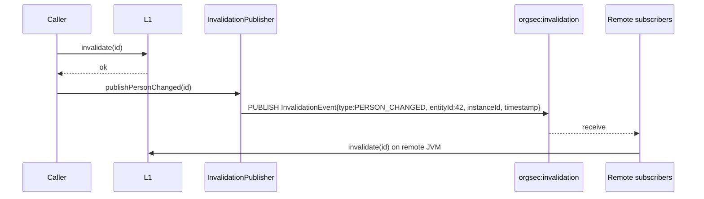
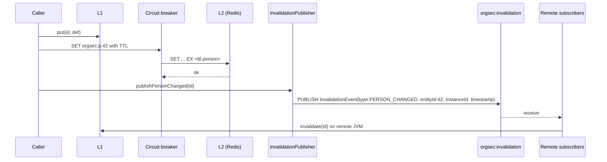

# Cache Architecture

This page describes the internals of the Redis backend's two-tier cache: how the L1 LRU works inside each JVM, how the L2 cache lives in Redis, and how Pub/Sub keeps the two coherent across instances. The audience is contributors and operators who already use [Storage / Redis](../storage/03-redis.md) and want the design behind the configuration knobs.

## Two layers, four caches

Each Redis-backed JVM holds **four independent L1 caches** - one per OrgSec entity type:

| Cache             | Key type | Value type        | Default `l1-max-size` |
| ----------------- | -------- | ----------------- | --------------------- |
| Persons           | `Long`   | `PersonDef`       | 1000                  |
| Organizations     | `Long`   | `OrganizationDef` | 1000                  |
| Roles             | `Long`   | `RoleDef`         | 1000                  |
| Privileges        | `String` | `PrivilegeDef`    | 1000                  |

The four are independent: an eviction in the persons cache does not affect organizations, and the per-cache size cap means a JVM can hold up to `4 * l1-max-size` entries in total.

L2 lives once per Redis instance and is shared across every JVM connected to it.

## L1 internals

`L1Cache<K, V>` is a small, self-contained class. Two design choices:

- **Backing data structure: `Collections.synchronizedMap(new LinkedHashMap<K, V>(maxSize, 0.75f, true))`.** The `true` argument switches `LinkedHashMap` to access-order iteration, which is what makes it an LRU. The synchronized wrapper makes basic `get` / `put` thread-safe; the read-modify-write paths (e.g. `computeIfAbsent`) are not used.
- **Eviction: `removeEldestEntry`.** When `size() > maxSize`, the eldest (least-recently-accessed) entry is removed and the eviction counter is incremented. The eviction is synchronous on the inserting thread - no background thread is involved.

```java
this.cache = Collections.synchronizedMap(
    new LinkedHashMap<K, V>(maxSize, 0.75f, true) {
        @Override
        protected boolean removeEldestEntry(Map.Entry<K, V> eldest) {
            boolean shouldRemove = size() > maxSize;
            if (shouldRemove) evictionCount.incrementAndGet();
            return shouldRemove;
        }
    }
);
```

The cache also tracks `hitCount`, `missCount`, and `evictionCount` as `AtomicLong` counters, exposed through `getStats()` - the read path documented in [Operations / Monitoring](../operations/monitoring.md#programmatic-cache-statistics).

### Memory characteristics

`l1-max-size` bounds *entry count*, not memory. A `PersonDef` with hundreds of `OrganizationDef` references in its `organizationsMap` is much larger than a `RoleDef` with a small `securityPrivilegeSet`. Size your `l1-max-size` against your typical entity sizes - the defaults of 1000 per cache are a starting point, not a target.

### `l1-enabled` is reserved

The `cache.l1-enabled` property is parsed but not enforced in 1.0.x - the L1 caches are always created. Setting it to `false` does not disable L1; tune `l1-max-size` to control memory.

## L2 internals

`L2RedisCache<V>` wraps a `RedisTemplate` with a per-type Jackson serializer. Operations go through Resilience4j's circuit breaker; if the circuit is open, every call returns immediately as a miss.

### Key naming

`CacheKeyBuilder` produces keys with stable prefixes:

| Entity type    | Key prefix     | Example key                     |
| -------------- | -------------- | ------------------------------- |
| Person         | `orgsec:p:`    | `orgsec:p:42`                   |
| Organization   | `orgsec:o:`    | `orgsec:o:22`                   |
| Role           | `orgsec:r:`    | `orgsec:r:101`                  |
| Privilege      | `orgsec:priv:` | `orgsec:priv:DOCUMENT_COMPHD_R` |

When `cache.obfuscate-keys: true`, `CacheKeyBuilder.hashKey(...)` SHA-256-hashes the **entire** plain key and produces a single flat form:

```text
orgsec:<sha256-hex>
```

The entity-type prefix (`p:`, `o:`, `r:`, `priv:`) is **not** preserved - obfuscated keys all live under the `orgsec:` root. As a consequence, `redis-cli KEYS 'orgsec:p:*'` returns nothing when obfuscation is on; you can only inspect the keyspace as a whole (`KEYS 'orgsec:*'`) and cannot tell person keys from organization keys without looking up the value. Use obfuscation when you specifically want that opacity (Redis instances shared with other applications, audit hardening); otherwise leave it off so your keyspace stays inspectable.

### Serialization

Each entity type has its own `JsonSerializer` bean:

- `personSerializer` -> `JsonSerializer<PersonDef>`
- `organizationSerializer` -> `JsonSerializer<OrganizationDef>`
- `roleSerializer` -> `JsonSerializer<RoleDef>`
- `privilegeSerializer` -> `JsonSerializer<PrivilegeDef>`

All four share an `ObjectMapper` produced by `OrgsecObjectMapperFactory`. `serialization.fail-on-unknown-properties` and `serialization.strict-mode` are exposed for hardening; their defaults (both `false`) prioritize forward compatibility, which is right for a library that may add fields between minor versions.

### TTL

Each entity type has its own TTL:

| Property                          | Default |
| --------------------------------- | ------- |
| `ttl.person`                      | 3600    |
| `ttl.organization`                | 7200    |
| `ttl.role`                        | 7200    |
| `ttl.privilege`                   | 7200    |
| `ttl.on-security-change`          | 300 (reserved - not enforced in 1.0.x) |

Every `set` call on `L2RedisCache` writes with the configured TTL. There is no per-key TTL override; the per-type TTLs are what L2 entries get.

## Read flow

Read flow on a Redis-backed `getPerson(personId)`:

```mermaid
sequenceDiagram
    participant App as Caller
    participant L1 as L1 (in JVM)
    participant CB as Circuit breaker
    participant L2 as L2 (Redis)

    App->>L1: get(personId)
    L1-->>App: hit -> PersonDef
    Note over App,L1: Common path; no Redis traffic.

    App->>L1: get(personId)
    L1-->>App: miss
    App->>CB: call L2
    CB->>L2: GET orgsec:p:42
    L2-->>CB: serialized JSON
    CB-->>App: PersonDef
    App->>L1: put(personId, personDef)

    App->>L1: get(personId)
    L1-->>App: miss
    App->>CB: call L2
    CB->>L2: GET orgsec:p:42
    L2-->>CB: nil
    CB-->>App: null
    Note over App: Application returns null.<br/>OrgSec does NOT reload from DB on miss.
```

The "L2 miss returns `null`" behavior is the design choice that distinguishes Redis from a read-through cache. See [Storage / Redis](../storage/03-redis.md) for why.

## Write flow

Two paths populate the cache: `notifyXxxChanged` and `updateXxx`.

### `notifyXxxChanged(id)` - invalidate L1, publish



Local L1 is dropped; remote L1s are dropped after the Pub/Sub fan-out. **L2 is not touched.**

### `updatePerson(id, personDef)` - write-through, publish



L1 + L2 are written; remote L1s are dropped. Remote next reads fall through to L2 and see the fresh value.

## Pub/Sub invalidation

The publisher and listener classes live in `com.nomendi6.orgsec.storage.redis.invalidation`. The publisher is created whenever the Redis auto-configuration is active; the listener (and Spring's `RedisMessageListenerContainer` that drives it) is created only when **`invalidation.enabled: true`** (default `false`). When invalidation is enabled:

- `InvalidationEventPublisher.publishPersonChanged(id)` (and the org / role variants) publishes a JSON-serialized `InvalidationEvent` on the configured channel (default `orgsec:invalidation`). The payload carries `type` (an `InvalidationType` enum: `PERSON_CHANGED`, `ORG_CHANGED`, `ROLE_CHANGED`, `PRIVILEGE_CHANGED`, or `SECURITY_REFRESH`), `entityId` (the affected id, or `null` for `SECURITY_REFRESH`), `instanceId`, and `timestamp`. The publisher does **not** send a Redis cache key - the listener picks the right L1 cache to invalidate based on `type`.
- `InvalidationEventListener` (driven by Spring's `RedisMessageListenerContainer`) subscribes to the channel on startup and invalidates the local L1 entry for any received key.
- `instanceId` (a unique-per-JVM string) is included in the message so the listener can ignore self-published invalidations.

When `invalidation.enabled: false`, the publisher is still wired but no listener / container is created in this application - publishes on the channel are still performed (other services subscribed to the same channel could still receive them) but this application does not consume any inbound invalidations.

The channel name is configurable per service (`invalidation.channel`); use distinct names when multiple OrgSec-backed services share a Redis instance, otherwise every service's invalidations cause every other service to drop entries it does not have.

## Coherence guarantees

The cache offers **eventual consistency, fail-closed-on-read, with caller-driven freshness.** Specifically:

| Property                               | Guarantee                                                                          |
| -------------------------------------- | ---------------------------------------------------------------------------------- |
| L1 read, hit                           | Returns the cached value as of the last successful write or load on this JVM.      |
| L1 miss -> L2 hit                  | Returns the value as of the last successful `set` on L2 (any JVM, any time before TTL). |
| L1 + L2 miss                           | Returns `null`. The application must populate via preload, `updateXxx`, or a delegated read in higher-level service code. |
| Remote `notifyXxxChanged`              | Local L1 will drop within Pub/Sub propagation time (typically <100 ms). L2 unchanged. |
| Remote `updateXxx`                     | Local L1 will drop within Pub/Sub propagation time and the next read will see the fresh value. |
| Network partition (Redis unreachable)  | Circuit breaker opens after the failure threshold; reads return `null` (effectively L2 miss). The application returns 403 (denied) on the next privilege check. Writes also fail; rely on the application's own retry / replay. |
| Concurrent writers, same key           | Last-writer-wins on L2 (Redis `SET`). L1 entries on different JVMs may briefly hold different values until invalidation arrives. |

There is no monotonic-read guarantee across instances. A user who hits instance A and then instance B during an invalidation race could see a slightly older value on B. The duration of this window is the Pub/Sub propagation time, typically well under a second.

## Failure modes

### Redis unreachable

The circuit breaker opens after `circuit-breaker.failure-threshold` percent of calls fail within the sliding window. While open:

- Every `L2RedisCache.get` returns `null` immediately.
- Every `L2RedisCache.set` is a no-op (logged at WARN).
- Pub/Sub publishes silently fail.
- The Pub/Sub listener stays subscribed but receives nothing while Redis is down.

When Redis recovers, the circuit half-opens and probes; successful probes close it.

### Pub/Sub publishes fail

Publishes ride on the same Lettuce connection pool as reads. If publishing fails (typically because the circuit is open), the `notify` / `update` operation still succeeds locally - remote L1s simply do not get the invalidation. **They are then stale until one of the following happens:**

- another `notify` / `update` for the same key publishes successfully and reaches them;
- a manual operator-driven invalidation is issued;
- the L1 entry is evicted due to the LRU size limit (L1 has no TTL - only access-order eviction);
- the affected JVM is restarted, clearing its L1 cache.

There is no automatic L1 expiry that would silently fix a missed invalidation. Plan for this when sizing `cache.l1-max-size` (smaller caches recover faster from missed invalidations through eviction churn) and when wiring operational alerts.

For operational alerting, log lines from `com.nomendi6.orgsec.storage.redis.invalidation` at WARN are the primary signal.

### Subscriber container reconnects

The Pub/Sub subscription is managed by Spring Data Redis's `RedisMessageListenerContainer`, which is created when `invalidation.enabled: true`. The container handles connection lifecycle and reconnect on its own - the `InvalidationEventListener` bean only implements `MessageListener.onMessage(...)` and does not contain reconnect code itself. While the container is reconnecting, invalidations published by other instances are dropped. This is a known limitation; a more robust replay would require an event-log infrastructure that OrgSec does not bring with it.

## Bounded staleness in practice

For the typical "user logs in, makes some requests, logs out" workflow, staleness is bounded by *different* mechanisms depending on which cache served the read:

- **L2 hit / L2 miss path.** Bounded by the L2 TTL (default 1 hour for persons) and, for cross-instance writes, by the Pub/Sub propagation time. After a successful invalidation or `updateXxx`, the next read sees the fresh value.
- **L1 hit path.** **Not bounded by L2 TTL.** L1 has no TTL of its own; an L1 entry stays as long as it is accessed often enough to avoid LRU eviction. If a remote `notifyXxxChanged` or `updateXxx` reaches this instance through Pub/Sub, the L1 entry is dropped and the next read pays an L2 round-trip. If the invalidation is missed (Pub/Sub disabled, channel mismatch, transient publish failure, listener container disconnected), the L1 entry remains stale until LRU eviction, an explicit invalidation, or a JVM restart.

In other words, the L2 TTL is a backstop for cache **content**, not for **L1 hits**. To bound the worst-case staleness on the L1 hit path, you must rely on either invalidation arriving or on size-pressure-driven LRU eviction; if neither happens, the entry can stay indefinitely.

If your application requires stricter freshness for a specific operation (typically revocations), use the `updateXxx` path described in [Cookbook / Cache invalidation](../cookbook/04-cache-invalidation.md). The cache architecture supports it; the application has to invoke it.

## Where to go next

- [Storage / Redis](../storage/03-redis.md) - the operator-facing reference.
- [Cookbook / Cache invalidation](../cookbook/04-cache-invalidation.md) - recipes for `notify` / `update`.
- [Architecture / Auto-configuration](./auto-configuration.md) - how the cache beans wire.
- [Operations / Monitoring](../operations/monitoring.md) - observe cache stats.
