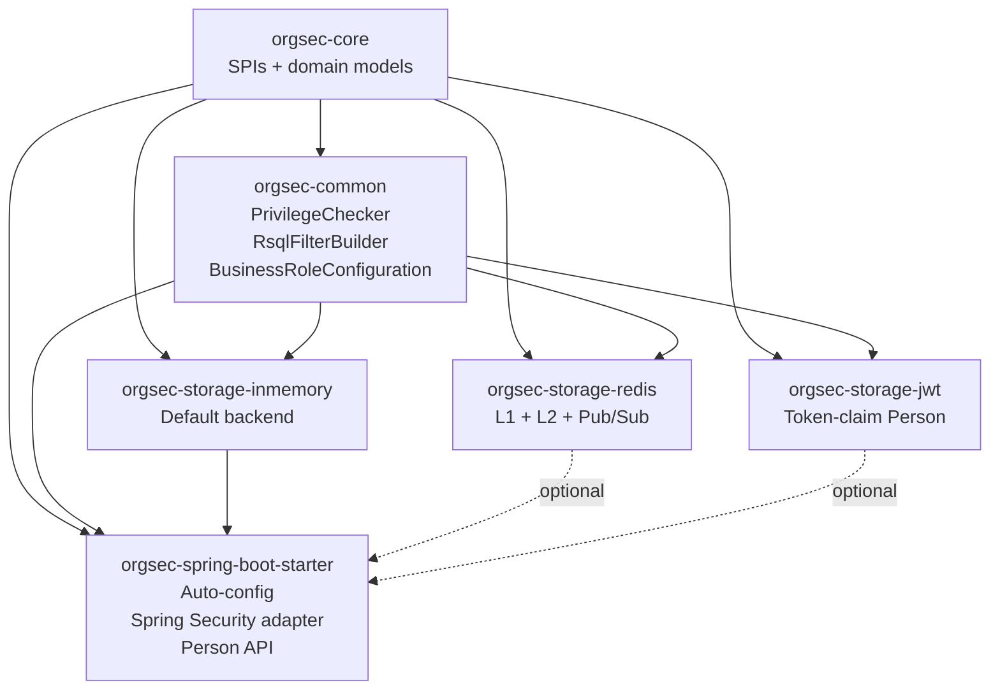
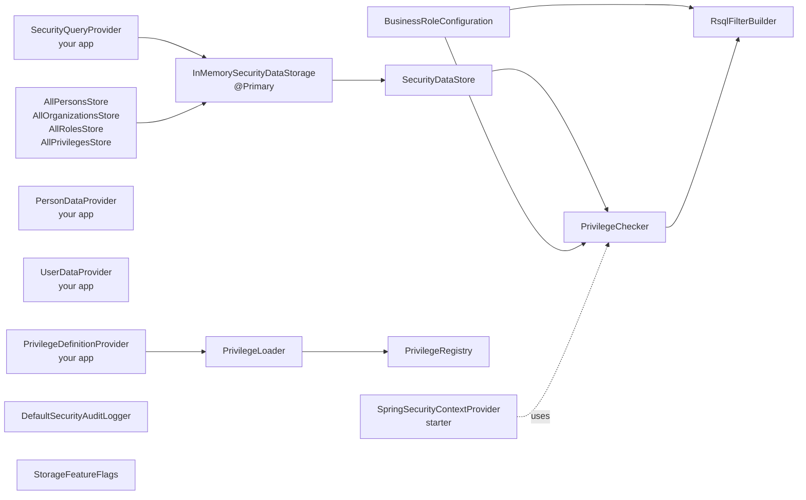

# Architecture Overview

This page is the architecture reference for advanced users and contributors. It covers how the modules layer, how the beans wire at startup, what runs on which thread, and where the natural extension points are. The audience is someone who has read [Core Concepts](../guide/03-core-concepts.md) and now wants to know *why* OrgSec is shaped the way it is.

## Module layering

OrgSec is a Maven multi-module project. Six modules, three layers, no cycles.



Three rules govern what depends on what:

1. **`orgsec-core` has zero dependencies on other OrgSec modules.** It declares interfaces, domain models, and exceptions. Anything the rest of the library needs to talk about is defined here.
2. **`orgsec-common` depends only on `orgsec-core`.** It implements the algorithm and SPIs that are storage-agnostic - the privilege evaluator, business-role configuration, the RSQL filter builder.
3. **Storage backends depend on `orgsec-core` and `orgsec-common`.** Each backend is a self-contained implementation of `SecurityDataStorage` plus its own auto-configuration. Backends do not depend on each other.

The starter pulls in `orgsec-storage-inmemory` transitively (the default backend). Redis and JWT are *opt-in* additions to the starter.

Because there are no cycles, the in-memory backend can be used in tests for `orgsec-spring-boot-starter` without dragging in Redis or JWT, the Redis backend can be used in tests for the JWT backend, and so on.

## Bean dependency graph (starter only)

When `orgsec-spring-boot-starter` is on the classpath and you have not added Redis or JWT, the bean graph in your application context looks like this:



A few load-bearing observations:

- **You provide a small set of beans; OrgSec wires the rest.** A minimal in-memory evaluator setup needs `SecurityQueryProvider` and `PrivilegeDefinitionProvider`. Applications that use `PrivilegeSecurityService` or any other current-user authorization flow also provide `PersonDataProvider`, `UserDataProvider`, and (when not using the starter's default Spring Security adapter) a custom `SecurityContextProvider`. JWT-fronted applications can sometimes omit `PersonDataProvider` if the token already carries the OrgSec person claim.
- **The in-memory backend is composed, not subclassed.** `InMemorySecurityDataStorage` aggregates four `Store` instances and four `Loader` instances. Each store is a small, thread-safe data holder; each loader produces domain models from `SecurityQueryProvider` tuples.
- **`SecurityDataStore` is a façade.** It sits between `PrivilegeChecker` and the active `SecurityDataStorage` so the checker does not change when the backend does.

## Boot sequence

Spring Boot's startup orders beans by dependencies. For an OrgSec-backed application the order at the high level is:

1. **`@ConfigurationProperties` binding.** `OrgsecProperties`, `BusinessRoleConfiguration`, `StorageFeatureFlags`, plus Redis / JWT properties if their modules are on the classpath. YAML values are bound into the property classes.
2. **Provider beans.** `SecurityContextProvider` (default `SpringSecurityContextProvider` when Spring Security is on the classpath), `SecurityQueryProvider` and `PrivilegeDefinitionProvider` (always required by the in-memory backend), and - when the application uses the current-user authorization flow - `PersonDataProvider` and `UserDataProvider`. Beans your application supplies come up here too, before storage, because storage often needs them.
3. **Stores and loaders.** `AllPersonsStore`, `AllOrganizationsStore`, `AllRolesStore`, `AllPrivilegesStore`, plus the matching loaders. Empty caches at this point.
4. **`SecurityDataStorage` activation.** The active backend's `@Primary` bean is created. If Redis or JWT are configured, they win over in-memory; otherwise in-memory is `@Primary`.
5. **`PrivilegeRegistry` and `PrivilegeLoader`.** The registry is empty; the loader is ready to populate it.
6. **`@PostConstruct` on `BusinessRoleConfiguration`.** Initializes business-role definitions from configured providers and applies YAML overrides.
7. **`@PostConstruct` on application's `PrivilegeDefinitionProvider`.** Calls `PrivilegeLoader.initializePrivileges(this)`. The registry now contains every privilege your application defined.
8. **`SecurityDataStorage.initialize()` - backend-specific behavior:**
    - **In-memory.** Calls every loader (`PersonLoader.loadAll(...)`, `OrganizationLoader`, `RoleLoader`, `PrivilegeLoader`) which run your `SecurityQueryProvider` and populate the four stores. After this call, `isReady()` returns `true` *and* the cache holds your data.
    - **Redis.** Wires `CacheWarmer` batch-store callbacks against the L1 / L2 update methods, runs `cacheWarmer.warmup()` if `preload.enabled: true`, and sets `ready=true`. **Reading from `SecurityQueryProvider` only happens if the application has registered `CacheWarmer` data loaders** (`setPersonLoader`, `setOrganizationLoader`, `setRoleLoader`); otherwise the warmup logs "Loader or store not configured, skipping warmup" and the cache starts empty. Subsequent reads on an empty cache return `null` until the application populates entries through `updateXxx` or `notifyXxxChanged` (followed by the application's own `update`).
    - **JWT.** `initialize()` is effectively a no-op; the JWT backend is per-request and has no cache to populate at startup. The fail-fast on a missing `JwtDecoder` happens earlier, in `JwtStorageAutoConfiguration`'s bean creation (step 9 below).
9. **JwtDecoder fail-fast (when applicable).** If `jwt-enabled: true` and no `JwtDecoder` bean is present, `JwtStorageAutoConfiguration` throws `IllegalStateException` and aborts startup. This happens during bean creation, not during `initialize()`.
10. **Application's filter chain registers.** `oauth2ResourceServer`, `orgsecApiSecurityFilterChain`, your own `SecurityFilterChain`. OrgSec's chain has order `BASIC_AUTH_ORDER - 50` so it runs *before* the typical default chain.
11. **`ApplicationContext` is fully refreshed.** First HTTP request can now arrive.

A failure in steps 6 / 7 / 8 / 9 aborts startup with a clear message. The Redis warmup inside step 8 is logged but non-fatal - the application is up, just with cold caches.

## Threading model

OrgSec's runtime threading is conservative.

| Operation                         | Thread                                                  | Notes                                                    |
| --------------------------------- | ------------------------------------------------------- | -------------------------------------------------------- |
| Privilege evaluation              | Caller's request thread                                 | No background work; everything synchronous.              |
| In-memory cache reads             | Caller's request thread                                 | `ConcurrentHashMap` lookup; defensive copy.              |
| In-memory cache writes (notify)   | Caller's request thread                                 | Acquires `ReentrantReadWriteLock` write lock.            |
| Redis L1 reads / writes           | Caller's request thread                                 | `LinkedHashMap` access-order, synchronized.              |
| Redis L2 reads / writes           | Caller's request thread (Lettuce sync ops)              | Routed through Resilience4j circuit breaker.             |
| Redis Pub/Sub publish             | Caller's request thread (or async if `invalidation.async: true`) | Async uses a small dedicated executor.    |
| Redis Pub/Sub receive             | Lettuce subscriber thread                               | Drops L1 entries on receipt; minimal work.               |
| Cache preload (eager)             | Spring boot startup thread (blocks `ApplicationContext`)| Runs once; long if dataset is large.                     |
| Cache preload (progressive)       | Spring `TaskExecutor` (one thread per type)             | Releases startup; cache fills incrementally.             |
| Cache preload (async)             | Spring `TaskExecutor`                                   | Detaches from startup entirely.                          |
| JWT parsing                       | Caller's request thread                                 | Cached per-request via `JwtTokenContextHolder`.          |

There is **no** OrgSec-managed scheduled thread, no daemon, no separate thread pool that the application has to worry about. Resilience4j has its own scheduler for circuit-breaker state transitions; that is the only background work outside the request and Lettuce threads.

## Extension points

OrgSec is designed to be extended in four places. Each is a Spring bean type with `@ConditionalOnMissingBean` so your override wins automatically.

| Extension point                | Default impl                                               | Override when                                                |
| ------------------------------ | ---------------------------------------------------------- | ------------------------------------------------------------ |
| `SecurityContextProvider`      | `SpringSecurityContextProvider` (in starter)               | You authenticate without Spring Security                     |
| `SecurityAuditLogger`          | `DefaultSecurityAuditLogger` (SLF4J + MDC)                 | You want events in a SIEM, Kafka, dedicated DB table         |
| `SecurityDataStorage`          | `InMemorySecurityDataStorage` (or Redis / JWT)             | You implement a fourth backend (MongoDB, JDBC, ...)          |
| `PrivilegeRegistry`            | A simple `Map`-backed implementation                       | You need event-driven privilege definition (very rare)       |

Beyond these, the SPIs you implement on the application side are domain-specific and have no defaults - they are how OrgSec talks to your application. A minimal in-memory evaluator setup requires `PrivilegeDefinitionProvider` and `SecurityQueryProvider`. Applications that use `PrivilegeSecurityService` or current-user authorization flows additionally provide `PersonDataProvider` and `UserDataProvider`. JWT-fronted applications may omit `PersonDataProvider` when the token already carries the OrgSec person claim.

## Storage SPI: minimum viable backend

A new storage backend implements the methods on `SecurityDataStorage`. The interface provides default no-op implementations for the notify hooks and the snapshot APIs, so a minimum viable backend is:

```java
public class MyBackend implements SecurityDataStorage {
    @Override public PersonDef getPerson(Long personId) { ... }
    @Override public OrganizationDef getOrganization(Long orgId) { ... }
    @Override public RoleDef getPartyRole(Long roleId) { ... }
    @Override public RoleDef getPositionRole(Long roleId) { ... }
    @Override public PrivilegeDef getPrivilege(String identifier) { ... }
    @Override public void initialize() { ... }
    @Override public void refresh() { ... }
    @Override public boolean isReady() { return ready; }
}
```

The notify hooks (`notifyPersonChanged`, `notifyOrganizationChanged`, ...) are optional but strongly recommended - without them, the cache cannot be invalidated incrementally, and only `refresh()` (full reload) keeps it correct.

For the contract details, the source is the authoritative reference: [`SecurityDataStorage.java`](https://github.com/Nomendi6/orgsec/blob/main/orgsec-core/src/main/java/com/nomendi6/orgsec/storage/SecurityDataStorage.java). The full implementation walkthrough is in [Cookbook / Custom storage backend](../cookbook/06-custom-storage-backend.md).

## Where the design choices come from

A few non-obvious shapes in the architecture and the reason behind each:

- **String-based privilege identifiers** instead of an enum. The library cannot know your application's privilege vocabulary at compile time.
- **`SecurityEnabledEntity` rather than annotations.** A method-based contract (`getSecurityField`) lets one entity advertise different fields under different business roles; an annotation set would force one shape per entity.
- **Pluggable storage rather than one canonical backend.** The same authorization API serves a single-instance monolith and a horizontally-scaled microservice; the only difference is configuration.
- **Cascade evaluation (company -> org -> person)** instead of multiple independent checks. Most real-world authorization rules collapse into "I have this privilege at *some* level"; the cascade encodes that.
- **Defensive copies on reads in the in-memory backend.** Added in 1.0.1 after the security review showed callers could mutate cached objects across requests.
- **JWT decoder fail-fast.** A library that defaults to "still serve requests if validation is broken" is a security regression; the application must opt out, not in.

## Where to go next

- [Architecture / Auto-configuration](./auto-configuration.md) - what Spring Boot wires when.
- [Architecture / Privilege evaluation](./privilege-evaluation.md) - step-by-step `hasRequiredOperation`.
- [Architecture / Cache architecture](./cache-architecture.md) - L1/L2 internals.
- [Cookbook / Custom storage backend](../cookbook/06-custom-storage-backend.md) - implement a fourth backend.
