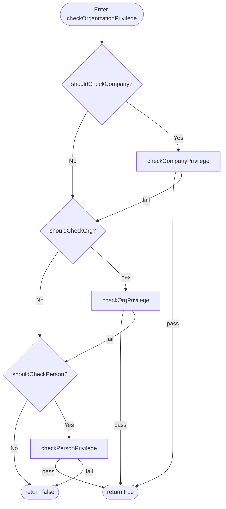

# Privilege Evaluation

This page is the step-by-step reference for OrgSec's privilege evaluator. It walks through `PrivilegeChecker.checkOrganizationPrivilege` - the core method that decides whether a given aggregated privilege grants access - and shows the exact string operations that match hierarchical paths. The audience is contributors and advanced users who want to read the evaluator's behavior off the source rather than off the docs.

The implementation is in [`PrivilegeChecker`](https://github.com/Nomendi6/orgsec/blob/main/orgsec-common/src/main/java/com/nomendi6/orgsec/common/service/PrivilegeChecker.java).

## The two-step API contract

Application code performs a privilege check in two calls:

```java
PrivilegeDef granted = privilegeChecker.getResourcePrivileges(resource, PrivilegeOperation.READ);
boolean ok = privilegeChecker.hasRequiredOperation(granted, PrivilegeOperation.READ);
```

The first call returns the *aggregated* privilege the caller holds for the resource (or `null` if none). The second checks the operation. The two calls are split so that callers can inspect or log `granted` between them.

The deeper `checkOrganizationPrivilege` and `checkBusinessRolePrivilege` methods are used internally and by `RsqlFilterBuilder`. They take richer context (an `OrganizationDef` and a `BusinessRoleContext`) and return the boolean answer in one call.

## Inputs

`checkOrganizationPrivilege` takes:

| Input                            | Source                                                          |
| -------------------------------- | --------------------------------------------------------------- |
| `currentPerson`                  | The caller's `PersonData` (id, name).                           |
| `organizationDef`                | The organization the caller's *position role* is anchored at.   |
| `resourceAggregatedPrivs`        | The aggregated `PrivilegeDef` for the resource.                 |
| `businessRoleCompanyId/Path`     | The *entity's* company id / path under the active business role.|
| `businessRoleOrgId/Path`         | The *entity's* org id / path under the active business role.    |
| `businessRolePersonId`           | The *entity's* person id under the active business role.        |
| `checkCompany / checkOrg / checkPerson` | Booleans derived from `BusinessRoleConfiguration.supportedFields`. |

The `businessRole*` arguments are produced by `extractSecurityContext(entityDTO, businessRoleName)`, which reads `getSecurityField(businessRole, ...)` on the entity for each `SecurityFieldType` the business role declares as supported. Fields the role does not declare return `null`, and the corresponding `check*` flag is `false`.

## Cascade structure

The evaluator runs three checks in order and returns `true` on the first one that matches. The order matters - the first non-`NONE` scope decides the outcome.



The three guard predicates (`shouldCheckCompany`, `shouldCheckOrg`, `shouldCheckPerson`) collapse two questions into one:

- "Is this scope enabled in the business role's `supported-fields`?" (`checkCompany`, `checkOrg`, `checkPerson`).
- "Is the privilege's direction at this scope non-`NONE`?" (`resourceAggregatedPrivs.company`, `.org`, `.person`).

If either answer is no, the scope is skipped and the cascade falls through.

### `shouldCheckCompany`

```java
checkCompany != null && checkCompany
  && businessRoleCompanyId != null
  && businessRoleCompanyPath != null
```

The path null check is the **fail-closed** behavior added in 1.0.1. A hierarchical privilege evaluated against an entity with a null `businessRoleCompanyPath` returns `false` rather than silently accepting the entity.

### `shouldCheckOrg`

```java
checkOrg != null && checkOrg
  && businessRoleOrgId != null
  && businessRoleOrgPath != null
  && (resourceAggregatedPrivs.company == NONE || !checkCompany)
```

The last clause is the cascade fall-through: org checks only run if the company check is genuinely disabled (either the privilege has `company == NONE`, or the business role does not support the company scope).

### `shouldCheckPerson`

```java
checkPerson != null && checkPerson
  && businessRolePersonId != null
  && (resourceAggregatedPrivs.company == NONE || !checkCompany)
  && (resourceAggregatedPrivs.org == NONE || !checkOrg)
```

Same pattern, fallen through both higher scopes.

## Direction matching

Each scope has its own match function. They all reduce to string operations on path strings.

### Company scope - `checkCompanyPrivilege`

| `company` direction | Match condition                                                  |
| ------------------- | ---------------------------------------------------------------- |
| `EXACT`             | `organizationDef.companyId.equals(businessRoleCompanyId)`        |
| `HIERARCHY_DOWN`    | `businessRoleCompanyPath.startsWith(organizationDef.companyParentPath)` |
| `HIERARCHY_UP`      | `businessRoleCompanyPath.endsWith(organizationDef.companyParentPath)` |
| `NONE` / other      | `false`                                                          |

A note on parameter names before reading the table: `businessRoleCompanyPath` is the **entity's** path (read out of the entity through `extractSecurityContext`), while `organizationDef.companyParentPath` is the **caller's** company-parent-path (the org the caller's position role is anchored at). The naming is unintuitive but consistent with how `extractSecurityContext` populates the `BusinessRoleContext`. With those names in mind:

- For `HIERARCHY_DOWN`: `entity.companyPath.startsWith(caller.companyParentPath)`. The caller's company-parent-path is a prefix of the entity's path - meaning the **entity sits at or below the caller** in the company hierarchy. That matches the intent of `_COMPHD_R` ("read everything in my company sub-tree").
- For `HIERARCHY_UP`: `entity.companyPath.endsWith(caller.companyParentPath)`. The caller's path appears at the end of the entity's path. This encodes "caller is an ancestor of the entity" using `endsWith` rather than the more usual `startsWith` - an asymmetry with the org-scope convention. Custom backends should preserve the operations as written; do not reorder the operands when porting.

### Org scope - `checkOrgPrivilege`

| `org` direction     | Match condition                                                  |
| ------------------- | ---------------------------------------------------------------- |
| `EXACT`             | `organizationDef.organizationId.equals(businessRoleOrgId)`       |
| `HIERARCHY_DOWN`    | `businessRoleOrgPath.startsWith(organizationDef.parentPath)`     |
| `HIERARCHY_UP`      | `organizationDef.parentPath.startsWith(businessRoleOrgPath)`     |
| `NONE` / other      | `false`                                                          |

For org scope, the operand convention is the same as for company on `HIERARCHY_DOWN` (`businessRoleOrgPath.startsWith(organizationDef.parentPath)` - the entity's org path begins with the caller's org-parent-path, i.e. the entity sits at or below the caller in the org tree). For `HIERARCHY_UP` the org-scope test is `organizationDef.parentPath.startsWith(businessRoleOrgPath)` - the **caller's** org-parent-path begins with the **entity's** org path, meaning the caller is at or below the entity. Encoded that way, the relation reads "the entity is an ancestor of the caller," which is the inverse of the down case as expected for `HIERARCHY_UP`. The operand order differs from company-scope `HIERARCHY_UP` (which uses `endsWith` rather than reversed `startsWith`); custom backends should preserve the operations as written.

### Person scope - `checkPersonPrivilege`

```java
if (resourceAggregatedPrivs.person) {
    return currentPerson.getId().equals(businessRolePersonId);
}
return false;
```

No path comparison - just an id equality.

## Worked example 1: `_COMPHD_R` allows access to a descendant company

This is a non-canonical path example used only to show the company-scope string comparison. The onboarding example uses Acme / EU Region / Shop-22 paths.

Setup:

- Caller `Alice` holds position role `REGION_MANAGER` at org `O22`. The role grants `DOCUMENT_COMPHD_R`.
- `O22.companyParentPath = "|1|"` (the caller's company anchor).
- Document `D-A` is owned in company `5` with `companyParentPath = "|1|5|"` (a descendant of `|1|`).
- Active business role on the entity: `owner`, supports `[COMPANY, COMPANY_PATH, ...]`.

Trace:

1. `extractSecurityContext` reads from the document: `businessRoleCompanyPath = "|1|5|"` (and the matching `companyId`).
2. `shouldCheckCompany` is `true` (path non-null, role supports COMPANY, `company == HIERARCHY_DOWN`).
3. `checkCompanyPrivilege` runs:
   - test: `"|1|5|".startsWith("|1|")`
   - result: `true`.
4. `checkOrganizationPrivilege` returns `true`. **Allowed.**

## Worked example 2: `_COMPHD_R` denies access to an unrelated company

Setup:

- Caller `Alice` and her grant identical to Worked example 1.
- Document `D-B` is owned in company `7` with `companyParentPath = "|7|"` (no relation to the caller's company `|1|`).

Trace:

1. `extractSecurityContext` reads `businessRoleCompanyPath = "|7|"`.
2. `shouldCheckCompany` is `true`.
3. `checkCompanyPrivilege` runs:
   - test: `"|7|".startsWith("|1|")`
   - result: `false`.
4. The cascade falls through to org / person checks, both of which are not in the privilege (`org == NONE`, `person == false`), so the cascade does not match.
5. `checkOrganizationPrivilege` returns `false`. **Denied.**

The two examples differ only in the entity's company path. The implementation is one `String.startsWith` call away from being right or wrong - this is why the path-denormalization and validation rules in [Usage / Security-enabled entity](../usage/01-security-enabled-entity.md) matter.

## Worked example 3: external auditor with `_ALL` privilege

Setup:

- Caller: `Bob`, position role `AUDITOR` at any organization. The role grants `DOCUMENT_ALL_R`.
- Document: any document anywhere.

Trace:

1. The aggregated `PrivilegeDef` has `all = true`.
2. `getResourcePrivileges` returns this `PrivilegeDef`.
3. `hasRequiredOperation(privilege, READ)` confirms the operation matches.
4. The cascade evaluator (`checkOrganizationPrivilege`) is normally still called downstream - but the `_ALL` shortcut also factors in earlier paths (such as `RsqlFilterBuilder`, which short-circuits on `__ORGSEC_ALL_GRANT__`).

The cascade itself does not have a special case for `all`; any direction set to `EXACT` / `HIERARCHY_DOWN` / `HIERARCHY_UP` would be matched the same way. The `all = true` flag is checked by callers (filter builder, certain wrapper paths) to skip the cascade entirely.

## Worked example 4: person-scope grant

Setup:

- Caller: `Carol`, `personId=42`. Holds position role `EMPLOYEE` at any organization. The role grants `DOCUMENT_EMP_W`.
- Document: owned by `personId=42` (the entity's `PERSON` field equals `42`).
- Document: owned by `personId=99` (a different person).

Trace:

1. `_EMP_W` produces `PrivilegeDef(company=NONE, org=NONE, person=true, op=WRITE)`.
2. `shouldCheckCompany` = false (privilege has `company == NONE`).
3. `shouldCheckOrg` = false (privilege has `org == NONE`).
4. `shouldCheckPerson` = true.
5. For the document owned by `42`: `currentPerson.getId().equals(businessRolePersonId)` -> `42.equals(42)` -> `true`. **Allowed.**
6. For the document owned by `99`: `42.equals(99)` -> `false`. **Denied.**

## Aggregation across position roles

A user often holds several position roles, each contributing privileges. The evaluator does not look at the position roles individually - it works on the **aggregated** `PrivilegeDef` produced by walking each position role's privileges and folding them with `PrivilegeDef.add`. The aggregation rules are documented in [Privilege Model Reference - Aggregation rules](../reference/privilege-model.md#aggregation-rules).

For evaluation, the only thing that matters is the final aggregated `PrivilegeDef`. Two position roles granting `_COMP_R` and `_COMPHD_R` aggregate to `_COMPHD_R`; the cascade then runs once.

## Where to go next

- [Reference / Privilege model](../reference/privilege-model.md) - truth tables and aggregation.
- [Privileges](../usage/05-privileges.md) - the narrative.
- [Architecture / Cache architecture](./cache-architecture.md) - how cached `PersonDef` / `OrganizationDef` instances reach the evaluator.
- [Usage / Security-enabled entity](../usage/01-security-enabled-entity.md) - how the entity exposes the fields the evaluator reads.
