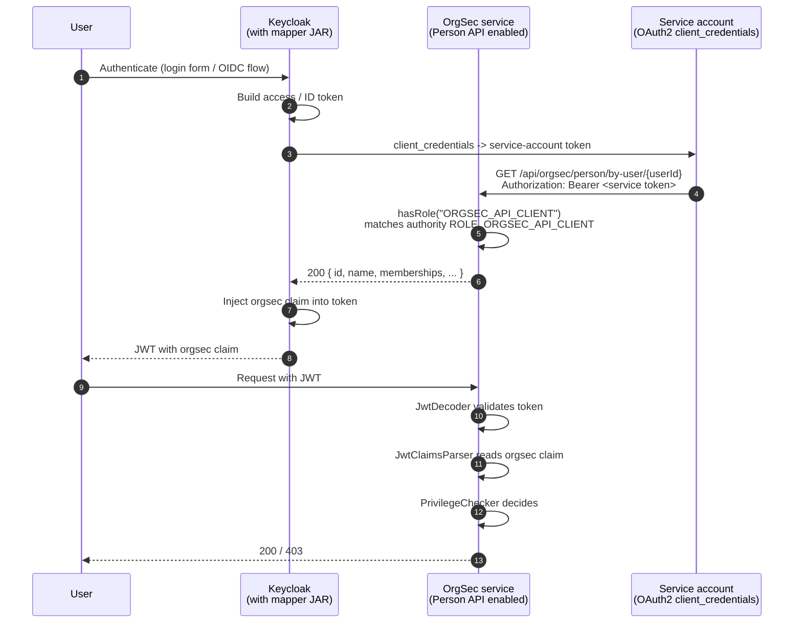

# Keycloak Mapper

This is the full integration recipe for the OrgSec Keycloak protocol mapper - the custom Keycloak SPI that injects an `orgsec` claim into JWTs so OrgSec's JWT backend can read them statelessly.

> **Status of the mapper repository.** The mapper is being prepared for public release at [`Nomendi6/orgsec-keycloak-mapper`](https://github.com/Nomendi6/orgsec-keycloak-mapper). Until that repository is public, the URL above will return `404` - the build / deployment instructions below are provided so you can follow them once the repository is published, or so you can adapt them for an internal fork. The Person API contract, the JWT claim format, and the application-side configuration on this page are stable and apply regardless of where the mapper JAR comes from.

This page walks through building it, deploying it to Keycloak, configuring the realm, and verifying the integration end to end.

## Architecture overview



The mapper is **a piece of code that runs inside Keycloak** every time Keycloak issues a token. It calls back into your OrgSec service through the Person API (`GET /api/orgsec/person/by-user/{userId}`), takes the JSON, and writes it as a single claim into the token. From the application's perspective the token is then self-contained: no shared session store, no extra database round-trip per request.

## What the mapper does

Keycloak's [Protocol Mapper SPI](https://www.keycloak.org/docs/latest/server_development/#_protocol_mappers) lets you customize what goes into the issued tokens. Many built-in mappers handle simple cases (a user attribute, a group name, a role list). OrgSec needs a richer structure - a `person` object plus a `memberships` array, each with `pathId`, `companyId`, and `positionRoleIds`. A custom mapper is the right tool: it has full access to the Keycloak session and can produce arbitrary JSON.

`OrgSecProtocolMapper` implements `OIDCAccessTokenMapper` and `OIDCIDTokenMapper`. On every token issuance it:

1. Reads the user id from the Keycloak session.
2. Calls the configured Person API URL with the chosen auth scheme (bearer token / API key / HTTP basic).
3. Parses the response into a small DTO and constructs the `orgsec` claim through `ClaimsBuilder`.
4. Attaches the claim to the access token (and to the ID token, if so configured).

If the Person API call fails, the mapper logs and leaves the claim out - the token is still issued. Your application then sees a request with no `orgsec` claim and treats it as unauthorized.

## Prerequisites

- **Keycloak**: 26.x. The mapper compiles against `26.2.3`; minor versions within the 26.x line are typically compatible.
- **Java**: 17 (matches Keycloak 26's runtime).
- **Maven**: 3.6+ for building the mapper.
- **Docker**: for running Keycloak locally with the mapper deployed (optional but easy).
- An **OrgSec-backed service** with `orgsec.api.person.enabled: true` and a service-account principal that carries `ROLE_ORGSEC_API_CLIENT`.

## OrgSec server side: provision the Person API

The Person API is off by default. Turn it on in your service's `application.yml`:

```yaml
orgsec:
  api:
    person:
      enabled: true
      required-role: ORGSEC_API_CLIENT      # default value; the principal must carry ROLE_ORGSEC_API_CLIENT
```

The starter wires a dedicated filter chain (`orgsecApiSecurityFilterChain`) that protects `/api/orgsec/person/**` with `hasRole(requiredRole)`. Spring Security's `hasRole(...)` *prepends* `ROLE_` at evaluation time, so the principal that calls the API must hold the authority `ROLE_ORGSEC_API_CLIENT`. Configure that in Keycloak:

- Create a Keycloak **realm role** named `ORGSEC_API_CLIENT`.
- Create a **client** for the mapper-callback path (e.g., `orgsec-mapper-callback`) with **service accounts enabled** and **client_credentials** flow.
- Assign the realm role `ORGSEC_API_CLIENT` to that client's service account.
- Make sure your application's `JwtAuthenticationConverter` produces `ROLE_*` authorities. Spring Security's resource-server stack does **not** ship a "Keycloak adapter" out of the box; configure a custom `Converter<Jwt, Collection<GrantedAuthority>>` (typically reading `realm_access.roles` and prefixing with `ROLE_`) and register it through `oauth2ResourceServer().jwt().jwtAuthenticationConverter(...)`. Without this step a Keycloak realm role like `ORGSEC_API_CLIENT` arrives as the literal authority `ORGSEC_API_CLIENT`, which `hasRole("ORGSEC_API_CLIENT")` will *not* match.

In production, also restrict the endpoint at the network layer - only Keycloak should reach it.

## Person API contract

The mapper expects this exact endpoint:

```
GET {baseUrl}/api/orgsec/person/by-user/{keycloakUserId}
Authorization: Bearer <service-account token>      (or API-key / Basic, per mapper config)
```

Successful response (HTTP 200):

```json
{
  "id": 42,
  "name": "Alice Smith",
  "relatedUserId": "kc-user-uuid-here",
  "relatedUserLogin": "alice@example.com",
  "defaultCompanyId": 1,
  "defaultOrgunitId": 22,
  "memberships": [
    {
      "organizationId": 22,
      "companyId": 1,
      "pathId": "|1|10|22|",
      "positionRoleIds": [101, 205]
    }
  ]
}
```

Error responses:

- `404 Not Found` - no person row exists for the given Keycloak user. The mapper logs and skips the claim.
- `401 / 403` - the service account does not have `ROLE_ORGSEC_API_CLIENT`. Fix the realm-role assignment.
- `500` - the application errored. Check the application logs.

The contract is implemented by `PersonApiController` (`/api/orgsec/person/by-user/{userId}` and `/api/orgsec/person/{personId}`) in `orgsec-spring-boot-starter`.

## JWT claim format

The mapper produces a single root claim. The default name is `orgsec`; configure the `claim.name` property if you need a different name (your application's `orgsec.storage.jwt.claim-name` must match).

```json
{
  "orgsec": {
    "version": "1.0",
    "person": {
      "id": 42,
      "name": "Alice Smith",
      "relatedUserId": "kc-user-uuid-here",
      "relatedUserLogin": "alice@example.com",
      "defaultCompanyId": 1,
      "defaultOrgunitId": 22
    },
    "memberships": [
      {
        "organizationId": 22,
        "companyId": 1,
        "pathId": "|1|10|22|",
        "positionRoleIds": [101, 205]
      }
    ]
  }
}
```

This is the same shape `JwtClaimsParser` consumes - see [Storage / JWT](../storage/04-jwt.md#the-orgsec-claim).

## Building the mapper JAR

Clone the mapper repository:

```bash
git clone https://github.com/Nomendi6/orgsec-keycloak-mapper.git
cd orgsec-keycloak-mapper
mvn -DskipTests package
```

The output is a self-contained JAR at `target/orgsec-keycloak-mapper-<version>.jar` (the `maven-shade-plugin` bundles the dependencies that are not `provided` by Keycloak).

## Deploying to Keycloak

Two common deployment paths.

### A. Standalone Keycloak

Copy the JAR into Keycloak's `providers/` directory and rebuild:

```bash
cp target/orgsec-keycloak-mapper-*.jar $KEYCLOAK_HOME/providers/
$KEYCLOAK_HOME/bin/kc.sh build
$KEYCLOAK_HOME/bin/kc.sh start                # or your usual start command
```

`kc.sh build` is required - Keycloak compiles its provider list at build time, so a new JAR is not visible until you run it.

### B. Keycloak in Docker

Mount the JAR into the container's `providers/` directory and let the entrypoint run `kc.sh build`:

```yaml
services:
  keycloak:
    image: quay.io/keycloak/keycloak:26.2.3
    command: start-dev
    environment:
      KC_BOOTSTRAP_ADMIN_USERNAME: admin
      KC_BOOTSTRAP_ADMIN_PASSWORD: admin
    ports:
      - "8080:8080"
    volumes:
      - ./mapper-jars/orgsec-keycloak-mapper.jar:/opt/keycloak/providers/orgsec-keycloak-mapper.jar:ro
```

`start-dev` rebuilds the provider list on startup; for `start` (production mode) you run `kc.sh build` first.

After Keycloak boots, log in to the admin UI and confirm: **Realm settings -> Client scopes -> (any scope) -> Mappers -> Add mapper -> By configuration**. The list should include "OrgSec Person Mapper".

## Configuring the mapper in a realm

1. Open your realm and navigate to **Clients -> (your application client) -> Client scopes -> (the dedicated client scope, often `roles`) -> Mappers**, or to **Realm settings -> Client scopes -> (scope) -> Mappers**.
2. Click **Add mapper -> By configuration** and pick **OrgSec Person Mapper**.
3. Fill in:

| Field                   | Example                                                  | Notes                                                |
| ----------------------- | -------------------------------------------------------- | ---------------------------------------------------- |
| Name                    | `orgsec-person`                                          | Display name in Keycloak                             |
| API URL                 | `http://orgsec-app:8080/api/orgsec/person/by-user`       | Mapper appends `/{userId}` automatically             |
| Auth Type               | `bearer` / `api-key` / `basic`                           | See the auth-type discussion below before choosing   |
| Auth Token              | (depends on auth type - see below)                 |                                                      |
| Timeout (seconds)       | `5`                                                      | Per-request HTTP timeout                             |
| Claim Name              | `orgsec`                                                 | Match `orgsec.storage.jwt.claim-name`                |
| Include Memberships     | `true`                                                   | Set `false` to omit `memberships` array              |
| Add to ID token         | `true`                                                   | Standard OIDC mapper toggle                          |
| Add to access token     | `true`                                                   |                                                      |

Save the mapper.

### Choosing the auth type

The mapper supports three auth schemes for the call back into your service. The right choice depends on whether you can refresh credentials inside Keycloak.

| Auth type | What goes in `Auth Token`                              | Strengths                                            | Limitations                                                                       |
| --------- | ------------------------------------------------------ | ---------------------------------------------------- | --------------------------------------------------------------------------------- |
| `bearer`  | A pre-issued OAuth2 access token for the mapper's service account | Standard OAuth2; the application validates the token through its existing `JwtDecoder` | **The token expires.** The mapper does not refresh it; once it expires, every login fails until you paste a new one. Suitable only for environments where you accept manual token rotation. |
| `api-key` | A long-lived shared secret your application validates  | Simple to rotate through your secret-management system; the application controls the validation policy | Requires the application to implement an API-key check on the Person API filter chain (in addition to or instead of the default `hasRole(...)`). |
| `basic`   | `username:password` of a service account               | Easy to set up                                       | Same lifetime issue as `bearer` if the password expires; weaker than mTLS         |

**Production guidance.** None of the three is "the secure default" out of the box. For a production deployment, treat the choice as part of the security review:

- If you keep `bearer`, document the rotation procedure and treat the configured token as a high-value secret (Keycloak's mapper config is encrypted at rest by Keycloak; `setSecret(true)` is set on the field). Plan for token expiry - a 24-hour token requires daily rotation.
- If you choose `api-key`, route the credential through your existing secret-management infrastructure and add a custom `SecurityFilterChain` (or replace `orgsecApiSecurityFilterChain`) that validates the header.
- If your environment supports it, **prefer mTLS at the network layer** in addition to one of the auth schemes above. The mapper does not enforce mTLS; your reverse proxy or service mesh does.

The mapper does not currently re-issue OAuth2 tokens through `client_credentials` on its own. If your operating model requires self-rotating credentials inside Keycloak, that capability is on the mapper roadmap; until then, treat the auth-type choice as the trade-off described above.

## Verifying the integration

1. Authenticate a real user against Keycloak using the standard OIDC flow:

   ```bash
   ACCESS_TOKEN=$(curl -s -X POST \
       "http://localhost:8080/realms/myrealm/protocol/openid-connect/token" \
       -d "grant_type=password" \
       -d "client_id=my-client" \
       -d "username=alice" \
       -d "password=alice-password" \
       | jq -r .access_token)
   ```

2. Decode the JWT payload (any base64-decoder works; below uses `jq`):

   ```bash
   echo "$ACCESS_TOKEN" | cut -d '.' -f 2 | base64 -d 2>/dev/null | jq .
   ```

   Look for the `orgsec` claim in the output. If it is not there, the mapper either skipped (Person API failure) or is not attached to the right client scope.

3. Call your protected endpoint:

   ```bash
   curl -s -H "Authorization: Bearer $ACCESS_TOKEN" \
       http://localhost:8080/api/documents/1
   ```

   With OrgSec's JWT backend wired (see below), the request is authorized using the membership data in the token.

## Application side: consuming the token

Configure your service to validate the token through Spring Security and to use the JWT storage backend:

```yaml
spring:
  security:
    oauth2:
      resourceserver:
        jwt:
          issuer-uri: http://keycloak:8080/realms/myrealm

orgsec:
  storage:
    primary: jwt
    features:
      jwt-enabled: true
      memory-enabled: true
      hybrid-mode-enabled: true
    data-sources:
      person: jwt
      organization: primary
      role: primary
      privilege: memory
    jwt:
      claim-name: orgsec                      # match the mapper's "Claim Name"
```

The full JWT-side reference is in [Storage / JWT](../storage/04-jwt.md). The application configuration of the Person API itself is covered in [Configuration - Person API](../guide/04-configuration.md#top-level-toggles).

## Troubleshooting

### The token does not contain an `orgsec` claim

- Confirm the mapper is attached to the active client scope, not just defined.
- Confirm the client uses the scope (Clients -> client -> Client scopes -> Default / Optional).
- Check Keycloak's server log for `OrgSecProtocolMapper` warnings - HTTP failures from the Person API are logged here.

### The Person API returns 401 or 403

- The mapper's service-account principal does not carry `ROLE_ORGSEC_API_CLIENT`.
- Spring Security's authority converter does not prepend `ROLE_` - verify your converter or set `required-role` to a value the converter already produces.

### The Person API returns 404

- No person row exists for the given Keycloak user id. The mapper passes the Keycloak `user.getId()` (a UUID); your application must store that id and find a person by it. See `PersonDataProvider.findByUserId(...)`.

### Token validation fails on the application side

- `iss` mismatch - `spring.security.oauth2.resourceserver.jwt.issuer-uri` must point at Keycloak's realm URL.
- `aud` mismatch - if you require audience validation, ensure the mapper or another mapper writes the expected audience.
- Clock skew - large JVM clock drift makes `nbf` / `exp` checks fail.

### Mapper changes do not take effect

- For `kc.sh start`, run `kc.sh build` after replacing the JAR.
- For Docker `start-dev`, restart the container.

## Where to go next

- [Storage / JWT](../storage/04-jwt.md) - the application-side JWT backend reference.
- [Examples / JWT-Keycloak app](../examples/jwt-keycloak-app.md) - runnable application that consumes the claim.
- [Configuration - Person API](../guide/04-configuration.md#top-level-toggles) - the YAML knobs.
- [Operations / Production checklist](../operations/production-checklist.md) - mandatory items for a Person-API-enabled deployment.
