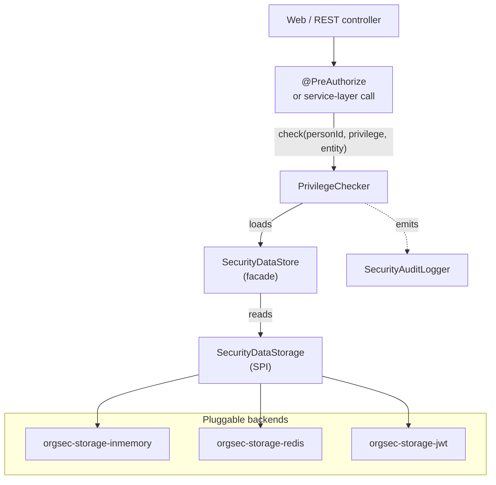

# Introduction

This page is for engineers and tech leads who are evaluating OrgSec for a Spring Boot project. It explains the problem OrgSec was built to solve, what it gives you, when it is - and is not - the right tool, and how it relates to alternatives.

If terms such as RBAC, ABAC, ReBAC, PDP, PEP, ACL, or RSQL are new to you, keep the [Glossary](../reference/glossary.md) open while reading this page.

## The problem

Many real-world systems express access control as variations of the same sentence:

> "User U may perform operation O on resource R, but only if R belongs to organization X - or to one of X's child organizations - and only if U holds the right business role for that organization."

A few examples:

- A SaaS document platform where a *manager* sees every document under their organizational sub-tree, while an *external contractor* sees only the documents on which they are explicitly named.
- A telecommunications back office where a *retail-shop employee* may price a contract for the customer in front of them, but cannot read another shop's contracts - while a *regional manager* can.
- A municipal service portal where a *citizen* sees their own filings, a *case worker* sees filings handled by their department, and a *department head* sees everything in the department's organizational sub-tree.

These cases share three properties:

1. **Resources are owned by an organization in a hierarchy**, not by a single tenant. "Tenant" is too coarse.
2. **The same user has different rights in different organizations** - the same physical person is a *manager* in one org, a *customer* in another, and a *contractor* in a third.
3. **Access decisions cascade**: a privilege defined at company level subsumes a privilege at organization level, which in turn subsumes a privilege at the personal level.

Spring Security on its own does not model any of this. Method-level security (`@PreAuthorize`) gives you a hook to evaluate an expression, but the *content* of that expression - the data model and the cascade rules - you still have to design and implement yourself. Spring Security ACL is an alternative, but it is row-grained and acl-table-centric: it solves "who can do what to *this specific row*" rather than "who has *this category of privilege* across an organizational sub-tree."

OrgSec is the missing layer between *Spring Security as authentication and method protection* and *your domain model with its hierarchy and business roles*. It is deliberately not a generic authorization platform. Its value is that the common enterprise case - organizational hierarchy, per-organization roles, company/org/person cascades, and list filtering - is already modeled and tested.

## Key features

- **A privilege model with three orthogonal axes.** Every privilege has an *operation* (`READ` / `WRITE` / `EXECUTE`), a *direction* per scope (`EXACT` / `HIERARCHY_DOWN` / `HIERARCHY_UP` / `NONE`), and a *cascade* across the company -> org -> person scopes. The model is small enough to fit on a page and rich enough to capture the cases above.
- **String-based privilege identifiers, registered at runtime.** Your application defines its own vocabulary - `DOCUMENT_READ`, `INVOICE_APPROVE`, `CONTRACT_SIGN_HD` - via `PrivilegeDefinitionProvider` beans. OrgSec does not ship a closed enum.
- **Pluggable storage backends.** The same authorization API is served by an in-memory store (single instance), a Redis store with L1+L2 caching and Pub/Sub invalidation (multi-instance), or a JWT store that reads the current user from a token. Hybrid routing - for example *Person* from JWT, *Organization* from Redis - is a configuration choice, not a code change.
- **Spring Boot auto-configuration.** Add the starter, declare your business roles, register your privileges, and the privilege evaluator, security data store, audit logger, and Spring Security adapter are wired automatically.
- **Audit logging hook.** A `SecurityAuditLogger` interface receives privilege checks, configuration changes, and security events. The default implementation logs through SLF4J with MDC keys, so you can route OrgSec events into a dedicated appender.
- **Cache invalidation across instances.** A Redis Pub/Sub channel (`orgsec:invalidation` by default) keeps L1 caches coherent. Your domain code emits `notifyXxxChanged()` calls when authorization-relevant state changes; OrgSec propagates them.
- **RSQL filter integration.** `RsqlFilterBuilder` produces a security-aware filter expression you can push into a Spring Data JPA query, so list endpoints return only the rows the caller is allowed to see - without N+1 authorization checks or post-filtering.
- **Configurable entity-field mapping.** Business roles can define the RSQL selector for each supported security field, so OrgSec works with both relationship-style models (`ownerCompany.id`) and flat-column models (`ownerCompanyId`).
- **Fail-closed by default.** Unknown business roles, missing organizational paths, and unparseable JWTs deny access rather than silently letting requests through. This is enforced by tests after the 1.0.0 security review.

## When to use OrgSec

OrgSec is a good fit when **all** of the following are true:

- Resources are owned by **organizations**, and organizations form a **hierarchy** (tree or DAG with a single canonical path).
- The same user holds **different roles in different organizations**.
- You need to express access decisions in terms of *privileges* and *business roles*, not row-level ACLs.
- List/search endpoints must enforce the same permissions as single-entity checks.
- You build on **Spring Boot 3.5.x** (1.0.x line) or are willing to wait for 2.0.x (Spring Boot 4.x).

It is also a good fit when you have multiple services that share an authorization model: putting the model in OrgSec keeps the rules in one library and lets each service pick the storage backend that suits it.

## Where OrgSec is strongest

OrgSec is usually the better choice when the authorization problem has a stable organizational shape and the main implementation risk is applying the same rule consistently across detail screens, list screens, exports, and background jobs.

| Scenario | Why OrgSec is strong |
| --- | --- |
| **Hierarchical business data** | The privilege model already understands exact organization, descendants, ancestors, company scope, org scope, and person scope. |
| **Different rights per organization** | Business roles are evaluated inside the organization membership, so a person can have different effective privileges in different parts of the tree. |
| **Query-time enforcement** | The same privilege data can produce an RSQL filter for list endpoints, avoiding ad hoc SQL fragments and unsafe post-filtering. |
| **Spring services that should stay local** | Checks run inside the JVM and compose with `@PreAuthorize`, service-layer code, and Spring Data query patterns. |
| **Shared authorization model across services** | The model lives in the library and storage SPI; deployment can choose in-memory, Redis, JWT, or hybrid routing without rewriting checks. |

This is the main difference from many general-purpose policy engines: OrgSec does not just answer `allow` / `deny`; it also helps produce the data-access predicate needed to fetch only authorized rows.

## When OrgSec is overkill

- **Flat, role-only applications.** If the answer to "who can do this?" is one of three or four global roles with no organizational dimension, plain Spring Security with `hasRole(...)` is enough.
- **Single-tenant CRUD apps.** If there are no tenants and no hierarchy, OrgSec is more machinery than you need.
- **General-purpose policy engines.** If you have to evaluate complex policies that mix many domains (security, billing, regulatory) and need a policy language, [Open Policy Agent (OPA)](https://www.openpolicyagent.org/) or a comparable engine is a better fit.
- **Reactive / WebFlux applications.** OrgSec 1.0.x is built around servlet-stack Spring Security. Reactive support is not in the 1.0 line and is not yet committed for 2.0.

## How it compares to alternatives

This table uses common authorization abbreviations. Short version: RBAC is role-based, ABAC is attribute-based, ReBAC is relationship-based, and PDP means the component that makes an authorization decision. The full definitions are in the [Glossary](../reference/glossary.md).

| Approach | What it solves | Where OrgSec is better |
| --- | --- | --- |
| **Spring Security `@PreAuthorize`** | Calls an expression that returns boolean | OrgSec gives you the *data model and evaluator* the expression should call. The two compose; OrgSec ships a `PrivilegeChecker` you invoke from `@PreAuthorize`. |
| **Spring Security ACL** | Per-row ACLs on JDBC tables | ACL is row-grained and write-heavy. OrgSec is privilege-grained over an organizational hierarchy, read-heavy with caching, and better suited to "all rows under this org subtree". |
| **Casbin / jCasbin** | Flexible local authorization model with RBAC/ABAC/ReBAC patterns | Casbin is broader, but OrgSec has the domain-specific pieces already wired: organization path semantics, business-role fields, Spring storage backends, and RSQL filter generation. |
| **Cerbos / OPA / Cedar** | Centralized policy-as-code and external PDP patterns | These are stronger for cross-domain policy governance. OrgSec is stronger when a Spring service needs local, typed, org-aware checks and query filters without designing a policy-to-query bridge. |
| **OpenFGA / SpiceDB** | Relationship graph authorization and resource lookup | ReBAC systems are stronger for complex sharing graphs. OrgSec is simpler when the graph is primarily an organization tree and the output you need is a repository filter. |
| **Hand-rolled `if (user.role == ...)`** | Whatever you need today | OrgSec gives you a reusable model, audit logging, hierarchy semantics, caching, fail-closed behavior, and tests so each endpoint does not invent its own authorization dialect. |

In practice, OrgSec is most often paired with `@PreAuthorize` (for the entry-point check) and Spring Data Specifications (for the list filter), with the ACL approach left aside.

## Architecture at a glance

The application calls the privilege checker; the checker reads from a single facade (`SecurityDataStore`) that fronts the active storage backend; the storage backend is whichever module you have on the classpath plus configuration. Audit events are emitted on every check and can be routed to your logging stack.

For a deeper walkthrough, see [Core Concepts](./03-core-concepts.md) and [Storage Overview](../storage/01-overview.md).

## Status and roadmap

- **OrgSec 1.0.1** - current GA. Targets Spring Boot 3.5.x and Java 17. Includes the security review remediations (fail-closed defaults, Person API protection, JWT validation, Redis TLS) that landed before the public release.
- **OrgSec 2.0.x** - in development. Targets Spring Boot 4.x and Java 21. The privilege model and storage SPI are expected to remain source-compatible, but the configuration namespace and Spring Security integration will change with Spring Security 7. There is no release date yet; the 1.0.x line will continue to receive security fixes for at least six months after 2.0 GA.

For release notes, see the [CHANGELOG](../../CHANGELOG.md). For dependency-version specifics, see the [compatibility table on the documentation home](../index.md#compatibility).

## Next steps

- [Quick Start](./02-quick-start.md) - have a privilege check running in 30 minutes.
- [Core Concepts](./03-core-concepts.md) - the privilege model in depth.
- [Configuration](./04-configuration.md) - every `orgsec.*` property in context.
- [Storage Overview](../storage/01-overview.md) - pick a backend.
