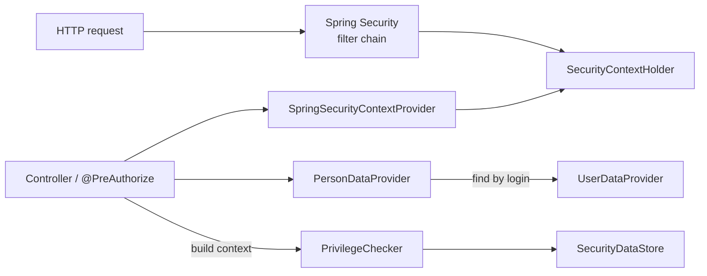

# Spring Security Integration

This page is for engineers wiring OrgSec into a Spring Security-protected application. The starter ships everything you need for the common case (Spring Security on the classpath, the user identity coming from `SecurityContextHolder`), so for many applications "integration" is *adding the dependency and not configuring anything*. This page describes that default, the ways to deviate from it, and the gotchas that come up most often.

## What the starter wires automatically

`OrgsecAutoConfiguration` registers a `SpringSecurityContextProvider` bean **only** when:

- Spring Security is on the classpath (`@ConditionalOnClass(SecurityContextHolder.class)`)
- No `SecurityContextProvider` bean is already declared in your context (`@ConditionalOnMissingBean`)

The provider exposes four methods:

| Method                  | Returns                                                         |
| ----------------------- | --------------------------------------------------------------- |
| `getCurrentUserLogin()` | `Optional<String>` - the authentication name, unless the principal is `"anonymousUser"` (which returns empty) |
| `isAuthenticated()`     | `boolean` - same anonymous filter applied                  |
| `hasRole(role)`         | Streams the authorities and matches both literal and `ROLE_`-prefixed forms |
| `getPrincipal()`        | The `Authentication.getPrincipal()` object                       |

OrgSec uses `getCurrentUserLogin()` to find the user *login* (typically a username). To turn the login into a `PersonDef`, the application provides a `PersonDataProvider` that knows how to map login -> person id (often by querying a `Person` table that stores the related user's login or external user id). The starter does not assume which mapping you need; it just calls the provider you give it.

## The full chain in production



A typical request flow:

1. Spring Security validates the credentials (form login, OAuth2 resource server, ...) and populates `SecurityContextHolder`.
2. The controller (or a service it calls) reads the current user's login through `SecurityContextProvider.getCurrentUserLogin()`.
3. The application maps that login to a `personId` through its `PersonDataProvider` / `UserDataProvider` implementation.
4. OrgSec's `SecurityDataStore.getPerson(personId)` returns the cached `PersonDef` with all memberships.
5. `PrivilegeChecker` evaluates the requested operation.

The mapping in step 3 is application-specific; OrgSec stays out of it.

## Custom `SecurityContextProvider`

If you authenticate users without Spring Security (for example through a custom servlet filter, mTLS, or session tokens you manage yourself), supply a `SecurityContextProvider` bean. The auto-configuration's `@ConditionalOnMissingBean` steps aside.

```java
@Component
public class HeaderBasedContextProvider implements SecurityContextProvider {

    @Override
    public Optional<String> getCurrentUserLogin() {
        HttpServletRequest req = currentRequest();
        return Optional.ofNullable(req).map(r -> r.getHeader("X-Authenticated-User"));
    }

    @Override
    public boolean hasRole(String role) {
        // Look at whichever source carries roles in your setup.
        return false;
    }

    private HttpServletRequest currentRequest() {
        ServletRequestAttributes attrs = (ServletRequestAttributes) RequestContextHolder.getRequestAttributes();
        return attrs == null ? null : attrs.getRequest();
    }
}
```

The `SecurityContextProvider` interface is a `@FunctionalInterface`; the only required method is `getCurrentUserLogin`. Override `hasRole` and `isAuthenticated` if you can answer those more efficiently than the default.

## Using `@PreAuthorize` with `PrivilegeChecker`

The `PrivilegeChecker` bean is callable from SpEL expressions inside `@PreAuthorize`. Expose a small bean that wraps the checker for clarity. The body that builds a `ResourceDef` from the caller's `PersonDef` and the entity is application-specific - OrgSec does not impose an aggregation policy - so the example below leaves it behind a `ResourceAggregator` interface that you implement once for your domain.

The interface is a placeholder: define it in your application package, implement it against your `BusinessRoleDef.resourcesMap` data, and inject it like any other bean.

```java
public interface ResourceAggregator {
    /**
     * Build a ResourceDef carrying the caller's aggregated privileges
     * for the named resource on the supplied entity.
     */
    ResourceDef aggregate(PersonDef person, SecurityEnabledEntity entity, String resourceName);
}
```

```java
@Component("orgsec")
public class OrgsecAuthorization {

    private final PrivilegeChecker checker;
    private final SecurityDataStore store;
    private final PersonDataProvider personDataProvider;
    private final SecurityContextProvider context;
    private final ResourceAggregator resourceAggregator;

    public OrgsecAuthorization(PrivilegeChecker checker,
                               SecurityDataStore store,
                               PersonDataProvider personDataProvider,
                               SecurityContextProvider context,
                               ResourceAggregator resourceAggregator) {
        this.checker = checker;
        this.store = store;
        this.personDataProvider = personDataProvider;
        this.context = context;
        this.resourceAggregator = resourceAggregator;
    }

    public boolean canRead(SecurityEnabledEntity entity, String resourceName) {
        return decide(entity, resourceName, PrivilegeOperation.READ);
    }

    public boolean canWrite(SecurityEnabledEntity entity, String resourceName) {
        return decide(entity, resourceName, PrivilegeOperation.WRITE);
    }

    private boolean decide(SecurityEnabledEntity entity, String resourceName, PrivilegeOperation op) {
        Long personId = context.getCurrentUserLogin()
            .flatMap(personDataProvider::findByRelatedUserLogin)
            .map(PersonData::getId)            // PersonData is a JavaBean with getters
            .orElse(null);
        if (personId == null || entity == null) return false;

        PersonDef person = store.getPerson(personId);
        if (person == null) return false;

        ResourceDef resource = resourceAggregator.aggregate(person, entity, resourceName);
        PrivilegeDef granted = checker.getResourcePrivileges(resource, op);
        return checker.hasRequiredOperation(granted, op);
    }
}
```

`PersonData` is a JavaBean (`getId()`, `getName()`, ...), not a record - do not write `PersonData::id`. `ResourceAggregator` is a placeholder application-side interface; the exact aggregation depends on your privilege scope (per-business-role versus pooled). For the simpler programmatic path that does not need this aggregation step, see the Quick Start's `getResourcePrivileges` example.

Then on a controller:

```java
@RestController
@RequestMapping("/api/documents")
public class DocumentController {

    private final DocumentRepository repo;

    public DocumentController(DocumentRepository repo) {
        this.repo = repo;
    }

    @GetMapping("/{id}")
    @PreAuthorize("@orgsec.canRead(#root.target.findEntity(#id), 'Document')")
    public DocumentDTO read(@PathVariable Long id) {
        return repo.findById(id).map(DocumentDTO::from).orElseThrow(NotFound::new);
    }

    public Document findEntity(Long id) {
        return repo.findById(id).orElseThrow(NotFound::new);
    }
}
```

The `@PreAuthorize` expression is evaluated *before* the controller method body, so the entity must be loadable from the path variables. For list endpoints, prefer `RsqlFilterBuilder` (see [Cookbook / RSQL filtering](../cookbook/03-rsql-filtering.md)) - per-row `@PreAuthorize` does not scale.

## REST endpoint patterns

Three common patterns, in increasing strictness:

1. **Service-layer check.** Inject `PrivilegeChecker` into the service. The controller stays simple; the check happens once the entity is loaded. Easiest to test.
2. **`@PreAuthorize` on the controller method.** Stops the request earlier. Best for write endpoints where loading-then-rejecting is wasteful.
3. **`HandlerInterceptor` or `Filter`.** Centralizes the check. Use only when the routing rules are uniform across many endpoints; per-endpoint nuance is hard to express here.

For list endpoints, none of the above scale - the check has to push into the query. Use `RsqlFilterBuilder` for the list-side path filter and one of patterns 1 / 2 for single-entity endpoints.

## JWT-issued user identity

When tokens carry the user identity (and, with the OrgSec mapper, the membership claim), the integration changes shape:

- `SpringSecurityContextProvider.getCurrentUserLogin()` returns the token's `sub` or `preferred_username` - whatever Spring Security decided is the principal name.
- The application may not need a `PersonDataProvider` at all if the JWT already carries the OrgSec `personId`. For the JWT backend the `PersonDef` is parsed from the token, so the lookup-by-login step disappears.
- If you still want a username-to-person lookup (for example for audit logging), a `PersonDataProvider` is fine to keep.

The full Keycloak setup is in [Cookbook / Keycloak mapper](../cookbook/05-keycloak-mapper.md). The JWT backend's role split is in [Storage / JWT](../storage/04-jwt.md).

## Common gotchas

### `anonymousUser` looks authenticated

When `permitAll()` allows an unauthenticated request through, Spring Security still populates `SecurityContextHolder` with an `Authentication` whose principal is the literal string `"anonymousUser"`. `SpringSecurityContextProvider` filters this out and returns empty - relying on `isAuthenticated()` from the `Authentication` itself would let anonymous requests look authenticated.

If you write your own provider, replicate the filter:

```java
boolean authenticated = auth != null
    && auth.isAuthenticated()
    && !"anonymousUser".equals(auth.getPrincipal());
```

### Authority vs. role

Spring Security `hasRole("X")` matches authority `ROLE_X`; `hasAuthority("X")` matches authority `X`. OrgSec's Person API filter chain uses `hasRole(...)`, so the configured `required-role` value is *prepended* with `ROLE_` at evaluation time. If your IdP emits unprefixed authorities (e.g., raw Keycloak realm roles), either map them to `ROLE_*` (Spring Security has converters for this), set `required-role` to a value your authorities already include, or replace the `orgsecApiSecurityFilterChain` bean.

### CSRF on the Person API

The starter disables CSRF on the OrgSec Person API filter chain (`csrf().disable()`). The endpoint is intended for service-to-service traffic with bearer tokens, where CSRF is not the right defense. If you expose the endpoint to a browser flow, add CSRF back through your own filter chain.

### Session vs. stateless

OrgSec is session-agnostic but works best when the request is stateless (`SessionCreationPolicy.STATELESS`). The Person API filter chain enforces stateless on its own match path; your application's primary filter chain can be whatever you need.

### `@PreAuthorize` with method arguments

SpEL expressions inside `@PreAuthorize` cannot easily access method arguments unless you pass them through. `#paramName` works for parameters; `#root.target.findEntity(#id)` works for helper methods on the controller. Avoid loading the entity twice - cache it in a request-scoped bean or accept that the cost is one extra read.

## Where to go next

- [Cookbook / Defining privileges](../cookbook/01-defining-privileges.md) - shape your privilege set.
- [Cookbook / Securing entities](../cookbook/02-securing-entities.md) - how the entity exposes ownership.
- [Cookbook / RSQL filtering](../cookbook/03-rsql-filtering.md) - list endpoints.
- [Storage / JWT](../storage/04-jwt.md) - token-backed integration.
- [Cookbook / Keycloak mapper](../cookbook/05-keycloak-mapper.md) - full IdP setup.
