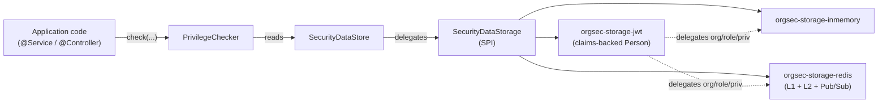

# OrgSec Documentation

OrgSec is a Spring Boot library for applications where authorization follows the organization chart. It models access as **privileges** scoped to a **business role** (`owner`, `customer`, `contractor`, ...) within an **organizational hierarchy**, evaluates those privileges at runtime, and can turn them into **RSQL filters** for list endpoints. Privileges are registered by your application at startup - OrgSec does not hard-code an authorization vocabulary - and authorization data is served by a pluggable storage backend (in-memory, Redis, or JWT).

OrgSec is strongest when the hard part is not "does this user have global role X?", but "which rows may this user see because of their position in one or more organizations?" It is intentionally narrower than a general policy engine: it gives Spring applications a ready-made model for company/org/person cascades, hierarchy-down and hierarchy-up privileges, business-role fields on protected entities, and query-time filtering.

## Why use it

- **Built for hierarchical, multi-tenant domains.** A privilege can apply *exactly* on one organization, *down* through descendants, or *up* through ancestors. Each combination cascades from company -> org -> person, and the result is fail-closed.
- **Turns authorization into query filters.** `RsqlFilterBuilder` produces a filter that can be pushed into repository queries, so list endpoints avoid "load too much, filter in Java" behavior.
- **Matches business relationships, not just technical roles.** A person can be an `owner` in one organization, a `contractor` in another, and a `customer` somewhere else; OrgSec keeps that relationship separate from position roles and application privileges.
- **Pluggable storage with hybrid routing.** A monolith can run on the in-memory backend; a microservice cluster can switch to Redis with L1+L2 caching and Pub/Sub invalidation; an OAuth2 application can read the current user from JWT claims while delegating organization and role data to another store - without recompiling business logic.
- **Spring Boot-native, but not Spring-Security-bound.** Auto-configuration wires the privilege evaluator, security data store, audit logger, and Spring Security integration. Applications that do not use Spring Security can plug in a custom `SecurityContextProvider`.

## Where OrgSec is the better fit

| Scenario | Why OrgSec fits better than generic role checks |
| --- | --- |
| Back-office or SaaS data is partitioned by organization, branch, department, or company | OrgSec models exact, descendant, and ancestor access directly instead of forcing every endpoint to reimplement tree logic. |
| The same person has different rights in different organizations | Business roles are scoped per organization, so the model does not collapse into one global authority set. |
| List endpoints must return only authorized rows | OrgSec can generate an RSQL filter for the query layer, which is usually more efficient and safer than post-filtering result sets. |
| Several services share the same authorization semantics | The privilege model and storage SPI stay in one library while each service chooses in-memory, Redis, JWT, or hybrid routing. |
| You want Spring-native enforcement without operating a separate PDP | OrgSec runs in the JVM, composes with Spring Security, and avoids a network call for common authorization checks. |

## High-level architecture

## Where to start

| If you want to...                                  | Read this                                                                  |
| ------------------------------------------------------- | -------------------------------------------------------------------------- |
| Decide whether OrgSec fits your project                 | [Introduction](./guide/01-introduction.md)                                 |
| Decode terms such as RBAC, ABAC, ReBAC, PDP, PEP, RSQL  | [Glossary](./reference/glossary.md)                                        |
| Get a working example running in under 30 minutes       | [Quick Start](./guide/02-quick-start.md)                                   |
| Understand the privilege model                          | [Core Concepts](./guide/03-core-concepts.md)                               |
| Look up an `orgsec.*` property                          | [Properties Reference](./reference/properties.md)                          |
| Choose a storage backend                                | [Storage Overview](./storage/01-overview.md)                               |
| See a complete copy-paste example                       | [Examples / In-memory app](./examples/in-memory-app.md)                    |
| Report a security issue                                 | [Security Policy](../SECURITY.md)                                          |

## Documentation map

- **`guide/`** - sequential reading path for new users (introduction -> quick start -> concepts -> configuration -> privileges).
- **`storage/`** - one document per storage backend, plus an overview that helps you pick.
- **`cookbook/`** - task-oriented recipes ("how do I...").
- **`reference/`** - tabular reference material: glossary, every `orgsec.*` property, every public exception, the privilege-model truth tables.
- **`architecture/`** - deeper dives for contributors and advanced users.
- **`examples/`** - complete, copy-paste-friendly walkthroughs (no external project required).
- **`operations/`** - production-deployment material: monitoring, hardening, troubleshooting.
- **`faq.md`** - questions that come up on the issue tracker.

## Compatibility

| OrgSec version | Spring Boot   | Spring Security | Java | Status                                     |
| -------------- | ------------- | --------------- | ---- | ------------------------------------------ |
| **1.0.x**      | 3.5.x         | 6.x             | 17   | Current GA; receives security and bug fixes |
| 2.0.x          | 4.x (planned) | 7.x (planned)   | 21   | In development; not yet released            |

Patch releases on the 1.0.x line stay backwards compatible. Spring Boot bumps within 3.5.x are validated through CI; if your application uses a 3.5.x version newer than the one OrgSec was built against, you should not need a code change.

## License & links

- [Apache License 2.0](../LICENSE)
- [Source code on GitHub](https://github.com/Nomendi6/orgsec)
- [Issues](https://github.com/Nomendi6/orgsec/issues)
- [Changelog](../CHANGELOG.md)
- [Security policy](../SECURITY.md)
- [Contributing](../CONTRIBUTING.md)
