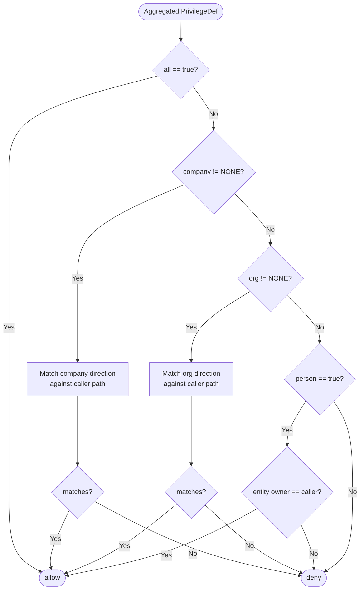

# Privilege Model Reference

This page is the tabular reference for OrgSec's privilege model. Read [Privileges and Business Roles](../guide/05-privileges-and-business-roles.md) for the narrative; come here when you need the truth tables.

## Operation enum

`PrivilegeOperation` (in `com.nomendi6.orgsec.constants`):

| Value     | Code      | Description       | `allowsRead` | `allowsWrite` | `allowsExecute` |
| --------- | --------- | ----------------- | ------------ | ------------- | --------------- |
| `NONE`    | `NONE`    | No operation      | `false`      | `false`       | `false`         |
| `READ`    | `READ`    | Read access       | `true`       | `false`       | `false`         |
| `WRITE`   | `WRITE`   | Write access      | `true`       | `true`        | `false`         |
| `EXECUTE` | `EXECUTE` | Execute access    | `true`       | `false`       | `true`          |

The columns describe what the **enum's own helpers** answer; they are not the rules used by aggregation or by `hasRequiredOperation`. Read those rules from the next two tables.

### `PrivilegeOperation.combine(other)`

Used by application code that wants the "most permissive" operation according to the lattice `NONE < READ < EXECUTE < WRITE`:

| `a` \\ `b`  | `NONE`   | `READ`   | `EXECUTE` | `WRITE` |
| ----------- | -------- | -------- | --------- | ------- |
| `NONE`      | `NONE`   | `READ`   | `EXECUTE` | `WRITE` |
| `READ`      | `READ`   | `READ`   | `EXECUTE` | `WRITE` |
| `EXECUTE`   | `EXECUTE`| `EXECUTE`| `EXECUTE` | `WRITE` |
| `WRITE`     | `WRITE`  | `WRITE`  | `WRITE`   | `WRITE` |

### `PrivilegeDef.add(a, b)` - the operation rule used by aggregation

Note: `PrivilegeDef.add(...)` does **not** call `PrivilegeOperation.combine(...)`. It defines its own rule, which is **not** the same as the lattice above:

| `a` \\ `b`  | `NONE`   | `READ`   | `EXECUTE` | `WRITE` |
| ----------- | -------- | -------- | --------- | ------- |
| `NONE`      | `NONE`   | `READ`   | `EXECUTE` | `WRITE` |
| `READ`      | `READ`   | `READ`   | `READ`    | `WRITE` |
| `EXECUTE`   | `EXECUTE`| `READ`   | `EXECUTE` | `WRITE` |
| `WRITE`     | `WRITE`  | `WRITE`  | `WRITE`   | `WRITE` |

The notable cell is `READ + EXECUTE = READ`. When two position roles grant `_R` and `_E` for the same resource, the aggregated `PrivilegeDef.operation` ends up as `READ`, **not** `EXECUTE`. This is the rule the privilege evaluator sees, since it always operates on the aggregated `PrivilegeDef`.

### Operation truth table for `hasRequiredOperation`

`PrivilegeChecker.hasRequiredOperation(granted, requested)`:

| Granted operation | Requested = `READ` | Requested = `WRITE` | Requested = `EXECUTE` |
| ----------------- | ------------------ | ------------------- | --------------------- |
| `NONE`            | `false`            | `false`             | `false`               |
| `READ`            | `true`             | `false`             | `false`               |
| `WRITE`           | `true`             | `true`              | `false`               |
| `EXECUTE`         | `false`            | `false`             | `true`                |

`WRITE` *implies* `READ` in the table above; that is the only widening the method does. `EXECUTE` is a separate action: it satisfies only an `EXECUTE` request, and `READ` / `WRITE` do not satisfy `EXECUTE`.

## Direction enum

`PrivilegeDirection` (in `com.nomendi6.orgsec.constants`):

| Value              | Code             | Description                                        | `allowsAccess` | `isHierarchical` | `includesDown` | `includesUp` |
| ------------------ | ---------------- | -------------------------------------------------- | -------------- | ---------------- | -------------- | ------------ |
| `NONE`             | `NONE`           | No access at this scope                            | `false`        | `false`          | `false`        | `false`      |
| `EXACT`            | `EXACT`          | Exact match only                                   | `true`         | `false`          | `false`        | `false`      |
| `HIERARCHY_DOWN`   | `HIERARCHY_DOWN` | This node and all descendants                      | `true`         | `true`           | `true`         | `false`      |
| `HIERARCHY_UP`     | `HIERARCHY_UP`   | This node and all ancestors                        | `true`         | `true`           | `false`        | `true`       |
| `ALL`              | `ALL`            | Every node                                         | `true`         | `true`           | `true`         | `true`       |

### Direction match table

The `EXACT` and `ALL` directions are scope-independent:

| Direction          | Match condition                                                                          |
| ------------------ | ---------------------------------------------------------------------------------------- |
| `NONE`             | Never matches                                                                            |
| `EXACT`            | Caller's id at this scope equals the entity's id at this scope                           |
| `ALL`              | Always matches (only meaningful in `PrivilegeDef.all`; not a per-scope direction value)  |

The hierarchical directions (`HIERARCHY_DOWN`, `HIERARCHY_UP`) compare *pipe-delimited paths*, but **the company and org scopes use slightly different string operations.** The exact predicates are documented in [Architecture / Privilege evaluation - Direction matching](../architecture/privilege-evaluation.md#direction-matching). In summary:

| Scope    | `HIERARCHY_DOWN`                                              | `HIERARCHY_UP`                                                |
| -------- | ------------------------------------------------------------- | ------------------------------------------------------------- |
| Company  | `entityCompanyPath.startsWith(callerCompanyParentPath)`        | `entityCompanyPath.endsWith(callerCompanyParentPath)`         |
| Org      | `entityOrgPath.startsWith(callerOrgParentPath)`                | `callerOrgParentPath.startsWith(entityOrgParentPath)`         |

Both encode the "ancestor / descendant" relationship; the company-scope `HIERARCHY_UP` uses `endsWith` while the org-scope variant reverses the operands of `startsWith`. Custom backends should preserve the conventions the implementation uses; see the architecture document for the source-level reference.

### `applies(isTarget, isDescendant, isAncestor)`

The legacy boolean form on `PrivilegeDirection`:

| Direction          | `isTarget=t, ist=f, isa=f` | `isd=t` | `isa=t` | All `false`        |
| ------------------ | -------------------------- | ------- | ------- | ------------------ |
| `NONE`             | `false`                    | `false` | `false` | `false`            |
| `EXACT`            | `true`                     | `false` | `false` | `false`            |
| `HIERARCHY_DOWN`   | `true`                     | `true`  | `false` | `false`            |
| `HIERARCHY_UP`     | `true`                     | `false` | `true`  | `false`            |
| `ALL`              | `true`                     | `true`  | `true`  | `true`             |

### `isMorePermissiveThan(other)`

The partial order on directions:

```text
NONE < EXACT < HIERARCHY_DOWN
                              \
                               ALL
                              /
              HIERARCHY_UP
```

`HIERARCHY_DOWN` and `HIERARCHY_UP` are not directly comparable; they are both more permissive than `EXACT` and both subsumed by `ALL`. Aggregation (`PrivilegeDef.add`) joins `HIERARCHY_DOWN + HIERARCHY_UP` -> `ALL`.

## Scope enum

`PrivilegeScope` (in `com.nomendi6.orgsec.constants`):

| Value      | Code       | `isCompanyLevel` | `isOrganizationLevel` | `isEmployeeLevel` | `getDirection`           |
| ---------- | ---------- | ---------------- | --------------------- | ----------------- | ------------------------ |
| `ALL`      | `ALL`      | `false`          | `false`               | `false`           | `ALL`                    |
| `COMP`     | `COMP`     | `true`           | `false`               | `false`           | `EXACT`                  |
| `COMPHD`   | `COMPHD`   | `true`           | `false`               | `false`           | `HIERARCHY_DOWN`         |
| `COMPHU`   | `COMPHU`   | `true`           | `false`               | `false`           | `HIERARCHY_UP`           |
| `ORG`      | `ORG`      | `false`          | `true`                | `false`           | `EXACT`                  |
| `ORGHD`    | `ORGHD`    | `false`          | `true`                | `false`           | `HIERARCHY_DOWN`         |
| `ORGHU`    | `ORGHU`    | `false`          | `true`                | `false`           | `HIERARCHY_UP`           |
| `EMP`      | `EMP`      | `false`          | `false`               | `true`            | `EXACT`                  |

### Scope <-> `PrivilegeDef` axes

Each scope expands into specific values of the underlying axes:

| Scope    | `company`        | `org`            | `person` | `all`   |
| -------- | ---------------- | ---------------- | -------- | ------- |
| `ALL`    | -                | -                | -        | `true`  |
| `COMP`   | `EXACT`          | `NONE`           | `false`  | `false` |
| `COMPHD` | `HIERARCHY_DOWN` | `NONE`           | `false`  | `false` |
| `COMPHU` | `HIERARCHY_UP`   | `NONE`           | `false`  | `false` |
| `ORG`    | `NONE`           | `EXACT`          | `false`  | `false` |
| `ORGHD`  | `NONE`           | `HIERARCHY_DOWN` | `false`  | `false` |
| `ORGHU`  | `NONE`           | `HIERARCHY_UP`   | `false`  | `false` |
| `EMP`    | `NONE`           | `NONE`           | `true`   | `false` |

## Cascade evaluation

The evaluation order is **company -> org -> person**, with the `all` shortcut on top:



The cascade is short-circuit: the first non-`NONE` scope decides the outcome. Setting `org = EXACT` *and* `company = EXACT` at the same time is technically allowed but the company decision wins; aggregation never produces this case.

## Aggregation rules

`PrivilegeDef.add(other)` joins two privileges from different position roles. For most axes the result is at least as permissive as each input; the **operation axis is the exception** - combining `READ + EXECUTE` produces `READ`, which is *less* permissive than `EXECUTE` along the execute dimension. See the `PrivilegeDef.add` table earlier in this document.

| Axis           | Join rule                                                                 |
| -------------- | ------------------------------------------------------------------------- |
| `all`          | `a.all OR b.all`                                                          |
| `operation`    | `PrivilegeDef.add(a, b)` - not `PrivilegeOperation.combine`. See the table in [PrivilegeDef.add](#privilegedefadda-b--the-operation-rule-used-by-aggregation). |
| `company`      | See direction join below; if result becomes non-`NONE`, drops `org`/`person` |
| `org`          | Same direction join; only consulted if `company == NONE` after join       |
| `person`       | `a.person OR b.person`; only consulted if both `company == NONE` and `org == NONE` |

### Direction join

For two `PrivilegeDirection` values:

| `a` \\ `b`         | `NONE`           | `EXACT`           | `HIERARCHY_DOWN`  | `HIERARCHY_UP`    | `ALL`  |
| ------------------ | ---------------- | ----------------- | ----------------- | ----------------- | ------ |
| `NONE`             | `NONE`           | `EXACT`           | `HIERARCHY_DOWN`  | `HIERARCHY_UP`    | `ALL`  |
| `EXACT`            | `EXACT`          | `EXACT`           | `EXACT`           | `EXACT`           | `ALL`  |
| `HIERARCHY_DOWN`   | `HIERARCHY_DOWN` | `EXACT`           | `HIERARCHY_DOWN`  | `ALL`             | `ALL`  |
| `HIERARCHY_UP`     | `HIERARCHY_UP`   | `EXACT`           | `ALL`             | `HIERARCHY_UP`    | `ALL`  |
| `ALL`              | `ALL`            | `ALL`             | `ALL`             | `ALL`             | `ALL`  |

The diagonal `EXACT + EXACT = EXACT` and the down-up combination `HIERARCHY_DOWN + HIERARCHY_UP = ALL` are the load-bearing entries. The `EXACT + HIERARCHY_DOWN = EXACT` row is intentional - combining a strictly-exact direction with a hierarchical one collapses to exact (the join is read as "values that match both"). This is consistent with the source implementation in `PrivilegeDef.add`.

## Identifier shape recap

The privilege name parser in `PrivilegeLoader.createPrivilegeDefinition`:

| Identifier           | `resourceName` | Scope    | Operation | Resulting `PrivilegeDef`                                      |
| -------------------- | -------------- | -------- | --------- | ------------------------------------------------------------- |
| `DOCUMENT_ALL_R`     | `DOCUMENT`     | `ALL`    | `READ`    | `all=true, op=READ`                                            |
| `DOCUMENT_COMP_R`    | `DOCUMENT`     | `COMP`   | `READ`    | `company=EXACT, op=READ`                                       |
| `DOCUMENT_COMPHD_R`  | `DOCUMENT`     | `COMPHD` | `READ`    | `company=HIERARCHY_DOWN, op=READ`                              |
| `DOCUMENT_COMPHU_R`  | `DOCUMENT`     | `COMPHU` | `READ`    | `company=HIERARCHY_UP, op=READ`                                |
| `DOCUMENT_ORG_R`     | `DOCUMENT`     | `ORG`    | `READ`    | `org=EXACT, op=READ`                                           |
| `DOCUMENT_ORGHD_R`   | `DOCUMENT`     | `ORGHD`  | `READ`    | `org=HIERARCHY_DOWN, op=READ`                                  |
| `DOCUMENT_ORGHU_R`   | `DOCUMENT`     | `ORGHU`  | `READ`    | `org=HIERARCHY_UP, op=READ`                                    |
| `DOCUMENT_EMP_R`     | `DOCUMENT`     | `EMP`    | `READ`    | `person=true, op=READ`                                          |
| `DOCUMENT_*_W` / `_E` | `DOCUMENT`    | various  | `WRITE` / `EXECUTE` | Same scope axes, different operation                |

Identifiers that lack the underscore-separated structure (`RESOURCE_SCOPE_OPERATION`) throw `IllegalArgumentException` from the parser. Identifiers that have the right *shape* but use unknown scope tokens (anything other than `ALL` / `COMP` / `COMPHD` / `COMPHU` / `ORG` / `ORGHD` / `ORGHU` / `EMP`) or unknown operation suffixes (anything other than `R` / `W` / `E`) are **accepted at registration time** but produce a `PrivilegeDef` that grants nothing - the directions stay at `NONE` and `hasRequiredOperation` will never match. Validate identifiers in tests; the parser in 1.0.x does not catch semantic typos.

## Edge cases

### `_COMPHU` is rare but legal

`HIERARCHY_UP` exists for the case of "subordinate at organization X needs to see context owned at an ancestor of X." In most domains the inverse (`HIERARCHY_DOWN`) is more common. If you find yourself reaching for `_COMPHU`, double-check that the data model is right: an entity owned at org X is not normally readable by people at descendants of X.

### `_EMP` and shared ownership

`_EMP` matches when `entity.PERSON == caller.personId`. If your domain has co-owners, `_EMP` does not work directly - either denormalize a "primary owner" person id, or model the co-ownership as multiple business roles (one per co-owner) on the same entity.

### `all = true` swallows everything

Once `all = true` enters an aggregated `PrivilegeDef`, no later combination can take it out. The result is always `all = true`. Reserve `_ALL` for a small, well-justified set of roles (auditors, on-call support).

### Empty `supported-fields` does not throw

A business role with `supported-fields: []` (or unset) is technically legal: OrgSec accepts the role but every field lookup returns `null`, so any privilege evaluated against that role denies. This is *recommendation, not enforcement* - catch this in your tests if it would be a configuration error in your application.

## Where to go next

- [Privileges and Business Roles](../guide/05-privileges-and-business-roles.md) - the narrative.
- [Architecture / Privilege evaluation](../architecture/privilege-evaluation.md) - step-by-step `hasRequiredOperation`.
- [Cookbook / Defining privileges](../cookbook/01-defining-privileges.md) - recipes that exercise these rules.
