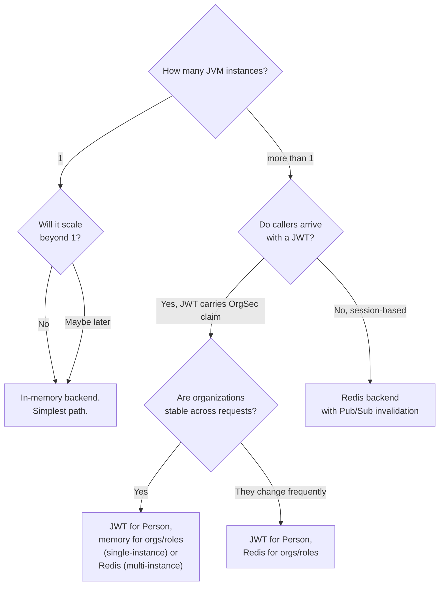

# Storage Overview

OrgSec ships three storage backends. They all implement the same `SecurityDataStorage` SPI and serve the same authorization API, so your application code does not change when you swap one for another. Picking the right backend is mostly a function of *deployment topology*: how many instances, where the user identity comes from, and how often the underlying data changes.

This page is the decision tree, the comparison matrix, and the rules for mixing backends. Once you have picked one, follow its dedicated page for configuration and tuning.

## The three backends in one paragraph each

- **`orgsec-storage-inmemory`** - the default. Loads `PersonDef` / `OrganizationDef` / `RoleDef` into thread-safe `ConcurrentHashMap`s at startup, refreshes them on demand. Fast, simple, and entirely process-local. Ships with the starter; you do not add a separate dependency.
- **`orgsec-storage-redis`** - a two-tier cache. An L1 in-memory LRU on each instance plus an L2 Redis cache shared across instances, with Pub/Sub invalidation on `orgsec:invalidation`. The cache is *populated* by preload at startup and by `notifyXxxChanged` calls from your domain code; it is **not** a read-through facade - on L1+L2 miss it returns `null`. A Resilience4j circuit breaker handles Redis outages. Add the `orgsec-storage-redis` dependency to activate.
- **`orgsec-storage-jwt`** - reads `PersonDef` from a JWT claim (`orgsec` by default) on every request. Stateless for the current user; delegates organizations, roles, and privileges to another storage backend (memory or Redis). Requires Spring Security OAuth2 resource server and a `JwtDecoder` bean. Add the `orgsec-storage-jwt` dependency.

## Comparison matrix

| Feature                                     | In-memory                | Redis                                        | JWT                                                    |
| ------------------------------------------- | ------------------------ | -------------------------------------------- | ------------------------------------------------------ |
| Maven coordinates                           | Bundled with starter     | `orgsec-storage-redis`                       | `orgsec-storage-jwt`                                   |
| Multi-instance coherent                     | No (process-local)       | Yes (Pub/Sub invalidation)                   | Yes for Person; delegate-dependent otherwise           |
| External dependencies                       | None                     | Redis 7.x (Lettuce client)                   | OAuth2 resource server, `JwtDecoder` bean              |
| Latency for hot reads                       | ConcurrentHashMap lookup | L1 hit: same; L1 miss: Redis round-trip      | Per-request token parse; delegate handles the rest     |
| Memory footprint                            | Whole dataset in heap    | Bounded by `cache.l1-max-size`               | Per-token Person; delegate handles the rest            |
| Survives a restart                          | No (reload from DB)      | Yes (L2 outlives the JVM)                    | Per-request, no persistence concerns                   |
| Person identity comes from                  | Database (loaded eagerly) | Database (cached)                           | JWT claim (validated by Spring Security)               |
| Organization / role / privilege comes from  | Database                 | Database (cached)                           | Delegate backend (memory or Redis)                     |
| Cache invalidation across instances         | n/a                      | Pub/Sub on `orgsec:invalidation`            | Delegate-dependent                                     |
| Notify hooks (`notifyXxxChanged`)           | Refreshes local copy     | Updates L1 / L2 and publishes invalidation  | Delegate-dependent                                     |
| Failure mode                                | Reload errors fail loud  | Circuit breaker fails fast; misses return `null` | Token rejection denies access (fail closed)            |
| Production-ready in 1.0.x                   | Yes (single instance)    | Yes                                          | Yes                                                    |
| Typical use                                 | Monolith, dev/test       | Multi-instance microservices                | OAuth2-fronted apps with Keycloak                      |

## Decision tree



A few words on the branches:

- **Single-instance -> in-memory.** Even if you intend to scale later, start with in-memory; switching to Redis is a configuration change, not a code change. There is no benefit to running Redis in a single-process deployment.
- **Multi-instance, session-based -> Redis.** The L1+L2 model gives you per-request latency similar to in-memory while keeping caches coherent across instances.
- **Multi-instance, JWT-fronted -> JWT hybrid.** Putting the current user's `Person` in a token claim lets every instance answer authorization questions without consulting a database for the user identity. Organizations and roles still need a backend - pick memory if your dataset fits in heap, Redis otherwise.

## Mixing backends (hybrid mode)

OrgSec lets you route each entity type to a different backend. Hybrid mode is opt-in:

```yaml
orgsec:
  storage:
    primary: redis                         # default for any non-routed type
    features:
      memory-enabled: true
      redis-enabled: true
      jwt-enabled: true
      hybrid-mode-enabled: true
    data-sources:
      person: jwt                          # PersonDef from token
      organization: primary                # = redis
      role: primary                        # = redis
      privilege: memory                    # always recommended in memory
```

The two situations where hybrid mode is essential:

1. **JWT for Person, Redis for everything else.** Stateless user identity, cached organizational data shared across instances.
2. **JWT for Person, memory for everything else.** Same as above but smaller footprint when organizations are small enough to keep in heap.

Hybrid mode only honors `data-sources` when `hybrid-mode-enabled: true`. With the flag off, the `primary` backend handles every type. The flag is checked at every storage call - flipping it via `StorageFeatureFlags.enableHybridMode()` takes effect immediately for new requests.

For the JWT-specific dependency on a `JwtDecoder` bean, see [Storage / JWT](./04-jwt.md).

## Migrating between backends

OrgSec does not require a code change to switch backends - the application calls `PrivilegeChecker` either way. Migrations are configuration-only and almost always run in two steps:

1. **Add the new backend's classpath dependency.** This makes its beans available without activating them; `@Primary` is still on the previous backend.
2. **Switch `orgsec.storage.primary` and the matching `*-enabled` flag.** Restart the JVM (or, for non-critical migrations, flip flags via `StorageFeatureFlags`).

Two practical notes:

- **Memory -> Redis migration.** The first request after the switch hits an empty L2 and returns `null` until something populates the caches - the Redis backend does not read from your database on miss. Either leave preload on with the application's data loaders wired (`orgsec.storage.redis.preload.enabled: true` plus `CacheWarmer.setPersonLoader/...`), or push entries via `notifyXxxChanged` from your application before relying on Redis-served decisions.
- **Memory -> JWT migration.** Your JWTs must already carry the `orgsec` claim before you flip the switch. The Keycloak custom mapper (see [Cookbook / Keycloak mapper](../cookbook/05-keycloak-mapper.md)) is the typical issuer.

You can run both backends in parallel during a migration: leave `memory-enabled: true` and `redis-enabled: true`, set `primary: redis`, and route `data-sources.person: memory` to keep Person served by memory while organizations migrate to Redis. Once you trust the Redis path, flip `data-sources.person: primary`.

## Where to go next

- [In-memory storage](./02-in-memory.md) - the default; what it loads and when.
- [Redis storage](./03-redis.md) - L1+L2, invalidation, TLS, circuit breaker.
- [JWT storage](./04-jwt.md) - claim format, decoder requirement, hybrid setup.
- [Configuration](../guide/04-configuration.md) - the YAML side of all of the above.
