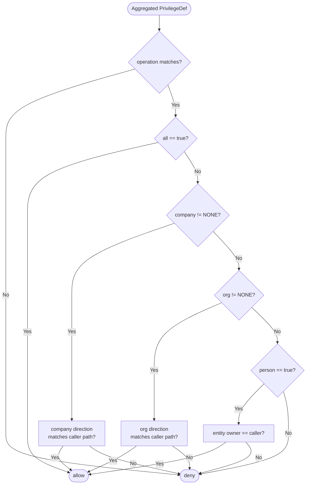

# Privileges and Business Roles

This page is the working reference for designing the authorization layer of an OrgSec-backed application: how to declare business roles, how to register privileges, how to name them, and how the cascade evaluates them. Read it once when you sit down to model your authorization rules; come back to it when you add a new resource type or a new role category.

## Defining business roles

Business roles are declared in YAML under `orgsec.business-roles`. Each entry names a role and lists the `SecurityFieldType` values entities must expose for that role.

```yaml
orgsec:
  business-roles:
    owner:
      supported-fields: [COMPANY, COMPANY_PATH, ORG, ORG_PATH, PERSON]
    customer:
      supported-fields: [COMPANY, COMPANY_PATH]
    contractor:
      supported-fields: [PERSON]
    executor:
      supported-fields: [ORG, ORG_PATH, PERSON]
    supervisor:
      supported-fields: [COMPANY, COMPANY_PATH, ORG, ORG_PATH]
```

The role name (`owner`, `customer`, `contractor`, ...) is what your `SecurityEnabledEntity.getSecurityField` checks against. The role name is treated case-insensitively at lookup time, but stay consistent in your code - lowercase by convention.

### `supported-fields` semantics

Each field listed in `supported-fields` is a *promise*: "for this business role, the entity will expose a non-null value for this field type." OrgSec uses the list as a directive when building the per-role security context:

| Field type     | Returned value                                                  | Required when the role...       |
| -------------- | --------------------------------------------------------------- | ------------------------------------ |
| `COMPANY`      | `Long` - the company id, or a `Party` whose `getId()` returns one | needs company-scope privileges      |
| `COMPANY_PATH` | `String` - the company's `pathId` (for example `|1|`)       | uses any of `_COMPHD`, `_COMPHU`     |
| `ORG`          | `Long` - the org id                                          | needs org-scope privileges            |
| `ORG_PATH`     | `String` - the org's `pathId` (for example `|1|10|22|`)     | uses any of `_ORGHD`, `_ORGHU`       |
| `PERSON`       | `Long` - the person id                                      | uses `_EMP` privileges (person scope) |

If a privilege requires `_COMPHD` direction but the entity returns `null` for `COMPANY_PATH`, the check **fails closed** rather than silently accepting the entity. This is enforced by tests added in the 1.0.1 security review.

### When to introduce a new business role

A new business role is justified when an entity would expose a *different* set of fields under it. If you can express a relationship by reusing an existing role and adjusting privileges, you do not need a new role - you need new privileges.

| Situation                                              | New role needed? |
| ------------------------------------------------------ | ---------------- |
| You want a "read-only owner"                           | No - same `owner` role with reduced privileges |
| Documents are visible to *another* company that contracted them | Yes - introduce `customer` |
| External auditors should see specific reports          | Probably yes - e.g. `auditor` |
| Same company, different department                    | No - that is a position role, not a business role |

Each business role is a *category of relationship* between a person and an organization. Position roles are how you express granular duties within those categories.

## Registering privileges

OrgSec stores privileges in a `PrivilegeRegistry`. You almost always populate it through a `PrivilegeDefinitionProvider` bean - that is the path Spring auto-configuration expects, and it lets you organize privileges by feature.

### Recommended path: `PrivilegeDefinitionProvider`

Implement the interface, expose it as a Spring bean, and call `PrivilegeLoader.initializePrivileges(this)` from a `@PostConstruct` hook:

```java
package com.example.docs;

import com.nomendi6.orgsec.api.PrivilegeDefinitionProvider;
import com.nomendi6.orgsec.model.PrivilegeDef;
import com.nomendi6.orgsec.storage.inmemory.loader.PrivilegeLoader;
import jakarta.annotation.PostConstruct;
import org.springframework.stereotype.Component;

import java.util.HashMap;
import java.util.List;
import java.util.Map;

@Component
public class DocumentPrivileges implements PrivilegeDefinitionProvider {

    private static final List<String> IDENTIFIERS = List.of(
        "DOCUMENT_COMPHD_R",
        "DOCUMENT_ORG_W",
        "DOCUMENT_EMP_R",
        "DOCUMENT_ALL_R"
    );

    private final PrivilegeLoader loader;

    public DocumentPrivileges(PrivilegeLoader loader) {
        this.loader = loader;
    }

    @PostConstruct
    public void register() {
        loader.initializePrivileges(this);
    }

    @Override
    public Map<String, PrivilegeDef> getPrivilegeDefinitions() {
        Map<String, PrivilegeDef> defs = new HashMap<>();
        for (String id : IDENTIFIERS) {
            defs.put(id, createPrivilegeDefinition(id));
        }
        return defs;
    }

    @Override
    public PrivilegeDef createPrivilegeDefinition(String identifier) {
        return PrivilegeLoader.createPrivilegeDefinition(identifier);
    }
}
```

`PrivilegeLoader.createPrivilegeDefinition` parses the identifier and produces a `PrivilegeDef` with the corresponding scope and operation axes set - provided the identifier follows the convention described under "Privilege identifier convention" below. The parser is permissive about token content (unknown scope or operation values are accepted but produce a privilege that grants nothing); see the caveat in that section before relying on this path. You can have several providers in the same application - one per feature module, for example. Each provider is invoked at startup and its definitions go into the same registry.

### Programmatic alternative: `PrivilegeRegistry.registerPrivilege`

If you need to construct `PrivilegeDef` instances by hand (because the identifier does not follow the convention, or because you want extra fields), inject `PrivilegeRegistry` directly:

```java
@Component
public class CustomPrivileges {

    private final PrivilegeRegistry registry;

    public CustomPrivileges(PrivilegeRegistry registry) {
        this.registry = registry;
    }

    @PostConstruct
    public void register() {
        PrivilegeDef def = new PrivilegeDef("CONTRACT_APPROVE", "Contract")
            .allowOperation(PrivilegeOperation.WRITE)
            .allowOrg(PrivilegeDirection.NONE, PrivilegeDirection.EXACT, false);
        registry.registerPrivilege("CONTRACT_APPROVE", def);
    }
}
```

Use this only when the standard convention does not fit. Mixing conventions in the same project leads to inconsistent identifiers.

> **Note on `EXECUTE`.** `PrivilegeOperation.EXECUTE` exists in the enum and `PrivilegeDef.allowOperation(EXECUTE)` is accepted, but `PrivilegeChecker.hasRequiredOperation(..., EXECUTE)` always returns `false` in 1.0.x - the method does not have an `EXECUTE` branch. Privileges built with `EXECUTE` register cleanly but never satisfy a standard authorization check until that branch lands. Until then, model execute-style operations as a separate resource with `READ` / `WRITE` privileges, or call into the lower-level evaluator directly.

## Privilege identifier convention

Identifiers follow the pattern **`RESOURCE_SCOPE_OPERATION`**, parsed by `PrivilegeLoader.createPrivilegeDefinition`. The three components are split on the underscore character.

| Component   | Allowed values                                                            | Example fragments         |
| ----------- | ------------------------------------------------------------------------- | ------------------------- |
| `RESOURCE`  | Free-form (uppercase, A-Z, no underscore)                                 | `DOCUMENT`, `INVOICE`, `CONTRACT` |
| `SCOPE`     | `ALL`, `COMP`, `COMPHD`, `COMPHU`, `ORG`, `ORGHD`, `ORGHU`, `EMP`         | see table below           |
| `OPERATION` | `R` (READ), `W` (WRITE), `E` (EXECUTE)                                    | `R`, `W`, `E`             |

The `SCOPE` segment expands as follows:

| `SCOPE`  | `company` direction | `org` direction  | `person` flag | `all` flag | Effect                                              |
| -------- | ------------------- | ---------------- | ------------- | ---------- | --------------------------------------------------- |
| `ALL`    | -                   | -                | -             | `true`     | Bypass all scope checks                             |
| `COMP`   | `EXACT`             | `NONE`           | `false`       | `false`    | Exact company match                                 |
| `COMPHD` | `HIERARCHY_DOWN`    | `NONE`           | `false`       | `false`    | Company and all descendants                         |
| `COMPHU` | `HIERARCHY_UP`      | `NONE`           | `false`       | `false`    | Company and all ancestors                           |
| `ORG`    | `NONE`              | `EXACT`          | `false`       | `false`    | Exact org match (cascade falls through company)     |
| `ORGHD`  | `NONE`              | `HIERARCHY_DOWN` | `false`       | `false`    | Org and all descendants                             |
| `ORGHU`  | `NONE`              | `HIERARCHY_UP`   | `false`       | `false`    | Org and all ancestors                               |
| `EMP`    | `NONE`              | `NONE`           | `true`        | `false`    | Person-owned entities only                          |

A privilege identifier is conventionally one combination of `RESOURCE` x `SCOPE` x `OPERATION`. **The parser in 1.0.x is permissive about this convention - it only enforces the *shape* (two underscore separators), not the semantic content of each token.** Specifically:

- `IllegalArgumentException` is thrown only when the identifier has fewer than two underscores (`PrivilegeLoader.createPrivilegeDefinition` cannot find the `_SCOPE_` segment).
- Unknown scope tokens (anything other than `ALL` / `COMP` / `COMPHD` / `COMPHU` / `ORG` / `ORGHD` / `ORGHU` / `EMP`) are *accepted* and produce a `PrivilegeDef` with all directions set to `NONE` and `all = false` - effectively a privilege that grants nothing.
- Unknown operation tokens (anything other than `R` / `W` / `E`) are *accepted* and produce `PrivilegeOperation.NONE`, which `hasRequiredOperation` will never satisfy.
- Lowercase tokens are not normalized; `document_comp_r` is parsed but produces an empty privilege (the scope token `comp` does not match the uppercase switch case).

In short: the parser catches *structural* mistakes (missing underscore) but not *semantic* ones (typo in scope, wrong operation suffix, wrong case). Validate your identifiers in tests; future releases may tighten the parser. The recommended discipline is to keep a single source of truth (an enum or a constants class) for identifiers in your application code so typos cannot reach the registry.

## How the cascade evaluates a privilege

When a check arrives, OrgSec aggregates the privileges the user holds for the resource (across all of their position roles, joined by business role) and asks one question: *given this aggregated `PrivilegeDef` and the requested `Operation`, does it grant access?*



The cascade is short-circuit: the *first* non-`NONE` scope decides the outcome, ignoring lower scopes. A privilege whose `company` is `EXACT` but whose `org` is also set is **technically possible but unsupported** - the cascade evaluates `company` first and the `org` value is ignored. Aggregation will never produce such a privilege; if you write one by hand through `PrivilegeRegistry.registerPrivilege`, the `org` axis is dead weight. The detailed aggregation rules (in particular, that direction join is **not** monotonically widening) are documented under "Aggregation behavior" below.

## Aggregation behavior

A user can have many position roles, each with its own privileges, all targeting the same resource. OrgSec combines them with `PrivilegeDef.add(other)`. The result follows three rules:

1. **`all` widens.** If either side has `all == true`, the result has `all == true`.
2. **Operation aggregation has a quirk.** `READ + WRITE = WRITE` and `WRITE + EXECUTE = WRITE`; combining with `NONE` returns the other side. **However, `READ + EXECUTE` produces `READ`, not `EXECUTE`** - the aggregation rule is not the lattice you might expect. The full table is in [Privilege Model Reference - PrivilegeDef.add](../reference/privilege-model.md#privilegedefadda-b--the-operation-rule-used-by-aggregation). Note also that `hasRequiredOperation` does not currently match `EXECUTE` in 1.0.x; treat `_E` privileges with care until the EXECUTE branch lands.
3. **Direction joins through `PrivilegeDef.add(direction, direction)` - not a strictly widening lattice.** The rule is: equal values stay; `NONE` returns the other side; `HIERARCHY_DOWN + HIERARCHY_UP` becomes `ALL`; **everything else returns `EXACT`**. So `EXACT + HIERARCHY_DOWN = EXACT` (the result is *narrower*, not wider). The full table is in [Privilege Model Reference - Direction join](../reference/privilege-model.md#direction-join). When two grants for the same scope axis are combined, the aggregated direction is the join of their directions; lower scopes are dropped if a higher scope becomes non-`NONE`.

For the `all` axis the aggregate is at least as permissive as each input. For direction, only `HIERARCHY_DOWN + HIERARCHY_UP` widens; other unequal combinations narrow toward `EXACT`. For operation, the table referenced above governs - usually widening, but with the `READ + EXECUTE = READ` exception. A user who holds `DOCUMENT_ORG_R` and `DOCUMENT_COMPHD_R` ends up with the equivalent of `DOCUMENT_COMPHD_R` - the company-scope grant subsumes the org-scope grant because, per rule 3 (lower scopes drop), the org-scope grant is dropped once the company axis is non-`NONE`.

## Fail-closed behavior

The 1.0.1 release tightened several checks that previously could fail-open. Awareness of these matters when designing your privileges and your data:

- **Hierarchical privileges with a missing path fail closed.** If `_COMPHD` is granted but the entity returns `null` for `COMPANY_PATH`, the check denies access. Earlier versions silently accepted the entity if the path was missing - the change closes the fail-open.
- **Unknown business roles fail closed.** A privilege whose business-role context is not in the YAML is rejected. Misspelled role names no longer silently grant nothing-but-also-not-deny.
- **Structurally malformed privilege identifiers fail at startup.** `PrivilegeLoader.createPrivilegeDefinition` throws `IllegalArgumentException` when an identifier is missing the underscore-separated structure. Note that the parser does **not** validate the *content* of the scope and operation tokens - see "Privilege identifier convention" above for the detail.
- **Missing JwtDecoder fails fast.** When `jwt-enabled: true` is set and no `JwtDecoder` bean is available, the application context fails to start.
- **Person API requires authentication and a role.** When `orgsec.api.person.enabled: true`, the configured `required-role` (default `ORGSEC_API_CLIENT`) must be present on the caller.

When you add or change a privilege, prefer expressing the *positive* condition. Do not rely on omissions: if a position role does not hold `DOCUMENT_WRITE`, that absence is enough. You do not need a "deny" privilege.

## Common patterns

### "Read everything in my company sub-tree"

A regional manager wants to see every document attached to their company line.

```text
DOCUMENT_COMPHD_R
```

Map this on the position role that the manager holds (e.g. `REGION_DIRECTOR`). Since the role is tagged with the `owner` business role, the manager will see every document whose `owner` company path *starts with* the manager's own company path - that is, every document anchored at the manager's company or a descendant company. The descendants come for free - the entity does not need to know about the hierarchy.

### "Write only on documents owned by my exact org"

A back-office clerk should be able to update documents for their organization only, not for descendants and not for the parent company.

```text
DOCUMENT_ORG_W
```

`_ORG_W` writes imply reads, so you do not need to add `DOCUMENT_ORG_R` separately. (The aggregation step combines them anyway, but the write privilege already covers it.)

### "Person-owned entities"

Each user can edit the documents that they personally own.

```text
DOCUMENT_EMP_W
```

The cascade falls through `company` and `org` (both `NONE`) and arrives at `person == true`. The check then compares the entity's `PERSON` field to the caller's id.

### "Super-user read access"

A read-only auditor needs to see every document everywhere.

```text
DOCUMENT_ALL_R
```

The `all` shortcut bypasses the cascade entirely. Reserve it for a small number of well-justified privileges - auditors, support agents with a strict UI workflow, ops users on call. Aggregating `_ALL` with anything else is irreversible (the result is always `_ALL`).

### "Multiple business roles, multiple privilege families"

When the same user is both an `owner` (their own organization's documents) and a `customer` (documents another company issued to them), give them privileges in both families:

```text
DOCUMENT_COMPHD_R       // owner: their sub-tree
DOCUMENT_COMP_R         // customer: documents at the issuing company
```

The two are evaluated independently - the user passes the check if either evaluation grants access. The aggregation step does not mix grants across business roles.

## Naming hygiene

A small amount of discipline pays off:

- **Stick to one identifier convention.** Do not mix `DOCUMENT_ORGHD_R` with hand-rolled identifiers like `Document.read.subtree` in the same project.
- **Use uppercase resource names** for consistency with the parser (`DOCUMENT`, not `Document`). The parser is permissive about case but readers benefit from one style.
- **Keep the resource name short.** It will appear inside aggregated privilege names: `DOCUMENT_COMPHD_R` is fine; `LEGALENTITYBILLINGADDRESS_COMPHD_R` is unwieldy. Consider a shorter alias.
- **Avoid embedded scope in the resource name.** `DOCUMENT_TEAM_HD_R` looks like it has a `_TEAM_` scope (it does not). Stick to one of the recognized scope tokens.
- **Group privileges by feature module.** A `PrivilegeDefinitionProvider` per module keeps the registration code close to the code that uses the privileges.

## Where to go next

- [Quick Start](./02-quick-start.md) - if you have not run an OrgSec app yet.
- [Cookbook / Defining privileges](../cookbook/01-defining-privileges.md) - recipes that combine these patterns.
- [Cookbook / Securing entities](../cookbook/02-securing-entities.md) - how to expose `SecurityEnabledEntity` cleanly.
- [Privilege Model Reference](../reference/privilege-model.md) - truth tables and edge cases.
