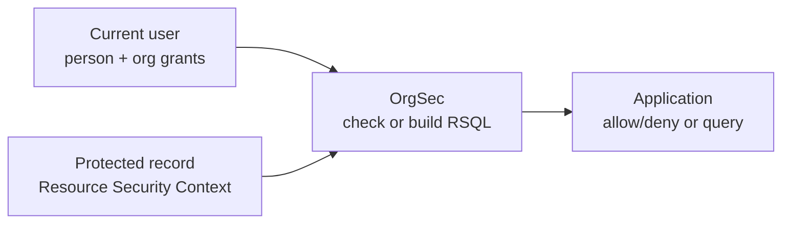

# OrgSec Documentation

OrgSec authorizes access to data that belongs to an organizational hierarchy. Your application sets a **Resource Security Context** on each protected record, and OrgSec compares that context with the current user's organization-scoped privileges.

Use OrgSec when global checks such as `hasRole("ADMIN")` are too coarse and the real question is: "Which rows may this person see or change because of their company, organization unit, position role, and relationship to the record?"

## What OrgSec Does

OrgSec gives Spring Boot applications a ready-made model for:

- checking one protected entity before read, write, or execute operations
- building an RSQL filter for list endpoints so the database returns only authorized rows
- modeling privileges at company, organization, organization-subtree, person, and all-data scopes
- separating position roles such as `SHOP_MANAGER` from business roles such as `owner` or `customer`
- loading security data from in-memory, Redis, JWT, or hybrid storage

## What OrgSec Is Not

OrgSec does not authenticate users, design your database schema, decide who owns a new business record, or operate as a general policy engine. Your application still owns login, domain modeling, Resource Security Context initialization, and persistence.

## The Basic Shape

The important split is simple: storage gives OrgSec the user's grants; the protected record gives OrgSec its ownership and path fields.

## Where To Start

| If you want to... | Read this |
| --- | --- |
| Understand the problem OrgSec solves | [What is OrgSec?](./start-here/01-what-is-orgsec.md) |
| See how it fits into your application | [How OrgSec fits your app](./start-here/02-how-orgsec-fits-your-app.md) |
| Follow the request flow from login to check/filter | [Core application flow](./start-here/03-core-application-flow.md) |
| Run a minimal positive example | [First working example](./start-here/04-first-working-example.md) |
| Add security fields to your entity | [Security-enabled entity](./usage/01-security-enabled-entity.md) |
| Understand Resource Security Context, the central application concept | [Resource Security Context](./usage/02-resource-security-context.md) |
| Filter list endpoints | [Filter a list endpoint](./usage/07-filter-list-endpoint.md) |
| Choose storage | [Choose storage](./storage/01-choose-storage.md) |
| Decode RBAC, ABAC, PDP, RSQL, JWT, and related terms | [Glossary](./reference/glossary.md) |

## Documentation Map

- **`start-here/`** - short onboarding path for new users.
- **`usage/`** - task-oriented guides for applying OrgSec in application code.
- **`storage/`** - choosing and configuring memory, Redis, JWT, or hybrid storage.
- **`spring/`** - Spring Boot starter, Spring Security, and Keycloak Person API integration.
- **`reference/`** - precise API, property, privilege-model, exception, and glossary material.
- **`architecture/`** - advanced internals and extension points.
- **`operations/`** - production checks, monitoring, and troubleshooting.
- **`archive/v1/`** - previous documentation structure kept for historical reference.

## Compatibility

| OrgSec version | Spring Boot | Spring Security | Java | Status |
| --- | --- | --- | --- | --- |
| **1.0.x** | 3.5.x | 6.x | 17 | Current GA; receives security and bug fixes |
| 2.0.x | 4.x planned | 7.x planned | 21 | In development; not yet released |

## License And Links

- [Apache License 2.0](../LICENSE)
- [Source code on GitHub](https://github.com/Nomendi6/orgsec)
- [Issues](https://github.com/Nomendi6/orgsec/issues)
- [Changelog](../CHANGELOG.md)
- [Security policy](../SECURITY.md)
- [Contributing](../CONTRIBUTING.md)
