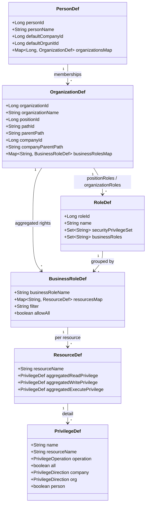
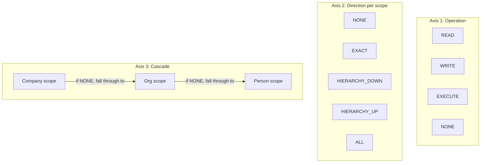
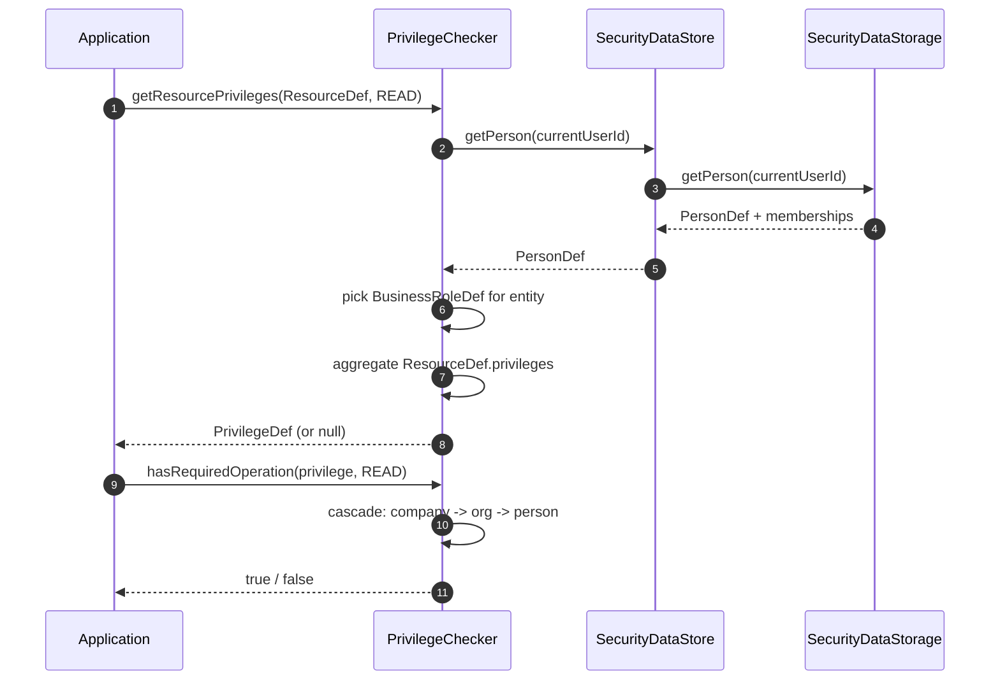
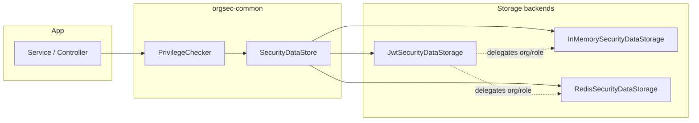

# Concepts Reference

This is the detailed concept reference. For onboarding, start with [What is OrgSec?](../start-here/01-what-is-orgsec.md) and [Resource Security Context](../usage/02-resource-security-context.md).

This page is the conceptual reference for the OrgSec model. Read it once before you start writing privilege definitions or wiring storage backends; come back to it whenever a check produces a surprising result. The model is small - six domain objects, three orthogonal axes on a privilege, and one cascade rule - but each piece does specific work.

## The domain model

OrgSec stores six kinds of entity in its data store. Application code never persists these directly; the storage backend builds them from your application's database (or, for JWT, from token claims).



A few words about each:

- **`PersonDef`** - the authenticated user, with the set of organizations they belong to.
- **`OrganizationDef`** - one node in the organizational tree (a company, a department, a project group). Carries enough hierarchy data (`pathId`, `parentPath`, `companyParentPath`) to evaluate hierarchical directions without a graph traversal.
- **`BusinessRoleDef`** - the *aggregated* view of what a person can do as a given business role inside a given organization. It is computed from the position roles the person holds at that organization plus the privileges those roles carry.
- **`RoleDef`** - a position role definition: a named role (`SHOP_MANAGER`, `BACK_OFFICE_CLERK`) bound to a set of privilege identifiers and tagged with which business roles it counts as.
- **`ResourceDef`** - a logical resource type (`Document`, `Invoice`, `Contract`). Inside a `BusinessRoleDef`, it carries the *aggregated* read / write / execute privileges the user holds for that resource through that role.
- **`PrivilegeDef`** - the unit of an authorization grant. Carries an `operation`, the per-scope `direction` values (`company`, `org`, `person`), and an `all` shortcut.

You will mostly write code against `SecurityEnabledEntity`, `PrivilegeChecker`, and the `SecurityDataStore` facade - the domain types above are the values flowing through them.

## Organizational hierarchy

OrgSec assumes your organizations form a tree (or a DAG with a single canonical path; OrgSec does not invent paths if you have multiple). The hierarchy is encoded in a few columns on each `OrganizationDef`:

| Field               | Format          | Example             | Meaning                                                                 |
| ------------------- | --------------- | ------------------- | ----------------------------------------------------------------------- |
| `pathId`            | local segment   | `o1_1`              | Local identifier of this node - the segment, no separators              |
| `parentPath`        | pipe-delimited  | `|c1|o1|o1_1|`      | Full path from the root down to **this node**, used as the hierarchy anchor for `_ORGHD` / `_ORGHU` |
| `companyId`         | numeric         | `1`                 | The company anchor for this org (often the root)                        |
| `companyParentPath` | pipe-delimited  | `|c1|`              | Full path of the root company, used as the hierarchy anchor for `_COMPHD` / `_COMPHU` |

Hierarchy decisions are made by string operations on the path columns:

- *Is `org A` a descendant of `org B`?* -> `A.parentPath.startsWith(B.parentPath)`.
- *Is `org A` an ancestor of `org B`?* -> `B.parentPath.startsWith(A.parentPath)`.

The field name `parentPath` is historical: despite the name, the value contains the **full path of this node**, not the path strictly above it. Hierarchy comparison uses this field, not `pathId`.

OrgSec needs the path columns to be present and well-formed. Empty or `null` paths are rejected as fail-closed (after the 1.0.0 security review); they cannot evaluate to "matches everywhere."

## Business role vs. position role

These two concepts cause more confusion than anything else in OrgSec. They are different objects with different lifecycles.

| Aspect                 | Business role                                                  | Position role                                                              |
| ---------------------- | -------------------------------------------------------------- | -------------------------------------------------------------------------- |
| Examples               | `owner`, `customer`, `contractor`, `executor`                  | `SHOP_MANAGER`, `BACK_OFFICE_CLERK`, `REGION_DIRECTOR`                     |
| Defined in             | `application.yml` under `orgsec.business-roles`                | Your domain database (one row per role)                                    |
| Scope                  | A category that classifies *what relationship* a person has to an organization | A concrete duty title attached to a person at a specific organization      |
| Affects entities       | Yes - `SecurityEnabledEntity.getSecurityField` is keyed by business role | No - entities don't know about position roles                        |
| Carries privileges     | No - it is a category                                    | Yes - each position role lists privilege identifiers                 |
| Maps to                | A bag of `RoleDef` instances (the roles tagged with this business role) | One `RoleDef`                                                              |
| Number per person/org  | Possibly several (a person can be both *owner* and *customer*) | Possibly several (a person can hold multiple position roles)               |

Or, said in one sentence: **business roles are how entities advertise *who they belong to*; position roles are how persons advertise *what they are allowed to do as which kind of relationship*.**

A worked example. Imagine a `Document` entity with two business roles:

- `owner` - the document is owned by a company / org / person.
- `customer` - the document is also visible to the customer it was issued to.

A user `Alice` has the position role `SHOP_MANAGER` at organization `Org-22` and the position role `EXTERNAL_AUDITOR` at organization `Org-99`. The `SHOP_MANAGER` role is tagged with the `owner` business role; the `EXTERNAL_AUDITOR` role is tagged with the `customer` business role.

When we check whether Alice can read `Document-1`:

1. Alice is a member of `Org-22` and `Org-99`.
2. For `Org-22` we look at her `owner` privileges (because `SHOP_MANAGER` carries the `owner` business role) and we ask the document for its `owner` security fields.
3. For `Org-99` we look at her `customer` privileges and we ask the document for its `customer` security fields.
4. If either path produces a sufficient privilege match, the check passes.

The mapping happens automatically inside `PrivilegeChecker`; you only have to make sure the YAML and the entity expose the right field types per business role.

## The privilege model

A privilege has three orthogonal axes. Each axis answers a different question.



### Axis 1: operation

`READ` -> `WRITE` -> `EXECUTE` is not a strict ordering; `WRITE` *implies* `READ`, and `EXECUTE` is independent. `NONE` means "no operation granted." When a check asks for `READ`, OrgSec accepts a privilege whose operation is `READ` or `WRITE`.

### Axis 2: direction (per scope)

`PrivilegeDirection` answers the question "given that the privilege is anchored to organization X, where does it apply?"

| Direction        | Effect on the anchor `X`                          | Typical use                                  |
| ---------------- | ------------------------------------------------ | -------------------------------------------- |
| `NONE`           | Does not apply at this scope                     | When the cascade should fall through         |
| `EXACT`          | Applies only to `X` itself                       | Single-org checks                            |
| `HIERARCHY_DOWN` | Applies to `X` and any descendant                | Manager who sees their team's records        |
| `HIERARCHY_UP`   | Applies to `X` and any ancestor                  | Subordinate who sees parent context (rare)   |
| `ALL`            | Applies to all organizations                     | Super-user privileges                        |

Each scope (`company`, `org`) carries its own direction. A privilege's `person` axis is a boolean - either the person scope applies (`true`) or it does not.

### Axis 3: cascade

The three scopes are evaluated in order: **company -> org -> person.** A privilege's effective scope is the first one whose direction is not `NONE`:

1. If `company != NONE`, the company direction governs and `org` / `person` are ignored.
2. Otherwise, if `org != NONE`, the org direction governs and `person` is ignored.
3. Otherwise, if `person == true`, the privilege applies only to entities owned by the person.
4. Otherwise, the privilege grants nothing.

Combined with the `all` shortcut (`PrivilegeDef.all == true` skips the cascade entirely and grants everything), this is the full evaluation rule.

The privilege identifier suffix encodes a single scope choice:

| Suffix    | `company`        | `org`            | `person` | `all`  |
| --------- | ---------------- | ---------------- | -------- | ------ |
| `_ALL`    | -                | -                | -        | `true` |
| `_COMP`   | `EXACT`          | `NONE`           | `false`  | `false`|
| `_COMPHD` | `HIERARCHY_DOWN` | `NONE`           | `false`  | `false`|
| `_COMPHU` | `HIERARCHY_UP`   | `NONE`           | `false`  | `false`|
| `_ORG`    | `NONE`           | `EXACT`          | `false`  | `false`|
| `_ORGHD`  | `NONE`           | `HIERARCHY_DOWN` | `false`  | `false`|
| `_ORGHU`  | `NONE`           | `HIERARCHY_UP`   | `false`  | `false`|
| `_EMP`    | `NONE`           | `NONE`           | `true`   | `false`|

When two privileges from different position roles aggregate, `PrivilegeDef.add` joins the per-axis directions with a small, **non-monotonic** rule: equal values stay; `NONE` returns the other side; `HIERARCHY_DOWN + HIERARCHY_UP` becomes `ALL`; **every other unequal combination collapses to `EXACT`**. So `_COMP + _COMPHU` aggregates to `_COMP`, not `_COMPHU` - the result is *narrower*, not wider. The full join table is in [Privilege Model Reference - Direction join](../reference/privilege-model.md#direction-join).

## How a check is evaluated



The shape rarely matters in production code - the application calls one method and gets a boolean - but it explains why authorization is fast: the heavy work (figuring out which business role applies, aggregating privileges) is done once per user-and-resource per request, and the storage layer caches the underlying `PersonDef` and `OrganizationDef` instances.

For the step-by-step semantics of `PrivilegeChecker.hasRequiredOperation` - including how cascade fall-through interacts with hierarchical directions - see [Privilege Evaluation](../architecture/privilege-evaluation.md). The expanded truth tables for the `_COMPHU` / `_ORGHU` / `EMP` cases are in [Privilege Model Reference](../reference/privilege-model.md).

## The SecurityEnabledEntity contract

Your domain entity exposes its security ownership through `SecurityEnabledEntity`. The interface has two methods:

```java
Object getSecurityField(String businessRole, SecurityFieldType fieldType);
void setSecurityField(String businessRole, SecurityFieldType fieldType, Object value);
```

The interface gives you a flexible mapping - one entity can expose different fields for different business roles - without forcing OrgSec to know your column names. The library reads `getSecurityField` only for the business roles your YAML declares, and only for the `SecurityFieldType` values that role's `supported-fields` lists. Anything else returns `null`.

The values returned should be:

- **`Long`** for `COMPANY`, `ORG`, `PERSON` - the foreign-key id of the related party / person.
- **`String`** for `COMPANY_PATH`, `ORG_PATH` - the pipe-delimited path of the related organization.

Returning a richer object (for example, a JPA-managed `Party` instance) also works - OrgSec uses reflection to extract the id when needed - but the simpler the return value, the lower the chance of accidentally triggering a lazy-loading proxy during a hot authorization path.

A practical consequence: the entity must already know the path columns at the moment the check happens. In a JPA setting, denormalize the path on write (typically in an `@PrePersist` / `@PreUpdate` hook on the entity, or via a domain event) so the read-side has the path without an extra round-trip. The pattern is shown in [Usage / Security-enabled entity](../usage/01-security-enabled-entity.md).

## How data reaches the checker

The privilege evaluator works against in-memory copies of `PersonDef`, `OrganizationDef`, and `RoleDef`. Those copies live behind the `SecurityDataStorage` SPI:



The `SecurityDataStore` facade keeps `PrivilegeChecker` agnostic to the active backend. A request always asks `Store.getPerson(personId)`; behind that call the inmemory backend reads from a `ConcurrentHashMap` snapshot, the Redis backend reads from L1-then-L2, and the JWT backend reads from a parsed token claim. Per-data-type routing (`orgsec.storage.data-sources.person=jwt`, etc.) is honored at this layer.

For backend-specific behavior - how data is loaded, when caches are invalidated, what happens on cache miss - see the [Choose storage](../storage/01-choose-storage.md) and the per-backend pages.

## Cache layers in one paragraph

The Redis backend keeps a local L1 LRU cache for hot reads and a Redis L2 cache for cross-instance coherence. The caches are populated by a startup preload step and by `notifyXxxChanged()` calls from your domain code; on L1+L2 miss the backend returns `null` rather than reading from your database. Mutations go through the same `notifyXxxChanged()` hooks, which publish on `orgsec:invalidation` so other instances drop their L1 entries. The L1 cap is configurable; the L2 entries are TTL-bounded per entity type. A circuit breaker protects against Redis outages by failing fast on Redis calls. The full picture is in [Cache Architecture](../architecture/cache-architecture.md).

## Where to go next

- [Configuration](./properties.md) - turn this model into `application.yml`.
- [Privileges](../usage/05-privileges.md) - design real privilege sets.
- [Choose storage](../storage/01-choose-storage.md) - pick a backend.
- [Privilege Model Reference](../reference/privilege-model.md) - truth tables and edge cases.
