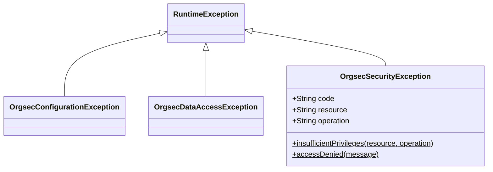

# Exceptions Reference

This page lists every exception OrgSec throws, what each one means, and how to handle it. Three exceptions are defined by OrgSec itself; the rest are Spring or JDK exceptions OrgSec re-uses where the semantics already fit.

All OrgSec-defined exceptions extend `RuntimeException` - they are unchecked, and their package is `com.nomendi6.orgsec.exceptions`.

## Hierarchy



## OrgSec-defined exceptions

### `OrgsecConfigurationException`

Wraps configuration errors that OrgSec can detect at runtime - missing beans, malformed values, mutually exclusive flags. The exception is informational; callers usually do not catch it because it indicates a programmer or operator error rather than a recoverable runtime condition.

| Constructor                                       | When OrgSec uses it                                                              |
| ------------------------------------------------- | -------------------------------------------------------------------------------- |
| `OrgsecConfigurationException(String)`            | A required configuration value is missing or inconsistent.                       |
| `OrgsecConfigurationException(String, Throwable)` | A configuration validation step failed because of an upstream exception.         |
| `OrgsecConfigurationException(Throwable)`         | Re-throws a downstream exception as a configuration error.                       |

Known throw site in 1.0.x:

- `PrivilegeSecurityService` throws `OrgsecConfigurationException("SecurityContextProvider not configured")` when the in-memory privilege service is invoked without a `SecurityContextProvider` bean in the context.

**Handling.** Treat as fatal. Fix the configuration or supply the missing bean.

### `OrgsecDataAccessException`

Wraps data-access errors when the underlying provider (your `SecurityQueryProvider`, the Redis connection, ...) fails. Provided for symmetry with `OrgsecConfigurationException` so application code can distinguish "configuration broken" from "data layer broken." OrgSec 1.0.x does not currently throw this exception from its own code; it is exposed as a target for custom backends and helpers.

**Handling.** A custom storage backend that throws this exception should set the cause to the underlying exception (`new OrgsecDataAccessException("Redis read failed", redisException)`). Application code can catch it to surface a 503 instead of a 500 when the underlying store is unavailable.

### `OrgsecSecurityException`

Thrown when an authorization-relevant invariant is violated. Carries optional structured fields (`code`, `resource`, `operation`) so handlers can produce structured error responses.

| Field        | Set by                                              | Typical value                       |
| ------------ | --------------------------------------------------- | ----------------------------------- |
| `code`       | The factory methods                                 | `INSUFFICIENT_PRIVILEGES`, `ACCESS_DENIED` |
| `resource`   | `insufficientPrivileges(resource, operation)`       | `"Document"`                        |
| `operation`  | `insufficientPrivileges(resource, operation)`       | `"WRITE"`                           |

Two factory methods on the class produce the canonical instances:

```java
throw OrgsecSecurityException.insufficientPrivileges("Document", "WRITE");
// → "Insufficient privileges for operation 'WRITE' on resource 'Document'"
//    code=INSUFFICIENT_PRIVILEGES, resource=Document, operation=WRITE

throw OrgsecSecurityException.accessDenied("path validation failed");
// → "path validation failed"
//    code=ACCESS_DENIED
```

Known throw sites in 1.0.x:

- `PathSanitizer` throws `OrgsecSecurityException` for null / empty / malformed paths, paths exceeding `MAX_PATH_DEPTH`, and path-id segments that contain disallowed characters or exceed `MAX_PATH_ID_LENGTH`. These are inputs the privilege evaluator cannot trust.

**Handling.** Catch in your global exception handler (`@ControllerAdvice`) and translate to a `403 Forbidden` HTTP response. Include the `code` / `resource` / `operation` fields if your error envelope supports structured details, but do not expose the underlying `message` to end users in untrusted contexts - it can leak resource names you may want to keep internal.

## Spring exceptions OrgSec throws

### `org.springframework.security.access.AccessDeniedException`

Thrown by `RsqlFilterBuilder` when:

- The current `PersonData` is `null`. Caller is unauthenticated or otherwise has no person identity.
- The cached `PersonDef` is `null` for the supplied person id. Either the cache misses (Redis cold cache without preload / loaders) or the person genuinely does not exist.
- A hierarchical privilege has a null parent path. This is the fail-closed behavior added in 1.0.1 - a `_COMPHD` privilege evaluated against a null `companyParentPath` is rejected rather than silently accepted.

**Handling.** Spring Security's default `ExceptionTranslationFilter` already maps this to a 403. If you have a custom filter chain, ensure `AccessDeniedException` is treated as 403 there too.

### `java.lang.UnsupportedOperationException`

Thrown by `SecurityDataStorage` default methods that a backend has not implemented:

- `updatePerson`, `updateOrganization`, `updateRole` - the in-memory and Redis backends override these; a custom backend that does not, throws `UnsupportedOperationException`.
- `createSnapshot`, `restoreSnapshot` - the in-memory backend implements them; the Redis and JWT backends do not.

**Handling.** Backend-agnostic code should either avoid these methods or be ready to catch the exception. Calls from inside OrgSec (for example, from a recipe in this documentation) always run on a backend that supports the method.

### `java.lang.IllegalStateException`

Thrown in two places:

- `JwtStorageAutoConfiguration` - when `jwt-enabled: true` but no `JwtDecoder` bean is present. The fail-fast that prevents a misconfigured JWT backend from accepting unverified tokens.
- `InMemorySecurityDataStorage.createSnapshot` - when the storage is not yet `ready` (initialize hasn't completed).

**Handling.** Both are programmer errors. The first is a configuration fix (supply the bean); the second indicates calling snapshot APIs from a `@PostConstruct` that runs before the in-memory loader.

### `java.lang.IllegalArgumentException`

Thrown by `PrivilegeLoader.createPrivilegeDefinition` when the privilege identifier is missing the structural shape the parser requires - specifically, when fewer than two underscore separators are present. The parser does **not** throw on unknown scope tokens or unknown operation suffixes; those are silently accepted and produce a `PrivilegeDef` that grants nothing. See [Privileges - Privilege identifier convention](../usage/05-privileges.md#naming-convention) and [Operations / Troubleshooting](../operations/troubleshooting.md#illegalargumentexception-malformed-privilege-name-) for the full story.

OrgSec does not wrap the exception in a dedicated type - the original `IllegalArgumentException` propagates up. Application code typically catches it in the `PrivilegeDefinitionProvider`'s `@PostConstruct` and either lets it abort startup (the simplest behavior) or wraps it in an application-specific exception type for richer diagnostics. There is no OrgSec-shipped wrapper class for this case.

## Recommended handling pattern

A minimal `@ControllerAdvice` that translates OrgSec exceptions to structured HTTP responses:

```java
@ControllerAdvice
public class OrgsecExceptionHandler {

    @ExceptionHandler(OrgsecSecurityException.class)
    public ResponseEntity<ProblemDetail> handleSecurity(OrgsecSecurityException ex) {
        ProblemDetail detail = ProblemDetail.forStatusAndDetail(HttpStatus.FORBIDDEN, ex.getMessage());
        if (ex.getCode() != null)      detail.setProperty("code", ex.getCode());
        if (ex.getResource() != null)  detail.setProperty("resource", ex.getResource());
        if (ex.getOperation() != null) detail.setProperty("operation", ex.getOperation());
        return ResponseEntity.status(HttpStatus.FORBIDDEN).body(detail);
    }

    @ExceptionHandler(AccessDeniedException.class)
    public ResponseEntity<ProblemDetail> handleAccessDenied(AccessDeniedException ex) {
        return ResponseEntity.status(HttpStatus.FORBIDDEN).body(
            ProblemDetail.forStatusAndDetail(HttpStatus.FORBIDDEN, "Access denied"));
    }

    @ExceptionHandler(OrgsecConfigurationException.class)
    public ResponseEntity<ProblemDetail> handleConfig(OrgsecConfigurationException ex) {
        // Should never happen at request time; surface as 500 with operator-visible detail in logs.
        log.error("OrgSec configuration error", ex);
        return ResponseEntity.status(HttpStatus.INTERNAL_SERVER_ERROR).body(
            ProblemDetail.forStatusAndDetail(HttpStatus.INTERNAL_SERVER_ERROR, "Internal server error"));
    }
}
```

Note the deliberate asymmetry: `OrgsecSecurityException` carries detail your client can read; `OrgsecConfigurationException` does not, because its message often references internal class names.

## Where to go next

- [Operations / Troubleshooting](../operations/troubleshooting.md) - symptoms-and-fixes runbook.
- [Privileges](../usage/05-privileges.md) - what causes `AccessDeniedException` from `RsqlFilterBuilder`.
- [Configuration - Validation at startup](../reference/properties.md) - what causes `IllegalStateException` at boot.
