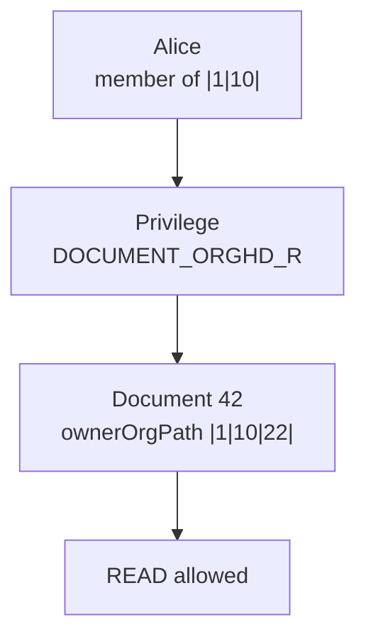

# What Is OrgSec?

OrgSec is a Spring Boot authorization library for applications where access follows an organizational hierarchy.

It is useful when a global role check is not enough. A user may be a manager in one branch, a contractor in another company, and a regular employee elsewhere. The authorization decision depends on both sides:

- the current user's person, organization memberships, position roles, and privileges
- the protected record's Resource Security Context: company, organization, person, and path fields

## Example

Alice is a member of `EU Region` with path `|1|10|`. She has `DOCUMENT_ORGHD_R` through the `owner` business role. A document is owned by `Shop-22`, whose path is `|1|10|22|`.

The privilege is hierarchical down from Alice's organization. The document belongs to a descendant organization, so the read check passes.

## Two Main Uses

| Use | What happens |
| --- | --- |
| Single entity check | Load one record, read its security context, and allow or deny a read/write/execute operation. |
| List filtering | Ask OrgSec to build an RSQL security filter and combine it with the user's normal list filters. |

List filtering is usually the reason to introduce OrgSec. It avoids loading rows the caller is not allowed to see and then filtering them in Java.

## When OrgSec Fits

Use OrgSec when:

- data is partitioned by company, branch, department, organization unit, or similar hierarchy
- the same user has different permissions in different organizations
- protected records carry owner/customer/contractor-style relationships
- list endpoints must return only authorized rows
- you want local JVM authorization without running a separate PDP

See [Glossary](../reference/glossary.md) for terms such as RBAC, ABAC, ReBAC, PDP, PEP, RSQL, JWT, and IdP.

## When OrgSec Is Overkill

OrgSec is probably too much if your app only needs a few global roles, object-by-object ACL exceptions, or a general-purpose policy language with environment attributes and externally managed policies.

Next: [How OrgSec fits your app](./02-how-orgsec-fits-your-app.md).
