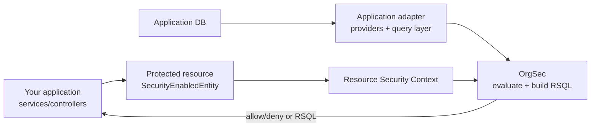

# How OrgSec Fits Your App

OrgSec does not replace your application model. It reads a standardized view of security data that your application exposes.

## Responsibilities

| Layer | Responsibility |
| --- | --- |
| Your application | Authenticates users, owns domain entities, persists data, initializes Resource Security Context fields, and decides the ownership algorithm for new records. |
| Application adapter | Maps your schema to OrgSec concepts: persons, organizations, roles, privileges, path fields, and current person id. |
| OrgSec | Evaluates privileges, aggregates grants by business role, fails closed when data is missing, and builds RSQL filters. |
| Repository/query layer | Applies the generated RSQL or equivalent predicate to the database query. |

Generators or internal platforms can scaffold the adapter layer, but the pattern is generic: OrgSec needs a consistent view of users, organizations, roles, and protected resources.

## Data Flow

The message of the diagram is that OrgSec compares two prepared inputs: user grants from storage/provider/JWT and ownership fields from the protected resource.

## What Your App Must Provide

- a way to map the authenticated user to a business person
- organization units with stable ids and path strings
- position roles and assigned privileges
- business role configuration such as `owner` or `customer`
- protected entities or DTOs implementing `SecurityEnabledEntity` / `SecurityEnabledDTO`
- Resource Security Context initialization on create/update paths
- repository support for applying RSQL on list endpoints, if you use list filtering

Next: [Core application flow](./03-core-application-flow.md).
