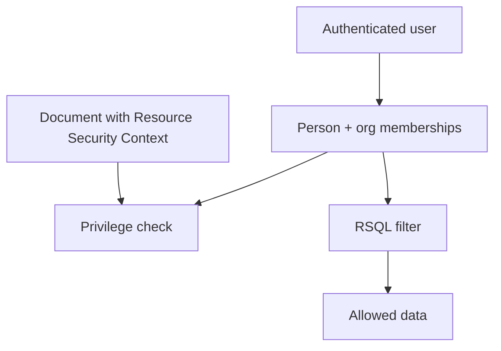

# Core Application Flow

The same authorization model is used for one-record checks and list filtering.

The important point is that the current user and the protected resource are prepared before OrgSec evaluates anything.

## Request Flow

1. The user is authenticated by Spring Security, an IdP, or another application mechanism.
2. The application maps the login to a business person.
3. Storage/provider/JWT data describes that person's organization memberships, position roles, business roles, and privileges.
4. A protected resource already has Resource Security Context fields such as `ownerOrgId`, `ownerOrgPath`, and `ownerPersonId`.
5. For a single record, the service checks the requested operation and denies if it does not match.
6. For a list endpoint, the service asks OrgSec for an RSQL filter and combines it with the user's normal filter.

## Create And Update Flow

OrgSec can only evaluate fields that exist on the resource, but create and update flows are different. On create, the application must initialize Resource Security Context before the first write check. On update, check write access against the currently persisted security context before applying request changes.

Typical create flow:

1. Build the new entity from request data.
2. Set Resource Security Context using the selected algorithm.
3. Check write privilege against the initialized entity.
4. Persist the entity.
5. Notify storage/cache if the change affects security data itself.

Typical update flow:

1. Load the existing entity.
2. Check write privilege against the existing Resource Security Context.
3. Apply the patch or command.
4. Refresh Resource Security Context only if the business operation is allowed to change ownership/scope.
5. Persist the entity.

Next: [First working example](./04-first-working-example.md).
