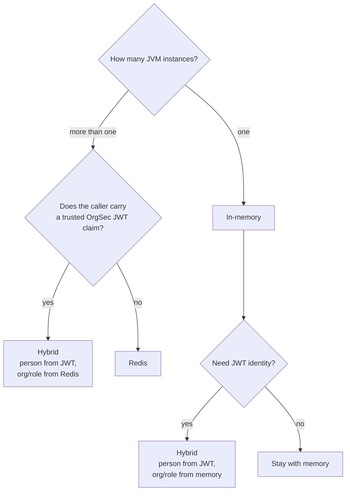

# Choose Storage

Storage is a deployment decision. It changes where OrgSec reads users, organizations, roles, and privileges from; it does not change Resource Security Context fields on protected entities.

All backends serve the same authorization API:

- `PrivilegeChecker` still checks one record.
- `RsqlFilterBuilder` still builds list filters.
- `SecurityEnabledEntity` mappings stay the same.

## Backends

| Backend | Use when | Important behavior |
| --- | --- | --- |
| In-memory | Single JVM, development, tests, small production deployments. | Loads a local snapshot through `SecurityQueryProvider`. |
| Redis | Multiple JVM instances need coherent security data. | Cache only; on L1+L2 miss it returns `null`, it does not query your database. |
| JWT | Current person identity comes from a trusted OAuth2/JWT flow. | Reads `PersonDef` from the token and delegates organizations, roles, and privileges. |
| Hybrid | Different data types should come from different sources. | Example: person from JWT, organizations/roles from Redis, privileges from memory. |

## Decision Tree



The storage choice answers "where do user grants come from?" It does not answer "which organization owns this document?" That second question is Resource Security Context and belongs to application create/update logic.

## Configuration Sketch

```yaml
orgsec:
  storage:
    primary: memory
```

For Redis:

```yaml
orgsec:
  storage:
    primary: redis
    features:
      redis-enabled: true
    redis:
      enabled: true
```

For JWT/hybrid:

```yaml
orgsec:
  storage:
    primary: jwt
    features:
      jwt-enabled: true
      redis-enabled: true
      hybrid-mode-enabled: true
    data-sources:
      person: jwt
      organization: redis
      role: redis
      privilege: memory
```

## Migration Notes

Switching storage is mostly configuration and classpath. The risk is data readiness:

- Memory must be loaded from `SecurityQueryProvider`.
- Redis must be preloaded or updated through notify hooks before reads are expected to succeed.
- JWT claims must already contain valid OrgSec person data before `person: jwt` is enabled.

## Next

- [In-memory storage](./02-in-memory.md)
- [Redis storage](./03-redis.md)
- [JWT storage](./04-jwt.md)
- [Hybrid storage](./05-hybrid.md)
