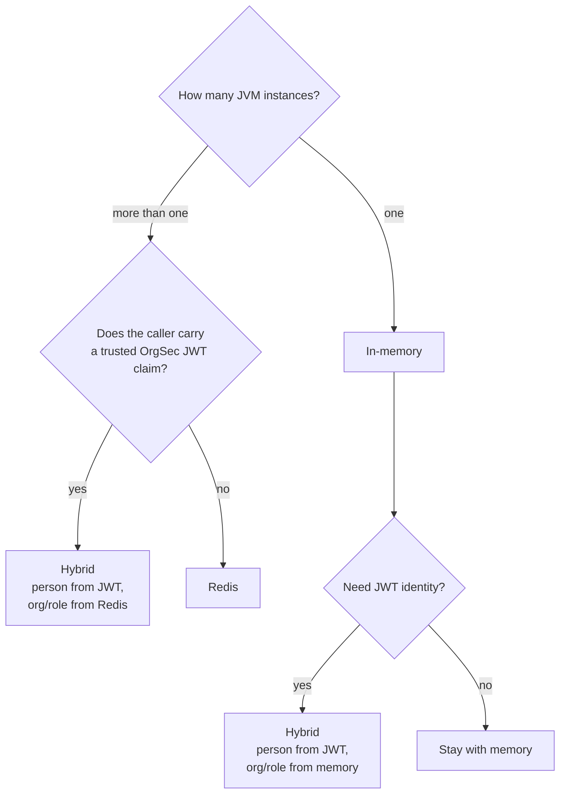

# Choose Storage

Storage is a deployment decision. It changes where OrgSec reads users, organizations, roles, and privileges from; it does not change Resource Security Context fields on protected entities.

All backends serve the same authorization API:

- `PrivilegeChecker` still checks one record.
- `RsqlFilterBuilder` still builds list filters.
- `SecurityEnabledEntity` mappings stay the same.

## Backends

| Backend | Use when | Important behavior |
| --- | --- | --- |
| In-memory | Single JVM, development, tests, small production deployments. | Loads a local snapshot through `SecurityQueryProvider`. |
| Redis | Multiple JVM instances need coherent security data. | Cache only; on L1+L2 miss it returns `null`, it does not query your database. |
| JWT | Current person identity comes from a trusted OAuth2/JWT flow. | Reads `PersonDef` from the token and delegates organizations, roles, and privileges. |
| Hybrid | Different data types should come from different sources. | Example: person from JWT, organizations/roles from Redis, privileges from memory. |

## Decision Tree


```mermaid
flowchart TB
    Q1{How many JVM instances?}
    Q1 -->|"one"| InMem["In-memory"]
    Q1 -->|"more than one"| Q2{Does the caller carry<br/>a trusted OrgSec JWT claim?}
    Q2 -->|"yes"| Hybrid["Hybrid<br/>person from JWT,<br/>org/role from Redis"]
    Q2 -->|"no"| Redis["Redis"]
    InMem --> Q3{Need JWT identity?}
    Q3 -->|"yes"| JwtMem["Hybrid<br/>person from JWT,<br/>org/role from memory"]
    Q3 -->|"no"| Done["Stay with memory"]
```

The storage choice answers "where do user grants come from?" It does not answer "which organization owns this document?" That second question is Resource Security Context and belongs to application create/update logic.

## Configuration Sketch

In-memory needs no configuration - it is what runs when nothing else is switched on.

For Redis, set both flags (they do different jobs; see [Activation](./03-redis.md#activation)):

```yaml
orgsec:
  storage:
    features:
      redis-enabled: true         # in-memory stands down from @Primary
    redis:
      enabled: true               # activates the Redis backend
```

Setting only one of the two refuses startup - see [Activation](./03-redis.md#activation).

For JWT - person from the token, organizations and roles from the delegate:

```yaml
orgsec:
  storage:
    features:
      jwt-enabled: true
```

The delegate defaults to in-memory. **JWT and Redis cannot be enabled together** - the combination is refused at startup, because a cache is not a safe delegate for the JWT backend. To put a different authoritative store behind JWT, declare a `jwtDelegateStorage` bean. See [Hybrid storage](./05-hybrid.md).

> `orgsec.storage.primary`, `hybrid-mode-enabled` and `data-sources.*` appear in older examples but are inert - no code reads them. There is no per-data-type router in 1.0.x.

## Migration Notes

Switching storage is mostly configuration and classpath. The risk is data readiness:

- Memory must be loaded from `SecurityQueryProvider`.
- Redis must be preloaded or updated through notify hooks before reads are expected to succeed.
- JWT claims must already contain valid OrgSec person data before `person: jwt` is enabled.

## Next

- [In-memory storage](./02-in-memory.md)
- [Redis storage](./03-redis.md)
- [JWT storage](./04-jwt.md)
- [Hybrid storage](./05-hybrid.md)
