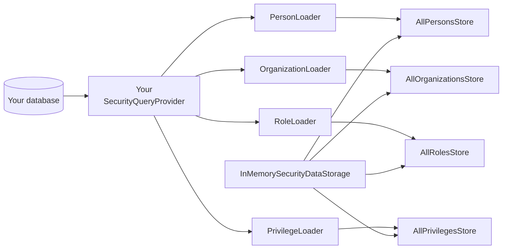

# In-Memory Storage

The in-memory backend loads user grants into the local JVM. It does not initialize Resource Security Context fields on your protected entities; your application still owns that create/update logic.

The in-memory backend is the default and the simplest. It loads `PersonDef` / `OrganizationDef` / `RoleDef` / `PrivilegeDef` instances at startup, holds them in thread-safe maps, and serves every authorization read directly from heap. There is no external infrastructure to manage and no extra dependency to add - the starter pulls it in transitively.

## How it works

Internally, `InMemorySecurityDataStorage` is composed of four stores and four loaders. The stores hold the cached data; the loaders translate JPA `Tuple` rows from your `SecurityQueryProvider` into the OrgSec domain model.



Each store is backed by a `ConcurrentHashMap`, with cross-store consistency protected by a `ReentrantReadWriteLock` on the storage class. Reads acquire the read lock; cache mutations (initial load, refresh, `notifyXxxChanged` hooks) acquire the write lock. Reads return defensive copies of the stored objects (added in the 1.0.1 security review), so a caller mutating a returned `PersonDef` cannot race against another instance.

## Lifecycle

The backend has three lifecycle methods inherited from `SecurityDataStorage`:

- **`initialize()`** - called once at startup. Calls each loader, populates the four stores. After this call, `isReady()` returns `true`.
- **`refresh()`** - reloads the entire dataset from your `SecurityQueryProvider`. Use it when you have a reason to re-read everything (configuration change, external bulk import). For incremental updates, prefer the notify hooks.
- **`notifyPartyRoleChanged(Long roleId)` / `notifyPositionRoleChanged(Long roleId)` / `notifyPersonChanged(Long personId)` / `notifyOrganizationChanged(Long orgId)`** - reload only the affected entity and any aggregated views that depend on it.

In a single-instance deployment the notify hooks keep the cache in sync with your database. Call them from the place where the data changes - usually a domain event listener or a service that performs the role assignment. There is no JPA listener hooked in by default; if your team prefers automatic invalidation, see [Usage / Load security data](../usage/08-load-security-data.md).

## When to use it

- **Local development and tests.** Zero infrastructure, fast feedback. The starter's default `orgsec.storage.primary: memory` lets every developer run the app with no extra setup.
- **Single-instance production.** A small SaaS, an internal tool, a back-office app that runs on one process - in-memory is enough. There is no inherent scale ceiling on the data set; what matters is whether the numbers fit in your heap.
- **Delegate for JWT (and parallel to Redis).** When `orgsec-storage-jwt` is on the classpath, in-memory typically serves as the JWT backend's *delegate* - the place where organizations and roles actually live, while the JWT backend handles `Person` from token claims. This is `data-sources.organization: primary` (= memory) when `primary: jwt`. The Redis backend, by contrast, does **not** call the in-memory backend on miss in 1.0.x; the two can coexist in the Spring context (one as `@Primary`, one as a delegate target for JWT), but Redis itself does not read through to in-memory.

## When not to use it

The in-memory backend is **not coherent across JVM instances.** Each instance has its own copy of the data, loaded at its own startup. Without external coordination, two instances will eventually disagree about who has which role.

- If you run **more than one instance** of the same service, switch to Redis. The cost - one extra dependency and a Pub/Sub channel - is small compared to debugging "user appears authorized on instance A but not on B."
- If you need **failure isolation** - the primary process dies, the secondary takes over instantly with the same authorization state - in-memory will not give it to you. Either use Redis for shared cache or rebuild from the database on takeover (which is what in-memory effectively does, but slowly).
- If your **dataset does not fit in heap**, the in-memory backend is a non-starter. There is no spill-to-disk; the loader will simply OOM. In practice the threshold is in the tens of thousands of organizations / millions of person-org memberships before you start worrying.

## Configuration

The only must-set property is the active backend:

```yaml
orgsec:
  storage:
    primary: memory                       # default
    features:
      memory-enabled: true                # default true
```

The starter sets `primary: memory` by default, so in a fresh project you do not need to write any storage block at all. The `OrgsecProperties.Storage.InMemory` sub-class also exposes two informational knobs that the in-memory backend itself does not consult; they are reserved for future use:

```yaml
orgsec:
  storage:
    inmemory:
      cache-ttl: 3600                     # reserved; not enforced in 1.0.x
      max-entries: 10000                  # reserved; not enforced in 1.0.x
```

The in-memory backend caches everything for the lifetime of the process. There is no TTL because the in-memory data *is* the truth (within the process); a TTL would only force unnecessary reloads.

## Testing utilities

For tests, examples, and demos, prefer `OrgsecInMemoryFixtures` when you want a readable programmatic setup instead of a full `SecurityQueryProvider`.

```java
fixtures
    .load()
    .privilege("DOCUMENT_ORGHD_R")
    .company(1L, "Acme")
    .organization(10L, "EU Region", "|1|10|")
    .company(1L)
    .organization(22L, "Shop-22", "|1|10|22|")
    .company(1L)
    .role("SHOP_MANAGER")
    .grants("DOCUMENT_ORGHD_R")
    .asBusinessRole("owner")
    .person(1L, "Alice")
    .defaultCompany(1L)
    .defaultOrgunit(22L)
    .memberOf(22L)
    .withRole("SHOP_MANAGER")
    .apply();
```

Production data should flow through `SecurityQueryProvider` or another storage adapter.

For integration tests that mutate the cache, OrgSec ships `StorageSnapshot` - an immutable snapshot of the four maps that you can take before the test and apply afterwards.

```java
import com.nomendi6.orgsec.storage.StorageSnapshot;

@Test
void roleAssignment_isVisibleAfterNotify() {
    StorageSnapshot before = takeSnapshot();
    try {
        // mutate state
        storage.notifyPartyRoleChanged(42L);
        assertThat(checker.getResourcePrivileges(documentResource(), READ)).isNotNull();
    } finally {
        restore(before);
    }
}
```

The `takeSnapshot()` and `restore()` helpers are not currently published as part of the public API - build them on top of the stores in your test base class. The `StorageSnapshot` constructor takes the five maps directly, so you can pass the live maps in a snapshot moment and copy them back later.

## Limitations

- **No persistence.** Restart the JVM and the cache is empty; the next startup runs a full load. For a single instance with reasonable warmup time this is fine. For a tight SLO on cold-start, prefer Redis.
- **No spill-over.** The four maps live entirely in heap.
- **No cross-instance coordination.** Documented above; this is the main reason to switch to Redis.
- **Refresh is global.** `refresh()` re-reads everything. Notify hooks are the granular alternative.
- **Defensive-copy cost.** Reads pay the price of copying `PersonDef` / `OrganizationDef` instances. The cost is small (these are small objects), but it appears on every privilege check. If your profiler points here, switch to Redis where the L1 returns shared references.

## Where to go next

- [Choose storage](./01-choose-storage.md) - the decision tree.
- [Configuration](../reference/properties.md) - the YAML reference.
- [Storage / Redis](./03-redis.md) - the multi-instance answer.
- [Archive / In-memory app](../archive/v1/examples/in-memory-app.md) - copy-paste-friendly starter project.
