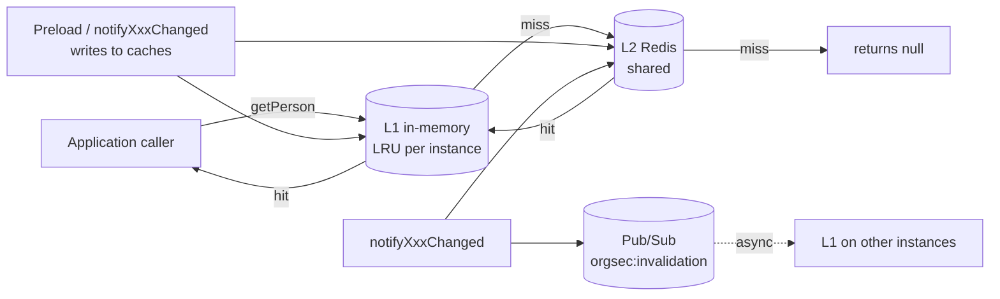

# Redis Storage

The Redis backend is the answer to the in-memory backend's only structural problem: it is process-local. Add Redis and you get a distributed cache with multi-instance coherence, a circuit breaker for outages, and configurable preload strategies. The price is one external dependency - a Redis server - and a small pile of configuration knobs you should understand before going to production.

> **Important - how reads behave on cache miss.** The 1.0.x Redis backend is a *cache*, not a read-through facade. It serves whatever has been *put into the caches* - through the preload step at startup, through `notifyXxxChanged` calls from your domain code, or through Pub/Sub fan-out from another instance. On L1+L2 miss `getPerson` / `getOrganization` / etc. return `null`. There is no automatic database fall-through. Plan your warmup and your invalidation calls accordingly.

Redis stores the user-grant side of authorization. It does not set or repair Resource Security Context fields on ordinary protected rows.

## Architecture



The read flow:

1. A read first hits the local L1 LRU. On hit, the cached value is returned.
2. On L1 miss, the read falls through to L2 (Redis). On L2 hit, the value is also stored in L1.
3. On L2 miss, the read returns `null`. Loading from your database is the responsibility of the application or higher-level service that calls `notifyXxxChanged` - *not* of the Redis storage itself.

The write/warm flow:

1. **Preload** at startup populates L2 (and optionally L1) for the configured strategy and mode (see [Preload strategies](#preload-strategies)).
2. **`notifyXxxChanged`** updates L2, optionally updates L1, and publishes on `orgsec:invalidation` so other instances drop their L1 entries.

The whole pipeline is wrapped in a Resilience4j circuit breaker. If Redis becomes unavailable, the circuit opens; subsequent reads fail fast (still returning `null` on miss) instead of stalling on Redis timeouts. When the circuit closes again, normal flow resumes.

## Adding the dependency

Redis is opt-in - add the dependency:

```xml
<dependency>
    <groupId>com.nomendi6.orgsec</groupId>
    <artifactId>orgsec-storage-redis</artifactId>
    <version>1.0.3</version>
</dependency>
```

The module pulls in `spring-boot-starter-data-redis` and the Lettuce client. You do not need to add `spring-boot-starter-data-redis` separately.

## Activation

Three flags turn the backend on. All three must be set:

```yaml
orgsec:
  storage:
    primary: redis
    features:
      memory-enabled: true                  # in-memory remains available as L1 source
      redis-enabled: true
    redis:
      enabled: true                         # auto-configures the Redis beans
```

- **`orgsec.storage.redis.enabled: true`** - gates the `RedisStorageAutoConfiguration` itself. Without this, no Redis beans are created, regardless of the flags above.
- **`orgsec.storage.features.redis-enabled: true`** - tells the storage facade that Redis is an active backend, so it can be picked by `primary` or by hybrid `data-sources` routing.
- **`orgsec.storage.primary: redis`** - selects Redis as the active backend.

The three-flag design lets you ship the Redis JAR on the classpath without auto-activating it (useful for builds that include several backends and choose at deploy time). When `primary: redis`, the Redis backend's `SecurityDataStorage` bean is `@Primary`; when `primary` is something else, the Redis backend can still serve specific entity types under hybrid mode.

## Connection settings

The most-frequently-edited block is the connection. Source the values from environment variables, never commit them.

```yaml
orgsec:
  storage:
    redis:
      host: ${REDIS_HOST:localhost}
      port: ${REDIS_PORT:6379}
      password: ${REDIS_PASSWORD:}        # optional but expected in production
      ssl: true                            # MANDATORY in production
      timeout: 2000                        # connect timeout in milliseconds
```

`ssl: true` is **non-negotiable** for production. OrgSec carries the entire authorization state of your application; sending it across a network in clear text is the kind of finding that ends a production deployment. The default is `false` only because local-dev Redis containers usually run without TLS - the production checklist treats `ssl: false` outside `dev` profiles as a release blocker.

## TTL configuration

Each entity type has its own TTL. Short TTLs reduce staleness at the cost of more cache misses; long TTLs reduce database load at the cost of more reliance on `notifyXxxChanged` for freshness.

```yaml
orgsec:
  storage:
    redis:
      ttl:
        person: 3600                       # seconds (1 hour)
        organization: 7200                 # 2 hours
        role: 7200
        privilege: 7200
        on-security-change: 300            # reserved; see note below
```

`on-security-change` is **reserved** in 1.0.x - the current update path applies the per-type TTLs (`person`, `organization`, ...) regardless. Set it for forward compatibility; do not rely on it for security-sensitive freshness guarantees yet.

## L1 cache

The L1 LRU lives inside each JVM instance. It is bounded by entry count, not by bytes; a `PersonDef` is small enough that you should size the L1 in the thousands.

```yaml
orgsec:
  storage:
    redis:
      cache:
        l1-enabled: true                   # reserved; L1 is always created in 1.0.x
        l1-max-size: 1000
        obfuscate-keys: false              # SHA-256 hash on cache keys
```

`l1-enabled` is **reserved** in 1.0.x - the L1 LRU is always created. Tune `l1-max-size` to bound memory; the entry count is per cache (persons, organizations, roles, privileges).

Set `obfuscate-keys: true` if Redis is shared with other applications and you do not want your key namespace (`orgsec:person:42`) to leak organizational metadata. The trade-off is that you can no longer inspect cache contents with `redis-cli KEYS orgsec:*`.

## Pub/Sub invalidation

Cross-instance cache invalidation rides on Redis Pub/Sub. The default is **off** - turn it on once you have verified the channel name is unique in your Redis namespace.

```yaml
orgsec:
  storage:
    redis:
      invalidation:
        enabled: true
        channel: orgsec:invalidation        # change for multi-tenant Redis
        async: true
```

Enabling invalidation does not change the *write* path - that still calls `notifyXxxChanged` directly. It changes the *read* path on remote instances: when one instance publishes an invalidation, all subscribers drop their L1 entry. The next read on a remote instance falls through to L2; on L2 miss it returns `null` (the Redis backend never reads from your database directly).

For a deeper recipe on the right places to call `notifyXxxChanged`, see [Usage / Load security data](../usage/08-load-security-data.md).

## Preload strategies

> **Preload is a framework hook, not automatic database loading.** The Redis auto-configuration creates a `CacheWarmer` and the Redis storage wires its batch-store callbacks. OrgSec does **not** know how to read your database directly - you must register data loaders on the `CacheWarmer` (`setPersonLoader`, `setOrganizationLoader`, `setRoleLoader`) before warmup runs. Without those loaders, every warmup strategy logs "Loader or store not configured, skipping warmup" and Redis starts empty.

The configuration knobs control *how* warmup runs once loaders are present:

```yaml
orgsec:
  storage:
    redis:
      preload:
        enabled: true
        on-startup: true
        strategy: all                       # all | persons | organizations | roles
        mode: eager                         # eager | progressive | lazy
        batch-size: 100                     # for progressive
        batch-delay-ms: 50                  # delay between batches
        async: false                        # block startup or run in background
        parallelism: 2                      # threads for parallel warmup
```

- **`eager`** - load everything during application startup. Spring's `ApplicationContext` is not considered ready until preload finishes. Predictable but slow on large datasets.
- **`progressive`** - load in batches with a small delay between them. Smaller startup spike, but the cache is incomplete until preload finishes.
- **`lazy`** - do not preload. The cache stays empty until something else (your `notifyXxxChanged` calls or a Pub/Sub invalidation followed by a populated `notify`) pushes entries in.

Set `async: true` to detach preload from the startup path entirely - the application starts immediately and preload runs in the background.

**Wiring the loaders.** In your application configuration, inject the `CacheWarmer` bean and register loaders that produce `Map<Long, PersonDef>` / `Map<Long, OrganizationDef>` / `Map<Long, RoleDef>` from your database. Until that wiring exists, treat preload as off regardless of `preload.enabled`.

## Circuit breaker

Resilience4j wraps every Redis call. If failures exceed the threshold the circuit opens, and Redis calls return immediately without waiting on TCP timeouts. While the circuit is open, reads simply behave as L2 misses (the L1 cache is still consulted first). After `wait-duration`, the circuit half-opens for a few probe calls; if those succeed, it closes.

```yaml
orgsec:
  storage:
    redis:
      circuit-breaker:
        enabled: true
        failure-threshold: 50               # percentage; default 50%
        wait-duration: 30000                # ms before half-open probe
        sliding-window-size: 10
        minimum-calls: 5
        permitted-calls-in-half-open: 3
```

You almost never need to tune these; the defaults are fine. The most likely change is increasing `wait-duration` for environments where Redis flapping is common, so the circuit does not thrash.

## Connection pool

Lettuce uses a native connection pool through Apache Commons Pool 2:

```yaml
orgsec:
  storage:
    redis:
      pool:
        enabled: true
        min-idle: 5
        max-idle: 10
        max-active: 20
        max-wait: 2000                      # ms; -1 = block forever
        test-while-idle: true
        time-between-eviction-runs: 30000
```

Defaults handle a moderate load. For high-traffic services, raise `max-active` until the pool stops throttling under peak load (you will see `Could not acquire connection in time` log lines).

## Health and monitoring

The Redis backend always creates a Spring Boot Actuator `RedisStorageHealthIndicator` when it is active. Add `spring-boot-starter-actuator` to your project to make the indicator visible at `/actuator/health`.

```yaml
orgsec:
  storage:
    redis:
      monitoring:
        metrics-enabled: true               # reserved; no Micrometer export in 1.0.x
        health-check-enabled: true          # reserved; indicator is always created
```

Both `monitoring.*` flags are **reserved** in 1.0.x:

- `metrics-enabled` - OrgSec does not ship a Micrometer `MeterBinder` in 1.0.x. You can still read internal counters programmatically through the cache classes if you want to wrap them in your own metrics.
- `health-check-enabled` - the `RedisStorageHealthIndicator` bean is created unconditionally when the Redis backend is active.

See [Operations / Monitoring](../operations/monitoring.md).

## Production hardening checklist

The non-negotiables for a Redis-backed OrgSec deployment:

- `ssl: true`
- `password` supplied via environment variable, not committed YAML
- `invalidation.enabled: true` if you run more than one instance
- A unique `invalidation.channel` per service if Redis is shared with other applications
- Connection pool sized for peak load
- Circuit breaker enabled (default is fine)
- Spring Boot Actuator on the classpath, with the health indicator wired to your readiness probes
- Audit logging on (`orgsec.storage.redis.audit.enabled: true`) so authorization decisions are observable through `DefaultSecurityAuditLogger`

The full list with rationale is in [Operations / Production checklist](../operations/production-checklist.md).

## Where to go next

- [Choose storage](./01-choose-storage.md) - the decision tree.
- [Archive / Redis app](../archive/v1/examples/redis-app.md) - copy-paste-friendly project.
- [Usage / Load security data](../usage/08-load-security-data.md) - when and where to call notify hooks.
- [Operations / Production checklist](../operations/production-checklist.md) - pre-deployment checks.
