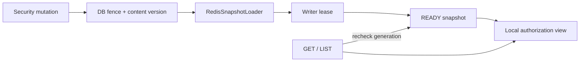

# Redis Storage

The Redis backend is the answer to the in-memory backend's only structural problem: it is process-local. In 1.1.0 a managed Redis deployment publishes one lease-fenced, immutable snapshot of the whole authorization dataset. Every instance's GET/LIST reads a local view of that snapshot after re-checking the current READY generation.

> **Upgrade from `<= 1.0.5`.** The previous L1/L2 + Pub/Sub path was a cache. A revoke that missed a notify, or a peer that rebuilt L1 from an older L2 value, could keep a grant the source database no longer has. 1.1.0 refuses a dependency-only upgrade: enabling Redis without exactly one `SecurityDatasetFenceStore` and one `RedisSnapshotLoader` fails at context construction. Mixed 1.0.x / 1.1.0 Redis processes are unsupported. See [Migration](#migration-from-105).

Redis stores the user-grant side of authorization. It does not set or repair Resource Security Context fields on ordinary protected rows.

## Supported topology

1.1.0 supports **one standalone Redis primary**. Several application instances may share it. At any moment only the lease-elected writer may publish a snapshot.

Out of scope, and not a supported contract:

- Redis Cluster, Sentinel, replicas, transparent failover
- `WAIT` / replica barriers
- a capacity ledger, reservation or quota
- JWT + Redis (refused at startup)

Pub/Sub may still be configured. It is a hint, not part of the correctness proof. GET/LIST do not consult L1 or L2.

The operator must keep Redis on `noeviction` with enough memory and headroom. OrgSec does not track Redis capacity. An OOM or write failure leaves the dataset NOT_READY and requires [operator recovery](../operations/redis-recovery.md).

## Architecture


```mermaid
flowchart LR
    Mutation[Security mutation]
    Fence[DB fence + content version]
    Loader[RedisSnapshotLoader]
    Lease[Writer lease]
    Ready[READY snapshot]
    View[Local authorization view]
    Get[GET / LIST]

    Mutation --> Fence
    Fence --> Loader
    Loader --> Lease
    Lease --> Ready
    Ready --> View
    Get --> View
    Get -->|recheck generation| Ready
```

1. Every security-source mutation takes the dataset fence in the same database transaction and increments `securityContentVersion` once.
2. After commit, `SecurityEventPublisher` notify asks the coordinator to refresh.
3. The coordinator either adopts the current READY snapshot (same fence version) or acquires the writer lease, loads all six families through `RedisSnapshotLoader`, and publishes a new READY generation.
4. GET/LIST decode from the local view only if the Redis control generation still matches. A generation change, missing family, corrupt record, or Redis outage clears the view and denies.

The six families are persons, organizations, party roles, position roles, roles and privileges. A snapshot is complete or it is not published.

## Required application beans

Enabling Redis requires **exactly one** of each:

| Type | Role |
| --- | --- |
| `SecurityDatasetFenceStore` | Exclusive source-database fence. Mutations increment the content version in the same transaction. Bootstrap and read-only adopt do not. |
| `RedisSnapshotLoader` | Writes one complete snapshot into the coordinator session from a **fresh** source read, not from process-wide `All*Store` state. Every family must be completed, including empty ones. |

A generated 1.1 application registers both. A hand-written application must do the same. Missing or duplicate beans raise `RedisStorageMigrationRequiredException` before any storage bean is created.

`update*` on managed Redis storage is rejected. The only write path is a new snapshot.

## Activation

Set both flags to the same value, and give the dataset a stable id:

```yaml
orgsec:
  storage:
    features:
      redis-enabled: true                   # in-memory storage stands down from @Primary
    redis:
      enabled: true                         # auto-configures the Redis beans
      security-dataset-id: my-service-prod  # stable across this dataset's instances/restarts
```

- **`orgsec.storage.redis.enabled: true`** - the only switch that activates the backend. It gates `RedisStorageAutoConfiguration`; without it no Redis bean is created.
- **`orgsec.storage.redis.security-dataset-id`** - required stable name for this security dataset. Use the exact same value on every instance that shares its source database and Redis snapshot, and keep it unchanged across normal restarts and rolling deployments. It has no default and is not the Redis database number.
- **`orgsec.storage.features.redis-enabled: true`** - does *not* activate anything. It only tells the in-memory storage to stop claiming `@Primary`, so that the Redis storage can take over.

Because the two flags do different jobs, setting only one produces a broken context. Since 1.0.5 OrgSec checks the pair before the context is built and **refuses to start** on a mismatch:

```
ORGSEC_STORAGE_REDIS_ACTIVATION_MISMATCH: orgsec.storage.redis.enabled=true but
orgsec.storage.features.redis-enabled=false. Set both properties to the same value.
```

This cannot be softened by configuration. Applications generated against 1.0.4 emit this combination, so **check your configuration before upgrading**.

Two further conditions are refused here: enabling Redis without `orgsec-storage-redis` on the classpath (`ORGSEC_STORAGE_REDIS_MODULE_REQUIRED`), and enabling Redis together with the JWT backend (`ORGSEC_STORAGE_JWT_REDIS_UNSUPPORTED`) - see [Hybrid storage](./05-hybrid.md).

Keeping the Redis JAR on the classpath without activating it is still supported - leave both flags unset.

`orgsec.storage.primary` is **not** part of activation and is not read by any code; see [properties reference](../reference/properties.md#storagefeatureflags---orgsecstorage).

## Connection settings

Source the values from environment variables, never commit them.

```yaml
orgsec:
  storage:
    redis:
      host: ${REDIS_HOST:localhost}
      port: ${REDIS_PORT:6379}
      password: ${REDIS_PASSWORD:}
      ssl: true
      timeout: 2000
```

`ssl: true` is **non-negotiable** for production. The default is `false` only because local-dev Redis containers usually run without TLS.

## Notify and refresh

Call `SecurityEventPublisher` producer methods from the service that mutates security data. After commit the publisher notifies storage; managed Redis then publishes a new snapshot (or stays on the previous READY generation if the fence version is unchanged).

- Commit → one refresh.
- Rollback → no refresh.
- No transaction → refresh immediately.
- Kafka / internal `apply*` → refresh immediately, no republish.

Do not call `storage.notify*` from inside an open transaction if a rollback is still possible. See [Load security data](../usage/08-load-security-data.md).

A peer that did not hold the writer lease adopts the READY snapshot on its next bootstrap or refresh. If another instance holds the lease, a cold instance stays NOT_READY until it can adopt.

## Fail-closed reads

GET/LIST return `null` / empty and `isReady()` is false when any of these hold:

- no READY snapshot is installed
- the control generation no longer matches the local view
- Redis is unreachable
- the snapshot is incomplete or fails verification
- the writer lease expired mid-publish

That is deny, not "try L2". A later successful bootstrap or refresh restores the view.

## Migration from 1.0.5

A jar-only bump is not enough.

1. Upgrade every instance together. Do not run 1.0.x and 1.1.0 against the same Redis keys.
2. Add the source-database fence table / row for `security-dataset-id` and protocol version 1.
3. Register one `SecurityDatasetFenceStore` and one `RedisSnapshotLoader`.
4. Stop calling `CacheWarmer.set*Loader` and `storage.update*` as the authorization write path.
5. Set Redis `maxmemory-policy noeviction` and size memory for a full snapshot plus one staging copy.
6. Confirm `orgsec.storage.redis.security-dataset-id` is identical on every instance.

The auto-configuration migration gate fails startup until steps 3 is done.

## Recovery

When Redis is empty, evicted, or left NOT_READY after a write failure, follow [Redis recovery](../operations/redis-recovery.md). The short version: restore Redis if you have a backup, then bounce one instance so it can take the writer lease and publish a fresh snapshot from the database. Do not hand-edit protocol keys.

## Connection pool, circuit breaker, health

Lettuce pool, Resilience4j and the Actuator health indicator still wrap the Redis connection. They do not change the snapshot contract: an open circuit or a failed health check means GET/LIST deny.

```yaml
orgsec:
  storage:
    redis:
      pool:
        enabled: true
        max-active: 20
        max-wait: 2000
      circuit-breaker:
        enabled: true
      monitoring:
        health-check-enabled: true
```

Add `spring-boot-starter-actuator` to expose `/actuator/health`.

## Legacy cache plane

TTL, L1 size, Pub/Sub invalidation and `CacheWarmer` preload still bind. They are **not** the managed GET/LIST path in 1.1.0. Leave them at defaults unless you are debugging a mixed leftover. Do not treat `preload.enabled` or `invalidation.enabled` as the freshness mechanism.

## Production hardening

- `ssl: true` and a password from the environment
- `noeviction` and enough Redis memory for two full snapshots
- a stable `security-dataset-id`
- fence + loader beans present
- notify through `SecurityEventPublisher` after commit
- Actuator health on the readiness probe

The full list is in [Operations / Production checklist](../operations/production-checklist.md).

## Where to go next

- [Choose storage](./01-choose-storage.md)
- [Redis recovery](../operations/redis-recovery.md)
- [Usage / Load security data](../usage/08-load-security-data.md)
- [Operations / Production checklist](../operations/production-checklist.md)
