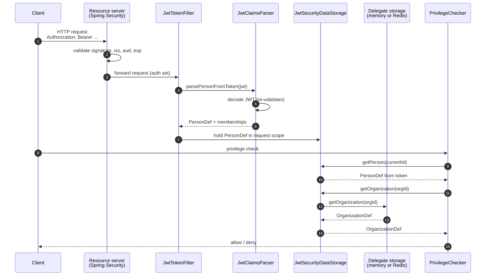

# JWT Storage

The JWT backend reads the current user's `PersonDef` from a JWT claim instead of from a database. It is the natural fit for OAuth2-fronted applications - especially when Keycloak (or any IdP that lets you inject a custom claim) is in front of your service. Person identity becomes stateless: every instance can answer authorization questions about the caller without consulting a shared cache, because the answer travels in the token.

See [Glossary](../reference/glossary.md) for JWT, IdP, and related authorization terms.

The JWT backend is **hybrid by design**: it never serves organizations, roles, or privileges itself. Those are delegated to another backend (memory or Redis) configured per data type. This keeps the token small and the cache logic for stable data unchanged.

> **Critical:** the JWT backend requires a Spring Security `JwtDecoder` bean. Without one, OrgSec **fails fast** at startup with `IllegalStateException`. This is intentional - an OrgSec deployment that accepts unverified tokens is a critical security regression. The fail-fast was added in the 1.0.1 security review.

If a delegated organization, role, or privilege is missing, JWT storage does not dynamically load it from the database. The delegate backend must already contain the data, or the authorization path fails closed.

## Architecture



The flow:

1. The client sends a request with an `Authorization: Bearer ...` header.
2. Spring Security's resource server validates the token (signature, issuer, audience, expiry).
3. After Spring Security accepts the token, OrgSec's `JwtTokenFilter` reads it again, hands the validated token string to `JwtClaimsParser`, and parses out the `orgsec` claim. The parser also asks the `JwtDecoder` to validate the token a second time before reading the claim - defense in depth, in case Spring Security's filter chain is misconfigured upstream.
4. The parsed `PersonDef` is stored in a `JwtTokenContextHolder` for the duration of the request.
5. When `PrivilegeChecker` calls `getPerson`, it gets the token-derived `PersonDef`. Calls for `getOrganization`, `getPartyRole`, `getPositionRole`, and `getPrivilege` go to the configured delegate.

## Adding the dependency

```xml
<dependency>
    <groupId>com.nomendi6.orgsec</groupId>
    <artifactId>orgsec-storage-jwt</artifactId>
    <version>1.0.3</version>
</dependency>
```

`orgsec-storage-jwt` already depends on `spring-boot-starter-oauth2-resource-server`, so adding the OrgSec module is enough to get the resource server stack on the classpath. You still have to provide a `JwtDecoder` bean (typically by setting `spring.security.oauth2.resourceserver.jwt.issuer-uri` or by supplying the bean manually in tests).

## Configuring the `JwtDecoder`

The simplest path is to point Spring Security at your IdP's issuer URI:

```yaml
spring:
  security:
    oauth2:
      resourceserver:
        jwt:
          issuer-uri: https://idp.example.com/realms/myrealm
```

Spring Security exposes a `JwtDecoder` bean that pulls the JWKS from the issuer's metadata, validates `iss`, `exp`, and `nbf`, and (with proper configuration) `aud`. OrgSec piggy-backs on this validation; the token has been verified before any OrgSec code touches it.

For tests, supply a `JwtDecoder` bean manually - the simplest implementation is `NimbusJwtDecoder.withSecretKey(...)` for HMAC-signed test tokens. See [Archive / JWT-Keycloak app](../archive/v1/examples/jwt-keycloak-app.md) for a working test setup.

## OrgSec configuration

```yaml
orgsec:
  storage:
    primary: jwt
    features:
      jwt-enabled: true
      memory-enabled: true                  # or redis-enabled: true
      hybrid-mode-enabled: true             # required for delegation
    data-sources:
      person: jwt
      organization: primary                 # = memory or redis
      role: primary
      privilege: memory
    jwt:
      claim-name: orgsec
      claim-version: "1.0"
      token-header: Authorization
      token-prefix: "Bearer "
      cache-parsed-person: true
      cache-ttl-seconds: 60                  # reserved; not enforced in 1.0.x
```

`cache-parsed-person: true` parses the token once per request and reuses the resulting `PersonDef` for all OrgSec calls in the same request. This is almost always what you want.

## The `orgsec` claim

The JWT must carry an `orgsec` claim (or the name you set in `claim-name`) shaped as follows:

```json
{
  "orgsec": {
    "version": "1.0",
    "person": {
      "id": 42,
      "name": "Alice Smith",
      "relatedUserId": "kc-user-uuid-here",
      "relatedUserLogin": "alice@example.com",
      "defaultCompanyId": 1,
      "defaultOrgunitId": 22
    },
    "memberships": [
      {
        "organizationId": 22,
        "companyId": 1,
        "pathId": "|1|10|22|",
        "positionRoleIds": [101, 205]
      },
      {
        "organizationId": 99,
        "companyId": 99,
        "pathId": "|99|",
        "positionRoleIds": [307]
      }
    ]
  }
}
```

The fields:

- **`version`** - matches `claim-version` (default `1.0`). Mismatched versions are rejected.
- **`person`** - the `PersonDef` body, minus `organizationsMap` (which is built from `memberships`).
- **`memberships`** - one entry per organization the person belongs to. The `positionRoleIds` are looked up against the delegate storage; the delegate is expected to know the role's privileges.

The JWT parser is permissive about unknown JSON fields (`@JsonIgnoreProperties(ignoreUnknown = true)` is set on the DTOs) so older or richer claim schemas can flow through without breaking deserialization - only fields OrgSec recognizes are used.

## Issuing the claim from Keycloak

OrgSec ships a custom Keycloak protocol mapper that produces this claim from your OrgSec data. The mapper calls the Person API endpoint `GET /api/orgsec/person/by-user/{userId}` (which is part of `orgsec-spring-boot-starter`, off by default) and injects the resulting JSON as the `orgsec` claim.

The full setup - service-account setup, Keycloak realm wiring, mapper deployment - is in [Keycloak Person API](../spring/03-keycloak-person-api.md). The mapper itself lives in [`Nomendi6/orgsec-keycloak-mapper`](https://github.com/Nomendi6/orgsec-keycloak-mapper).

If you do not use Keycloak, you can produce the claim from any token issuer that supports custom claims - the format is documented above and is independent of the issuer.

## Defense in depth

The 1.0.1 security review tightened several JWT-related paths. Knowing them helps you reason about what *cannot* go wrong:

- **`JwtClaimsParser` re-decodes the token before reading the claim.** Even though Spring Security has already verified the token, the parser asks `JwtDecoder` to do it again. If Spring Security's filter chain is bypassed (misconfiguration, alternative authentication path), the parser still rejects forged tokens.
- **The token cache is bounded and per-token.** Earlier versions used a `Map` keyed by `String.hashCode()`, which collides at 32-bit and could mix up tokens between users. The cache is now an LRU keyed by the full token string with a small bound; collisions are not possible.
- **Failures fail closed.** A `JwtException` thrown by the decoder, an unknown claim version, or a malformed `orgsec` JSON all return `null` from the parser, which downstream code treats as "no person identified" - the request is denied authorization.

You should still:

- **Set the audience on your tokens** and configure `JwtDecoder` to require it. Spring Security's default decoder validates `iss` and `exp`; audience checking is a one-line customization.
- **Use short token TTLs.** A revoked role still appears valid until the token expires. Five-to-fifteen-minute access tokens with refresh are typical for OrgSec deployments.
- **Use a separate Person API role.** When Keycloak's service account calls back into OrgSec to fetch the person data, that call is authorized by `orgsec.api.person.required-role` (default `ORGSEC_API_CLIENT`). Spring Security's `hasRole(...)` adds the `ROLE_` prefix automatically - the service-account principal must therefore carry authority `ROLE_ORGSEC_API_CLIENT` (or whatever value you set, prefixed with `ROLE_`). Do not reuse the role with end-user privileges.

## Combining JWT with Redis delegate

When you have many instances and need cached organization data, route the org / role types to Redis:

```yaml
orgsec:
  storage:
    primary: jwt
    features:
      jwt-enabled: true
      redis-enabled: true
      memory-enabled: true
      hybrid-mode-enabled: true
    data-sources:
      person: jwt
      organization: redis
      role: redis
      privilege: memory
    redis:
      enabled: true                         # gates the Redis auto-configuration
      host: ${REDIS_HOST}
      ssl: true
      # ... rest of Redis config
```

The Person path is stateless; the Organization / Role path is shared across instances through Redis. This is the canonical setup for a horizontally-scaled microservice fronted by Keycloak. Remember the Redis caveat from [Storage / Redis](./03-redis.md): Redis serves what has been put into the caches via preload or `notifyXxxChanged` - it does not load from your database on miss.

## Limitations

- **Token size.** Large `memberships` arrays inflate the JWT. Keep the claim to the organizations and position roles the user actually uses; do not include the entire org tree.
- **Stale memberships.** If a user's role changes, their existing token still carries the old memberships until it expires. Short token TTLs and revocation are the standard mitigations - OrgSec cannot do better than the IdP allows.
- **Claim format is fixed in 1.0.x.** The `version: "1.0"` claim matches the `OrgSecClaimsDTO` shape above. Future versions may extend the format; the parser checks the version field.

## Where to go next

- [Choose storage](./01-choose-storage.md) - the decision tree.
- [Keycloak Person API](../spring/03-keycloak-person-api.md) - full Keycloak setup.
- [Archive / JWT-Keycloak app](../archive/v1/examples/jwt-keycloak-app.md) - copy-paste-friendly project.
- [Configuration](../reference/properties.md) - the YAML reference.
