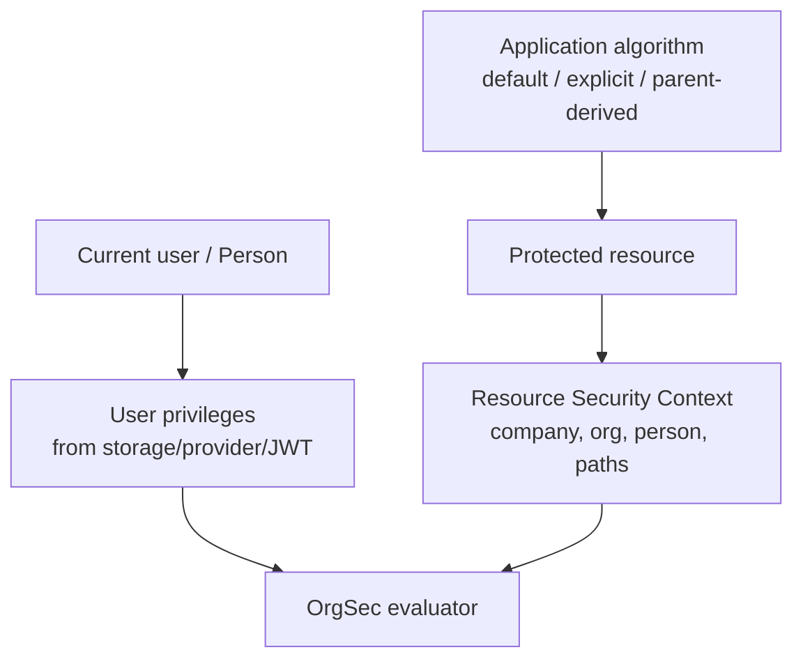

# Resource Security Context

Resource Security Context is the set of values on a protected entity that OrgSec uses for authorization: company, organization, person, and path fields per business role.

For example, a `Document` protected through the `owner` role may expose:

```text
ownerCompanyId   = 1
ownerCompanyPath = |1|
ownerOrgId       = 22
ownerOrgPath     = |1|10|22|
ownerPersonId    = 1
```

OrgSec does not decide these values. Your application sets them when a record is created or when ownership changes.

## Two Contexts

| Context | Meaning | Prepared by |
| --- | --- | --- |
| Runtime user context | Current person, default company/org, memberships, position roles, business roles, privileges. | Storage adapter, provider, JWT, and application login integration. |
| Resource Security Context | Ownership/scope fields on the protected record. | Application create/update logic. |



Storage gives OrgSec the user's grants; Resource Security Context gives OrgSec the record's ownership and scope.

## Initialization Algorithms

The default algorithm is usually: new records belong to the current person's default company, default organization unit, and person id.

Other algorithms are valid when the domain needs them:

| Algorithm | When to use it | Example |
| --- | --- | --- |
| Current person default context | The record belongs to the creator's default scope. | An employee creates an internal document. |
| Explicit owner selection | The user chooses the owning company or organization. | An administrator creates a record for another branch. |
| Parent-derived context | A child record inherits from its parent. | Contract line inherits contract ownership. |
| Customer-specific context | Visibility follows a customer, investor, taxpayer, or other party. | A case is visible through `customerCompany`. |
| Workflow-derived context | A process assigns the responsible organization. | A task moves to a regional office. |
| Import/migration context | Ownership comes from external data. | Migration maps old department codes to org units. |

Parent-derived initialization should copy the same role/type pairs the parent uses:

```java
ContractLine line = new ContractLine();
line.copySecurityFields(contract, "owner");
```

Explicit-owner and workflow-derived algorithms should still finish with the same result: the protected record exposes stable company/org/person/path values before OrgSec is asked to evaluate it.

## What OrgSec Expects

After initialization, the protected entity or DTO should return consistent values from `getSecurityField(role, fieldType)`.

For hierarchical privileges, path fields are required:

- `_COMPHD` / `_COMPHU` need `COMPANY_PATH`
- `_ORGHD` / `_ORGHU` need `ORG_PATH`

Missing data fails closed. That is safer than accidentally exposing rows, but it means bad initialization will look like denied access.

Example: if a role grants `DOCUMENT_ORGHD_R` but the document returns `null` for `ORG_PATH`, OrgSec cannot prove that the document belongs to the caller's organization subtree. The check denies and the list filter cannot include that row through the hierarchical rule.

## Checklist

- The entity implements `SecurityEnabledEntity` or the DTO implements `SecurityEnabledDTO`.
- Each configured business role has matching fields in `getSecurityField`.
- Path fields are populated when hierarchical privileges are used.
- Create paths initialize context before the first write check.
- Update paths check the existing context before applying request changes.
- Ownership/scope changes are explicit business operations, not incidental patch side effects.
- Tests cover at least one positive and one denied check for every ownership algorithm.

Next: [Organization path maintenance](./03-organization-path-maintenance.md).
