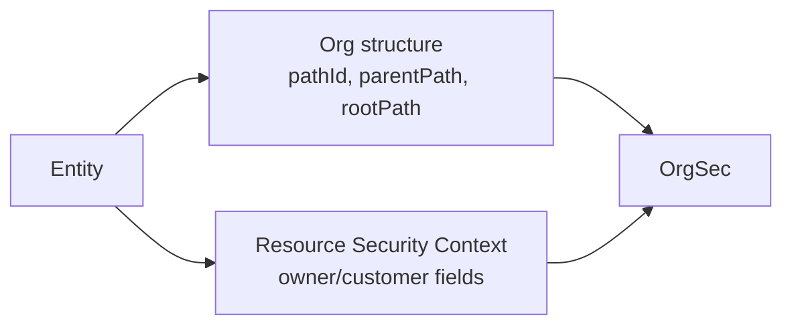

# Organization Path Maintenance

Hierarchical privileges depend on stable organization path values. OrgSec reads those values; your application creates and maintains them.

## Two Kinds Of Path Data

The same table or entity can be both an organization node and a protected resource.



Structural org path says where the organization is in the tree. Resource security path says which organization owns a protected record.

## Structural Organization Fields

Typical organization-node columns on the application side look like:

| Column         | Format          | Example                | Meaning                                                                |
| -------------- | --------------- | ---------------------- | ---------------------------------------------------------------------- |
| `path_id`      | local segment   | `o1_1`                 | Local identifier of this node - just the segment, no separators        |
| `parent_path`  | pipe-delimited  | `|c1|o1|o1_1|`         | Full hierarchical path **including this node**                         |
| `root_path`    | pipe-delimited  | `|c1|`                 | Full path of the root company or top node                              |
| `path_level`   | numeric         | `2`                    | Tree depth (top-level company is `0`, increases per level)             |
| `parent_id`    | foreign key     | `120`                  | Parent organization reference                                          |
| `root_party_id`| foreign key     | `2`                    | Root company / root organization reference                             |

A typical CSV import row for a company and one of its organizations looks like:

```text
id; code;     name;          tparty;       path_id;  parent_path;            path_level; parent_id; root_party_id
1;  ow;       COwner;        COMPANY;      ow;       |ow|;                   0;          null;      null
110;ow_o_1;   COwner O_1;    ORGANIZATION; o1;       |ow|o1|;                1;          1;         1
111;ow_o_1_1; COwner O_1_1;  ORGANIZATION; o1_1;     |ow|o1|o1_1|;           2;          110;       1
```

The application owns these columns. OrgSec consumes them through the storage/provider layer; the SQL aliases in your `SecurityQueryProvider` map them onto the `Tuple` keys the loader expects (`pathId`, `parentPath`, `companyParentPath`). The library uses `parentPath` (the full path including the node) as the hierarchy anchor for `_ORGHD` / `_ORGHU` privileges, and `companyParentPath` for `_COMPHD` / `_COMPHU`.

## Resource Security Fields

Protected resources usually denormalize ownership:

- `ownerCompany`
- `ownerCompanyPath`
- `ownerOrg`
- `ownerOrgPath`
- `ownerPerson`
- optional role-specific fields such as `customerCompanyPath`

These fields are the Resource Security Context and are separate from the organization tree fields.

## Creating A Node That Is Also Protected

A common flow for a new organization unit is:

1. Set the default Resource Security Context so the new record itself can be checked.
2. Check write privilege for the initialized record.
3. Save once to obtain the database id if the id is part of the path.
4. Calculate `pathId`, `parentPath`, `rootPath`, and `pathLevel`.
5. Save the path fields.
6. Notify OrgSec storage/cache that organization data changed.

Some generated applications scaffold this as a path service plus a context-management service. The pattern is application-owned even when a generator creates the initial code.

## Moving An Organization

When an organization moves, path changes are not local:

- update the moved node's structural path fields
- update descendants
- update protected resources that denormalized the old org/company path
- invalidate or refresh OrgSec storage/cache

Treat path maintenance as domain data maintenance, not as a runtime authorization side effect.

Next: [Business roles](./04-business-roles.md).
