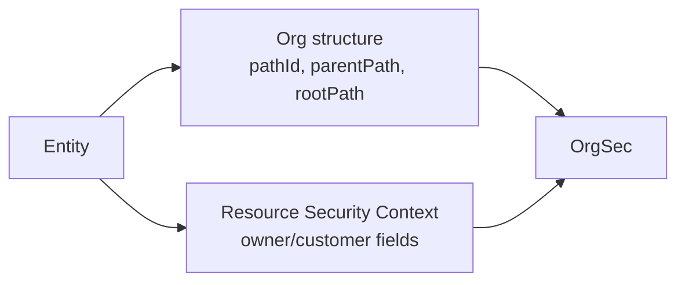

# Organization Path Maintenance

Hierarchical privileges depend on stable organization path values. OrgSec reads those values; your application creates and maintains them.

## Two Kinds Of Path Data

The same table or entity can be both an organization node and a protected resource.

Structural org path says where the organization is in the tree. Resource security path says which organization owns a protected record.

## Structural Organization Fields

Typical organization-node fields are:

- `pathId`: full path of this node, such as `|1|10|22|`
- `parentPath`: path of the parent node, such as `|1|10|`
- `rootPath`: path of the root company or top node
- `pathLevel`: tree depth
- `parent`: parent organization reference
- `rootEntity`: root company/root organization reference

OrgSec's internal `OrganizationDef` expects this information through the storage/provider layer. It does not create full application organization records for you.

## Resource Security Fields

Protected resources usually denormalize ownership:

- `ownerCompany`
- `ownerCompanyPath`
- `ownerOrg`
- `ownerOrgPath`
- `ownerPerson`
- optional role-specific fields such as `customerCompanyPath`

These fields are the Resource Security Context and are separate from the organization tree fields.

## Creating A Node That Is Also Protected

A common flow for a new organization unit is:

1. Set the default Resource Security Context so the new record itself can be checked.
2. Check write privilege for the initialized record.
3. Save once to obtain the database id if the id is part of the path.
4. Calculate `pathId`, `parentPath`, `rootPath`, and `pathLevel`.
5. Save the path fields.
6. Notify OrgSec storage/cache that organization data changed.

Some generated applications scaffold this as a path service plus a context-management service. The pattern is application-owned even when a generator creates the initial code.

## Moving An Organization

When an organization moves, path changes are not local:

- update the moved node's structural path fields
- update descendants
- update protected resources that denormalized the old org/company path
- invalidate or refresh OrgSec storage/cache

Treat path maintenance as domain data maintenance, not as a runtime authorization side effect.

Next: [Business roles](./04-business-roles.md).
