# Business Roles

A business role names the relationship between the person side and the protected entity side. Common examples are `owner`, `customer`, `contractor`, `executor`, and `auditor`.

Do not confuse business roles with position roles. A position role such as `SHOP_MANAGER` carries privileges. A business role such as `owner` selects which fields on the entity are used when those privileges are evaluated.

```mermaid
flowchart LR
    subgraph PersonSide["Person side"]
        Pos["Position role<br/>SHOP_MANAGER"]
        Priv["Privilege<br/>DOCUMENT_ORGHD_R"]
        BR["Business role<br/>owner"]
    end
    subgraph EntitySide["Entity side"]
        Doc["Document"]
        Field["ownerOrgPath<br/>&#124;1&#124;10&#124;22&#124;"]
    end

    Pos --> Priv
    Pos -.->|tagged as| BR
    Doc -->|exposes field for| BR
    BR -.->|selects| Field
    Priv -.->|matches| Field
```



The diagram shows the core idea: position roles grant rights; business roles choose the protected resource fields that those rights apply to.

## Declare Business Roles

```yaml
orgsec:
  business-roles:
    owner:
      supported-fields: [COMPANY, COMPANY_PATH, ORG, ORG_PATH, PERSON]
      rsql-fields:
        COMPANY: ownerCompanyId
        COMPANY_PATH: ownerCompanyPath
        ORG: ownerOrgId
        ORG_PATH: ownerOrgPath
        PERSON: ownerPersonId
    customer:
      supported-fields: [COMPANY, COMPANY_PATH]
```

`supported-fields` says which `SecurityFieldType` values a protected entity must expose for the role.

| Field type | Used for |
| --- | --- |
| `COMPANY` | Exact company privileges such as `DOCUMENT_COMP_R`. |
| `COMPANY_PATH` | Company hierarchy privileges such as `DOCUMENT_COMPHD_R`. |
| `ORG` | Exact organization privileges such as `DOCUMENT_ORG_R`. |
| `ORG_PATH` | Organization hierarchy privileges such as `DOCUMENT_ORGHD_R`. |
| `PERSON` | Person-owned privileges such as `DOCUMENT_EMP_R`. |

## Custom RSQL Field Selectors

`rsql-fields` is optional. It changes the property names emitted by `RsqlFilterBuilder`.

Without overrides, OrgSec assumes relationship-style selectors such as `ownerCompany.id`, `ownerOrg.id`, and `ownerPerson.id`. If your entity stores flat ids, configure selectors such as `ownerCompanyId` and `ownerOrgId`.

Keep selector configuration aligned with `getSecurityField(role, fieldType)`. OrgSec can validate selector syntax and that the field is listed in `supported-fields`, but it cannot prove that an RSQL property path and Java code read the same database column.

## When To Add A Business Role

Add a new business role when the same entity exposes a different ownership relationship.

| Situation | New business role? |
| --- | --- |
| "Owner can write, owner can read" | No. Same role, different privileges. |
| "Customer company can read a subset" | Yes. `customer` uses different fields than `owner`. |
| "External auditor sees reports" | Usually yes. `auditor` describes a different relationship. |
| "Manager and employee in the same org" | No. That is a position role difference. |

Next: [Privileges](./05-privileges.md).
