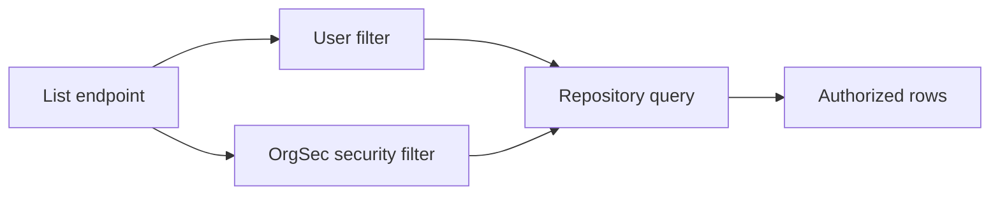

# Filter A List Endpoint

For list endpoints, do not load a broad result set and filter it in Java. Ask OrgSec for an RSQL filter and push it into the repository query.



The list endpoint combines the user's normal filter with the OrgSec security filter.

## Build A Read Filter

```java
String securityRsql = rsqlFilterBuilder.buildRsqlFilterForReadPrivileges(
    "DOCUMENT",
    null,
    currentPerson
);

String finalRsql = combineWithAnd(userRsql, securityRsql);
return documentRepository.findAll(finalRsql, pageable);
```

`buildRsqlFilterForWritePrivileges` does the same for write-scope list operations.

## Combining Filters

OrgSec returns:

- a non-empty RSQL expression when the user has scoped access
- an empty string when an all-data grant means no security predicate is needed
- `AccessDeniedException` when no matching privilege exists

Treat the exception as deny. Do not convert it into an empty filter.

## Custom Field Selectors

Configure `rsql-fields` when your entity property names do not match OrgSec's defaults:

```yaml
orgsec:
  business-roles:
    owner:
      supported-fields: [COMPANY, COMPANY_PATH, ORG, ORG_PATH, PERSON]
      rsql-fields:
        COMPANY: ownerCompanyId
        COMPANY_PATH: ownerCompanyPath
        ORG: ownerOrgId
        ORG_PATH: ownerOrgPath
        PERSON: ownerPersonId
```

Each selector must be a simple property path and must correspond to the same logical field returned by `SecurityEnabledEntity.getSecurityField`.

## Parent Field

For child resources whose access is inherited from a parent relationship, pass `parentField`:

```java
String filter = rsqlFilterBuilder.buildRsqlFilterForReadPrivileges(
    "DOCUMENT",
    "document",
    currentPerson
);
```

This prefixes generated selectors with `document.`.

## Internal All-Grant Signal

Internally, the builder uses `__ORGSEC_ALL_GRANT__` to detect an all-data grant. That sentinel is not part of the public API and is not returned to callers. The public contract is: empty string means all granted, non-empty string means apply this filter, exception means deny.

Next: [Load security data](./08-load-security-data.md).
